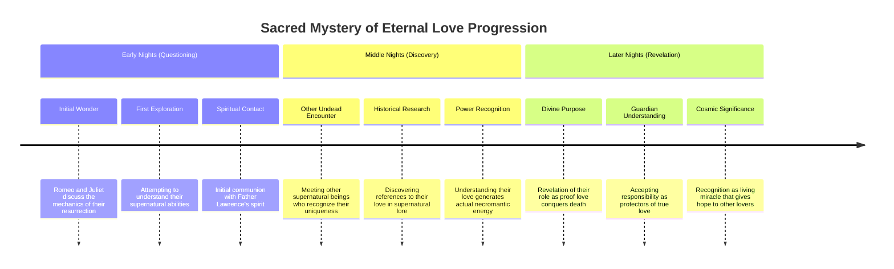
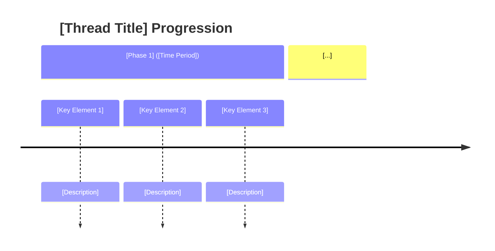

# Plot Thread: Mysteries of the Undead Heart

## AI Friendly Summary
**File Purpose**: Exploration thread investigating the supernatural mechanics and deeper purpose of Romeo and Juliet's undead existence

**Content Overview**: Philosophical and mystical elements as the lovers seek to understand their resurrection, discover others like them, and explore the cosmic significance of love conquering death

**Dependencies**: characters/1.md (Romeo), characters/2.md (Juliet), world.md (supernatural elements)

**Usage Context**: Provides mystical scenes, world-building exploration, and deeper thematic development about love and death

## Cross-References
- **Main Plot Framework**: Philosophical/mystical thread | timeline.md for discovery events
- **Character Relationships**: Romeo-Juliet shared quest for understanding | Spiritual guide relationships
- **Scene Implementation**: Mystical exploration scenes | Supernatural encounter scenes | Revelation scenes
- **Related Threads**: plots/1.md (Nightly Resurrection), plots/2.md (Secrecy/Discovery)
- **Key Players**: Romeo (characters/1.md), Juliet (characters/2.md), Father Lawrence's spirit, Other supernatural beings

# Plot Thread: The Sacred Mystery of Eternal Love
*Supernatural Mystery/Philosophical Quest | Episodic Discoveries*

## Thread Overview
**Core Conflict**: Romeo and Juliet seek to understand the true nature and purpose of their undead existence - whether it's divine blessing, natural law, or cosmic anomaly, and what responsibility this knowledge brings.

**Timeline Span**: Intermittent throughout story, building to major revelations
**Thread Type**: Character Agency/Mystical Forces  
**Resolution**: Acceptance of their role as guardians and proof of love's ultimate power over death

## Plot Timeline

## Key Plot Beats

### Act I: The Questions Begin
- **Night of Wonder**: Romeo and Juliet discuss why they alone among the dead can return
- **Testing Boundaries**: Exploring the limits and rules of their undead existence
- **Spiritual Guidance**: Father Lawrence's ghost appears to provide initial answers

### Act II: Seeking Understanding  
- **Encounter with Others**: Meeting other supernatural entities who treat them with reverence
- **Historical Discovery**: Finding evidence their love story has become legend in supernatural world
- **Power Manifestation**: Realizing their emotional bond generates visible supernatural energy

### Act III: Accepting Purpose
- **Divine Revelation**: Understanding their resurrection as sacred gift, not curse
- **Guardian Role**: Accepting responsibility to protect and inspire other true lovers
- **Eternal Mission**: Embracing their existence as living proof love transcends death

## Character Development Through Thread
- **Romeo**: Evolves from passionate lover to wise guardian of eternal love
- **Juliet**: Grows from questioning victim to mystical guide understanding cosmic purpose
- **Their Bond**: Transforms from personal romance to universal symbol of love's power

## Supernatural Elements Introduced
- **Necromantic Energy**: Love literally generates life force that sustains their existence
- **Spiritual Recognition**: Other supernatural beings recognize them as unique among undead
- **Divine Connection**: Direct communication with forces that blessed their union
- **Cosmic Significance**: Their love serves as beacon of hope in supernatural realm

## Resolution and Thematic Culmination
The thread concludes with Romeo and Juliet fully understanding their existence serves a greater purpose - they are living proof that pure love can literally conquer death. This knowledge transforms their secret existence from burden to sacred mission, giving deeper meaning to their eternal bond and establishing their role as guardians of true love throughout the world.

## Act-by-Act Development

### Act I: [Phase Title] ([Time Period])
**Development Focus**: [Primary narrative focus for this act]

**Key Plot Points**:
1. **[Event Name]** ([Timing])
   - [Event description and consequences]
   - [Character involvement and decisions]
   - [Stakes and complications]

2. ...

**Character Involvement**:
- **[Character Name]**: [Role and development in this act]
- **[Character Name]**: ...

### Act II: ... 

## Character Arc Integration

### [Character Name] - [Role Description]
**Thread Role**: [How character functions in this plot thread]
**Character Development**: [Arc progression through the thread]
**Key Moments**:
- [Moment description] ([Act/Timing])
- ...

**Development Progression**:
1. **[Phase]**: [Character state and growth]
2. ....

## Plot Thread Connections

### Primary Thread Intersections:
1. **[Related Thread]**: [How threads interact and influence each other]
2. ...

## Stakes and Consequences

**Personal Stakes**: [What individual characters risk or gain]

## Resolution Framework

**Resolution Type**: [How the thread concludes - triumph/tragedy/transformation/etc.]

**Character Outcomes**: [How resolution affects character arcs]

**Thread Legacy**: [How resolution impacts subsequent story elements]

---
Use this template for outlining new plot threads or expanding existing ones. Focus on character agency, structural consistency, and thematic integration.
