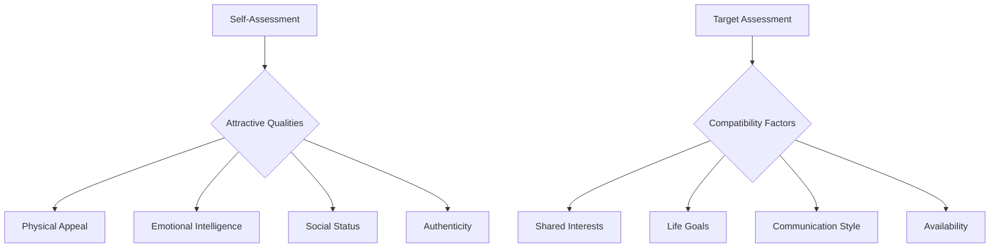

<!-- AI Friendly Summary: Complete strategic framework for romantic conquest inspired by Sunzi's Art of War, covering preparation, approach, engagement, and victory in modern dating scenarios -->

<!-- filepath: /Users/sami.j.p.heikkinen/Documents/src/summer-2025/da-dl/recursive-writing/art-of-love/art-of-love-framework.md -->

# The Art of Love: A Strategic Guide to Romantic Conquest

*"In love, as in war, the supreme excellence is to subdue the enemy without fighting."* - Adapted from Sunzi

## Cross-References
- Related files: `./world.md`, `./characters/`, `./practical-guide.md`
- Core templates: `../shared-artifacts/`
- Timeline: `./timeline.md`

---

## The Thirteen Chapters of Romantic Warfare

### I. Laying Plans (Know Thyself, Know Thy Target)

**The Five Constant Factors of Love:**
1. **The Way (Dao)** - Your authentic self and values
2. **Heaven** - Timing and social context  
3. **Earth** - The venue (Tinder, bar, coffee shop, etc.)
4. **The Commander** - Your confidence and leadership
5. **Method and Discipline** - Your approach and consistency

**Strategic Assessment:**

**Classic Opening Moves:**
- *The Scholar's Gambit*: "I couldn't help but notice your book choice..."
- *The Adventurer's Probe*: "You look like someone with stories to tell..."
- *The Direct Assault*: "I'm terrible at pickup lines, but I had to meet you..."

### II. Waging Love (The Economics of Attraction)

**Resource Management:**
- Time investment vs. return potential
- Emotional energy allocation
- Financial considerations (dates, gifts, etc.)
- Social capital expenditure

**The Art of Scarcity:**
- Don't be too available immediately
- Create mystery and intrigue
- Let them invest in pursuing you
- Balance interest with independence

### III. Attack by Stratagem (The Indirect Approach)

**The Four Levels of Romantic Victory:**
1. **Supreme Excellence**: They pursue you without effort
2. **Next Best**: Win through charm and wit
3. **Acceptable**: Direct approach with clear interest
4. **Worst**: Persistence after clear rejection

**Flanking Maneuvers:**
- Befriend their social circle
- Show interest in their passions
- Create positive associations
- Use social proof effectively

### IV. Tactical Dispositions (Creating Advantage)

**Positioning Yourself:**
- Choose venues that showcase your strengths
- Time interactions for maximum impact
- Create favorable comparison contexts
- Maintain mysterious allure

**The Unassailable Position:**
- Emotional stability and independence
- Multiple options and social connections
- Clear boundaries and self-respect
- Authentic confidence (not arrogance)

### V. Energy (Momentum and Timing)

**Reading the Battlefield:**
- Body language signals
- Verbal cues and tone
- Social dynamics of the group
- Environmental factors

**Creating Momentum:**
- Start with small compliance requests
- Build rapport through mirroring
- Escalate physical and emotional intimacy gradually
- Recognize and seize optimal moments

### VI. Weak Points and Strong (Vulnerability as Strength)

**Strategic Vulnerability:**
- Share meaningful (not overwhelming) personal stories
- Show genuine interest in their thoughts and feelings
- Admit attractive flaws and limitations
- Create emotional connection through openness

**Exploiting Their Weaknesses (Ethically):**
- Unmet emotional needs
- Desire for validation
- Fear of missing out
- Natural reciprocity instincts

### VII. Maneuvering (The Art of the Dance)

**Opening Moves:**
| Scenario | Approach | Example |
|----------|----------|---------|
| Coffee Shop | Observational | "That book changed my perspective on..." |
| Bar | Situational | "This place has the best [drink] in the city..." |
| Tinder | Intriguing | "Your [photo/bio element] tells a story..." |
| Social Event | Introduction | "Sarah mentioned you're the [interesting fact]..." |

**Advanced Maneuvering:**
- The Strategic Retreat (creating space to increase desire)
- The Flanking Movement (approaching through friends)
- The Feigned Disinterest (reverse psychology)
- The Common Enemy (bonding over shared dislikes)

### VIII. Variation in Tactics (Adapting to Different Types)

**The Five Personality Archetypes:**

1. **The Intellectual** - Engage with ideas and deep conversation
2. **The Adventurer** - Suggest exciting activities and experiences  
3. **The Nurturer** - Show vulnerability and appreciation
4. **The Achiever** - Demonstrate ambition and success
5. **The Free Spirit** - Be spontaneous and unconventional

**Platform-Specific Tactics:**

**Tinder Strategy:**
- Profile optimization with strategic photos
- Opening messages that reference specific details
- Quick transition to real meeting
- Playful banter over serious conversation

**Bar/Club Approach:**
- Confident approach without aggressive energy
- Use environment for conversation starters
- Physical proximity and light touching
- Extract contact info before separation

### IX. The Army on the March (Escalation and Progression)

**The Natural Progression:**
1. **Initial Contact** - First impression and interest
2. **Rapport Building** - Finding common ground
3. **Emotional Connection** - Deeper sharing and vulnerability
4. **Physical Escalation** - Appropriate touching and proximity
5. **Commitment** - Exclusive relationship discussion

**Warning Signs to Retreat:**
- Consistent lack of reciprocation
- Clear statements of disinterest
- Hostile body language
- Mentions of being taken/unavailable

### X. Terrain (Understanding the Environment)

**The Six Types of Terrain:**

1. **Accessible** (Coffee shops, bookstores) - Equal opportunity for both
2. **Entangling** (Clubs, loud venues) - Easy to approach, hard to have meaningful conversation
3. **Temporizing** (Work, gym) - Proceed with extreme caution
4. **Narrow Passes** (Online dating) - Limited information, high competition
5. **Precipitous Heights** (Social events) - High reward but social consequences
6. **Positions at a Great Distance** (Long-distance) - Requires different strategy

### XI. The Nine Situations (Different Relationship Contexts)

1. **Dispersive Ground** - Casual dating, multiple options
2. **Facile Ground** - Early dating, low commitment
3. **Contentious Ground** - Competing with other suitors
4. **Open Ground** - Social settings with mutual friends
5. **Ground of Intersecting Highways** - Meeting through multiple social circles
6. **Serious Ground** - Discussing exclusivity and future
7. **Difficult Ground** - Relationship challenges and conflicts
8. **Hemmed-in Ground** - Limited options or circumstances
9. **Desperate Ground** - Last chance scenarios

### XII. The Attack by Fire (Passion and Intensity)

**The Five Types of Fire:**
1. **Burning the Person** - Compliments that ignite self-confidence
2. **Burning the Stores** - Eliminating competition through superiority
3. **Burning the Baggage** - Helping them release past relationship trauma
4. **Burning the Arsenal** - Disarming their defenses through authenticity
5. **Burning the Lines** - Creating exclusive connection

**Fanning the Flames:**
- Intense eye contact and presence
- Passionate discussion of mutual interests
- Physical chemistry and attraction
- Emotional vulnerability and intimacy

### XIII. The Use of Spies (Information Gathering)

**The Five Types of Intelligence:**

1. **Local Spies** - Mutual friends and social circle
2. **Inward Spies** - Their close friends who like you
3. **Converted Spies** - Exes who speak well of you
4. **Doomed Spies** - Social media stalking (use sparingly)
5. **Surviving Spies** - Direct observation and conversation

**What to Learn:**
- Relationship history and patterns
- Current life situation and goals
- Interests, values, and dealbreakers
- Love languages and communication preferences

---

## The Ultimate Maxims of Love

1. **"Know yourself and know your target; in a hundred romantic encounters you will never be rejected."**

2. **"The supreme excellence is to subdue the heart without conquering the will."**

3. **"All romantic warfare is based on deception - but only self-deception leads to defeat."**

4. **"The clever romantic wins before the first message is sent."**

5. **"In love, timing is everything; in timing, patience is everything."**

6. **"Water shapes its course according to the ground; the lover shapes their approach according to the person."**

7. **"The skilled lover does not repeat their tactics, but responds to circumstances infinitely."**

8. **"When you surround someone with attention, leave them a way to reciprocate."**

9. **"The ultimate goal is not conquest, but mutual surrender."**

10. **"True victory in love is when both parties feel they have won."**

---

*Remember: The true art of love lies not in manipulation, but in the authentic expression of your best self to someone worthy of that gift.*
