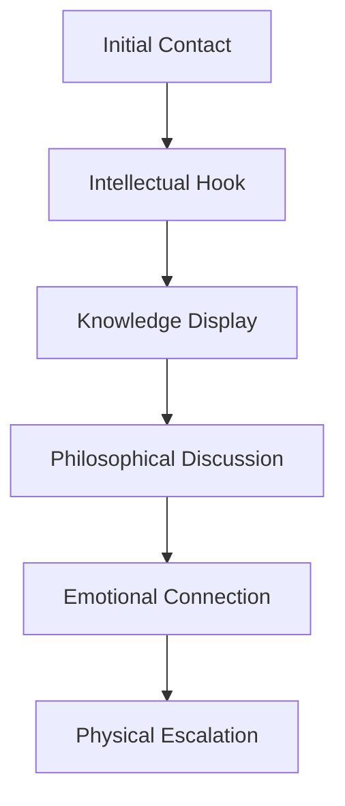

<!-- AI Friendly Summary: Character archetypes for romantic targets, defining personality types and optimal approach strategies for each type -->

<!-- filepath: /Users/sami.j.p.heikkinen/Documents/src/summer-2025/da-dl/recursive-writing/art-of-love/characters/target-archetypes.md -->

# The Five Romantic Archetypes

## Cross-References
- Strategic framework: `../art-of-love-framework.md`
- Tactical guide: `../practical-guide.md`
- World context: `../world.md`

---

## Archetype I: The Intellectual (The Scholar)

### Core Characteristics
- Values intelligence and deep conversation
- Often well-read and academically inclined
- Enjoys debates and philosophical discussions
- May be introverted or selectively social
- Attracted to mental stimulation over physical

### Identification Signals
- Book references in dating profiles
- Complex vocabulary in conversations
- Interest in documentaries, museums, lectures
- Graduate degrees or specialized knowledge
- Asks thoughtful, probing questions

### Optimal Approach Strategy

**Opening Moves:**
- "I noticed you're reading [book]. Have you read [related author]?"
- "Your perspective on [topic] is fascinating. Where did that insight come from?"
- "I've been thinking about [philosophical concept]. What's your take?"

**Conversation Topics:**
- Current events and their deeper implications
- Books, podcasts, documentaries
- Travel experiences and cultural observations
- Future goals and ambitions
- Ethical dilemmas and moral questions

**Relationship Progression:**
1. **Mental Attraction** - Impress with knowledge and insight
2. **Intellectual Intimacy** - Share ideas and worldviews
3. **Emotional Depth** - Connect on values and beliefs
4. **Physical Chemistry** - Let attraction build naturally

**Warning Signs:**
- Don't try to fake intelligence
- Avoid superficial small talk
- Don't dominate conversations
- Respect their need for mental space

---

## Archetype II: The Adventurer (The Explorer)

### Core Characteristics
- Seeks new experiences and excitement
- Often spontaneous and energetic
- Values freedom and independence
- Attracted to confidence and boldness
- May have commitment hesitations

### Identification Signals
- Travel photos and adventure stories
- Outdoor activities and sports interests
- Spontaneous plans and last-minute decisions
- Multiple hobbies and varied experiences
- "Let's see where this goes" attitude

### Optimal Approach Strategy
**Opening Moves:**
- "That hiking photo looks incredible. What was the most challenging part?"
- "I'm planning [adventure activity]. Know any good spots?"
- "You look like someone who says yes to adventure"

**Date Ideas:**
- Rock climbing or hiking
- Food festivals or markets
- Spontaneous road trips
- New restaurant discoveries
- Outdoor concerts or events

**Relationship Progression:**
1. **Adventure Partnership** - Shared exciting experiences
2. **Trust Building** - Reliability in unpredictable situations
3. **Emotional Adventure** - Exploring feelings together
4. **Commitment Journey** - Making exclusivity feel like an adventure

**Key Tactics:**
- Be spontaneous and flexible
- Suggest unique, exciting dates
- Show your own adventurous side
- Don't pressure for immediate commitment
- Make routine feel like exploration

---

## Archetype III: The Nurturer (The Caregiver)

### Core Characteristics
- Empathetic and emotionally intelligent
- Values kindness and genuine connection
- Often puts others' needs first
- Attracted to vulnerability and authenticity
- Seeks long-term, meaningful relationships

### Identification Signals
- Caring profession (teacher, nurse, social worker)
- Close family relationships
- Volunteer work or charitable interests
- Asks about your feelings and wellbeing
- Remembers small details about your life

### Optimal Approach Strategy
**Opening Moves:**
- "You have such a warm energy. It's really nice to meet someone genuine"
- "I can tell you really care about [cause/people]. That's beautiful"
- "Thank you for [small kindness]. It means more than you know"

**Conversation Focus:**
- Family and close relationships
- Personal growth and emotional intelligence
- Helping others and making a difference
- Life challenges and how you've grown
- Dreams for the future and legacy

**Relationship Progression:**
1. **Emotional Safety** - Create trust and vulnerability
2. **Mutual Care** - Show you can both give and receive
3. **Deep Intimacy** - Share fears, dreams, and authentic self
4. **Partnership Vision** - Discuss building something together

**Key Behaviors:**
- Show genuine interest in their wellbeing
- Be vulnerable and authentic
- Remember and follow up on personal details
- Demonstrate emotional intelligence
- Express appreciation regularly

---

## Archetype IV: The Achiever (The Competitor)

### Core Characteristics
- Goal-oriented and ambitious
- Values success and status
- Competitive by nature
- Attracted to confidence and achievement
- Respects directness and efficiency

### Identification Signals
- Career-focused social media presence
- Competitive hobbies (sports, gaming, business)
- Talk about goals and achievements
- Busy schedule and time-conscious
- Values quality and status symbols

### Optimal Approach Strategy
**Opening Moves:**
- "I respect people who go after what they want. What are you working toward?"
- "Your success in [field] is impressive. What drives you?"
- "I can tell you don't settle for mediocre. What's your standard?"

**Demonstration of Value:**
- Share your own ambitions and achievements
- Show you can keep up with their pace
- Demonstrate competence in your field
- Respect their time and schedule
- Suggest high-quality experiences

**Relationship Progression:**
1. **Mutual Respect** - Recognize each other's achievements
2. **Power Couple Dynamic** - Supporting each other's success
3. **Competitive Partnership** - Pushing each other to excel
4. **Shared Vision** - Building success together

**Date Strategies:**
- Upscale venues that reflect success
- Networking events or professional gatherings
- Competitive activities (tennis, bowling, etc.)
- Goal-setting and planning sessions
- Celebration of achievements

---

## Archetype V: The Free Spirit (The Artist)

### Core Characteristics
- Creative and unconventional
- Values authenticity and self-expression
- Often follows passion over practicality
- Attracted to uniqueness and creativity
- May be emotionally intense

### Identification Signals
- Artistic pursuits and creative expression
- Unconventional style or appearance
- Values experiences over possessions
- Talks about meaning and purpose
- May have irregular schedule or lifestyle

### Optimal Approach Strategy
**Opening Moves:**
- "Your style is so unique. I love how you express yourself"
- "What inspires your creativity? I'm curious about your process"
- "You seem like someone who follows their heart. That's rare"

**Connection Methods:**
- Appreciate their artistic expression
- Share your own creative interests
- Be genuine and authentic
- Avoid trying to change or "improve" them
- Support their artistic pursuits

**Relationship Progression:**
1. **Artistic Appreciation** - Understand and value their creativity
2. **Authentic Connection** - Share your true self without masks
3. **Creative Collaboration** - Find ways to create together
4. **Spiritual Partnership** - Connect on deeper meaning and purpose

**Key Approaches:**
- Be spontaneous and open to new experiences
- Show appreciation for beauty and art
- Express emotions openly and honestly
- Don't try to impose structure or convention
- Celebrate their uniqueness

---

## Mixed Archetypes and Adaptation

### Hybrid Personalities
Most people combine elements from multiple archetypes:
- **Intellectual-Achiever**: Academic professionals
- **Adventurer-Free Spirit**: Creative travelers
- **Nurturer-Intellectual**: Caring teachers or therapists
- **Achiever-Adventurer**: Competitive athletes or entrepreneurs

### Adaptive Strategy
1. **Observe** multiple characteristics
2. **Test** different approaches
3. **Adapt** based on their response
4. **Evolve** your strategy as you learn more

### Assessment Framework
| Question | Intellectual | Adventurer | Nurturer | Achiever | Free Spirit |
|----------|-------------|------------|----------|-----------|-------------|
| Ideal first date? | Museum/cafe | Hiking/new place | Cozy dinner | Nice restaurant | Art gallery/unique spot |
| Weekend preference? | Reading/learning | Exploring/sports | Time with loved ones | Working/achieving | Creating/experiencing |
| Life priority? | Knowledge/growth | Freedom/experience | Connection/helping | Success/goals | Authenticity/expression |
| Stress response? | Analysis/research | Action/movement | Seeking support | Working harder | Creative outlet |

---

*Remember: These archetypes are guides, not rigid categories. The key is authentic connection while adapting your approach to what resonates with each individual.*
