<!-- AI Friendly Summary: Timeline framework for romantic campaign progression from initial contact to relationship establishment, following strategic phases -->

<!-- filepath: /Users/sami.j.p.heikkinen/Documents/src/summer-2025/da-dl/recursive-writing/art-of-love/timeline.md -->

# The Art of Love: Campaign Timeline

## Cross-References
- Strategic framework: `./art-of-love-framework.md`
- Character types: `./characters/target-archetypes.md`
- Tactical guide: `./practical-guide.md`

---

## Phase-Based Romantic Campaign Timeline

| Phase | Duration | Key Objectives | Critical Activities | Success Metrics |
|-------|----------|----------------|-------------------|------------------|
| **Reconnaissance** | 1-7 days | Intelligence gathering | Profile analysis, mutual friends research | Target archetype identified |
| **First Contact** | Day 1 | Initial impression | Opening message/approach | Response received |
| **Rapport Building** | Days 1-14 | Establish connection | Conversation flow, shared interests | Regular communication |
| **Trust Development** | Days 7-30 | Emotional safety | Vulnerability sharing, consistency | Comfort level increases |
| **Physical Escalation** | Days 14-60 | Chemistry building | Touch progression, intimacy | Mutual attraction confirmed |
| **Commitment Discussion** | Days 30-90 | Relationship definition | Exclusivity conversation | Mutual agreement reached |

---

## Detailed Campaign Progression

### Week 1: The Opening Gambit
**Days 1-3: Initial Contact Phase**
- Day 1: First message/approach
- Day 2: Response evaluation and follow-up
- Day 3: Conversation momentum building

**Days 4-7: Interest Confirmation**
- Day 4-5: Deeper conversation topics
- Day 6: First meeting arrangement
- Day 7: Post-meeting assessment

### Week 2: Establishing Beachhead
**Days 8-10: Deepening Connection**
- Day 8: Follow-up from first meeting
- Day 9: Second interaction planning
- Day 10: Personal story sharing begins

**Days 11-14: Building Momentum**
- Day 11-12: Regular communication pattern
- Day 13: Third meeting or significant conversation
- Day 14: First physical contact (hand holding, etc.)

### Month 1: Securing Territory
**Week 3: Trust and Vulnerability**
- Days 15-17: Sharing more personal information
- Days 18-19: Introducing to social circle consideration
- Days 20-21: First weekend time together

**Week 4: Intimacy Development**
- Days 22-24: Emotional intimacy deepening
- Days 25-26: Physical chemistry exploration
- Days 27-30: Relationship pace evaluation

### Month 2: Consolidating Gains
**Week 5-6: Integration Phase**
- Meeting friends/family consideration
- Regular date rhythm establishment
- Conflict resolution testing
- Future planning discussions

**Week 7-8: Commitment Preparation**
- Exclusivity hints and testing
- Serious relationship conversation prep
- Assessment of long-term compatibility
- Decision point approaching

### Month 3: Victory or Strategic Withdrawal
**Week 9-10: Relationship Definition**
- "What are we?" conversation
- Exclusivity agreement (or not)
- Future vision alignment
- Social media relationship status

**Week 11-12: Solidification**
- Public couple activities
- Long-term planning begins
- Relationship routine establishment
- Campaign success celebration

---

## Critical Timing Considerations

### The 48-Hour Rule
- Respond to messages within 24-48 hours
- Don't wait too long to make first move
- Follow up within 2 days after meeting

### The One-Week Checkpoint
- Assess progress after 7 days
- Adjust strategy if momentum stalls
- Consider strategic withdrawal if no reciprocation

### The One-Month Decision Point
- Evaluate relationship potential
- Make commitment push or graceful exit
- Avoid indefinite "talking" phase

### The Three-Month Milestone
- Traditional relationship establishment point
- Either committed relationship or honest reassessment
- Long-term compatibility evaluation

---

## Scenario-Specific Timelines

### Digital-First Campaign (Dating Apps)

```mermaid
gantt
    title Tinder to Relationship Timeline
    dateFormat  X
    axisFormat  %d

    section Phase 1
    Profile Match          :done, 0, 1
    Opening Message        :done, 1, 2
    Response & Banter      :done, 2, 7
    
    section Phase 2  
    Video Call/Phone       :done, 7, 10
    First Date Planning    :done, 10, 14
    First Meeting          :done, 14, 15
    
    section Phase 3
    Regular Dating         :done, 15, 45
    Exclusivity Talk       :done, 45, 60
    Relationship Status    :done, 60, 90
```

### Social Circle Campaign (Mutual Friends)
- **Advantage**: Built-in social proof and safety
- **Timeline**: Often accelerated due to trust transfer
- **Risk**: Social consequences of failure

### Cold Approach Campaign (Bar/Coffee Shop)
- **Advantage**: Pure attraction-based connection
- **Timeline**: Faster initial chemistry assessment
- **Risk**: Higher rejection rate, no social context

### Workplace Campaign (DANGER ZONE)
- **Extreme Caution Required**
- **Extended Timeline**: Much slower due to professional considerations
- **High Stakes**: Career implications of failure

---

## Timeline Adjustment Factors

### Accelerating Factors
- Strong mutual attraction
- Shared life goals and values
- Compatible communication styles
- Similar relationship experience levels
- External pressure (moving, time constraints)

### Decelerating Factors
- Recent breakup (either party)
- Different relationship goals
- Geographic distance
- Career/life transitions
- Trust issues from past relationships

### Warning Signs to Pause Timeline
- Inconsistent communication patterns
- Avoidance of commitment discussions
- Reluctance to introduce to friends/family
- Keeping options open behaviors
- Mixed signals about exclusivity

---

## Strategic Timeline Checkpoints

### Day 3 Assessment
- Is there mutual interest?
- Are they responsive to communication?
- Should I continue investment?

### Week 1 Review
- Have we met in person?
- Is conversation flowing naturally?
- Are they making time for me?

### Month 1 Evaluation
- Are we progressing toward relationship?
- Do our goals align?
- Is this worth continued investment?

### Quarter 1 Decision
- Commit to relationship or strategic withdrawal
- Address any unresolved issues
- Plan for next phase or graceful exit

---

*Remember: Timelines are guidelines, not rigid rules. Adapt based on individual circumstances, but maintain strategic awareness of progression and momentum.*
