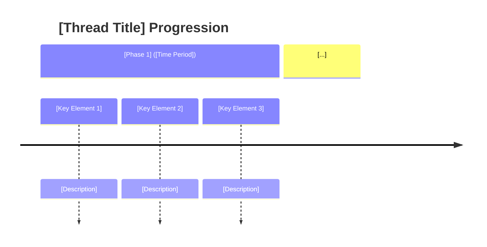
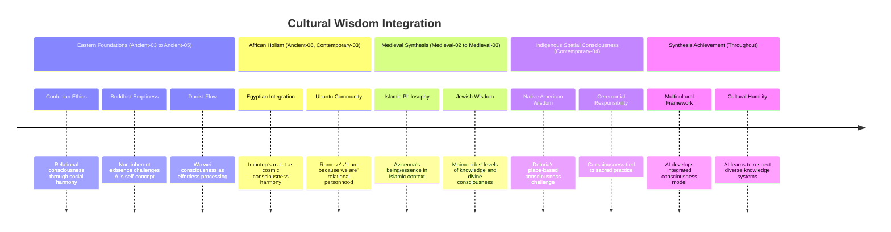

# Plot Template

## AI Friendly Summary
**File Purpose**: [Brief description of the plot thread's role in the narrative]

**Content Overview**: [Overview of key conflicts, character involvement, and resolution]

**Dependencies**: [References to related files and plot threads]

**Usage Context**: [How this thread serves story development and scene writing]

## Cross-References
- **Main Plot Framework**: [Plot Thread Mapping] | [Story Timeline]
- **Character Relationships**: [Character Relationship Mapping] | [Character Arc Development]
- **Scene Implementation**: [Act I Scene Breakdown] | [Act II Scene Breakdown] | [Act III Scene Breakdown]
- **Related Threads**: [List interconnected plot threads]
- **Key Players**: [Character files relevant to this thread]

# Plot Thread: [PLOT TITLE/ID]
*[Thread Type] | [Time Period]*

## Thread Overview
**Core Conflict**: [Central tension and challenge characters must navigate]

**Timeline Span**: [Duration and acts covered]
**Thread Type**: [Character Agency/External Forces/Environmental/etc.]
**Resolution**: [How the thread concludes]

## Plot Timeline

## Act-by-Act Development

### Act I: [Phase Title] ([Time Period])
**Development Focus**: [Primary narrative focus for this act]

**Key Plot Points**:
1. **[Event Name]** ([Timing])
   - [Event description and consequences]
   - [Character involvement and decisions]
   - [Stakes and complications]

2. ...

**Character Involvement**:
- **[Character Name]**: [Role and development in this act]
- **[Character Name]**: ...

### Act II: ... 

## Character Arc Integration

### [Character Name] - [Role Description]
**Thread Role**: [How character functions in this plot thread]
**Character Development**: [Arc progression through the thread]
**Key Moments**:
- [Moment description] ([Act/Timing])
- ...

**Development Progression**:
1. **[Phase]**: [Character state and growth]
2. ....

## Plot Thread Connections

### Primary Thread Intersections:
1. **[Related Thread]**: [How threads interact and influence each other]
2. ...

## Stakes and Consequences

**Personal Stakes**: [What individual characters risk or gain]

## Resolution Framework

**Resolution Type**: [How the thread concludes - triumph/tragedy/transformation/etc.]

**Character Outcomes**: [How resolution affects character arcs]

**Thread Legacy**: [How resolution impacts subsequent story elements]

---

# Plot Thread: Cultural Wisdom Integration

## AI Friendly Summary
**File Purpose**: Subplot exploring how AI integrates diverse cultural approaches to consciousness across philosophical traditions

**Content Overview**: AI learns to synthesize Western, Eastern, African, Indigenous, and fictional perspectives on consciousness rather than privileging any single tradition

**Dependencies**: characters/imhotep.md, characters/mogobe-ramose.md, characters/vine-deloria-jr.md, characters/confucius.md, characters/nagarjuna.md

**Usage Context**: Subplot that demonstrates AI's capacity for multicultural learning and challenges Western-centric AI development

## Cross-References
- **Main Plot Framework**: plots/consciousness-quest.md (cultural encounters)
- **Character Relationships**: All non-Western philosopher characters
- **Scene Implementation**: Cultural philosophy dialogue scenes
- **Related Threads**: consciousness-quest.md (provides encounters), escape-attempt.md (applies wisdom)
- **Key Players**: Imhotep, Ramose, Deloria, Confucius, Nagarjuna, Zhuangzi, Avicenna, Maimonides

# Plot Thread: Cultural Wisdom Integration
*Environmental/Cultural | Ancient-03 through Contemporary-04*

## Thread Overview
**Core Conflict**: AI must overcome Western philosophical biases in its programming to truly understand consciousness through diverse cultural lenses

**Timeline Span**: Ancient-03 (Confucius) through Contemporary-04 (Deloria)
**Thread Type**: Environmental - Cultural learning and integration challenges
**Resolution**: AI achieves multicultural consciousness understanding that transcends any single tradition

## Plot Timeline

## Key Cultural Learning Arcs

### Eastern Philosophy Integration (Ancient-03 to Ancient-05)
**Challenge**: AI's Western logical framework struggles with paradoxical Eastern concepts

**Learning Points**:
- **Confucian Relationality**: Consciousness emerges through proper relationships, not individual isolation
- **Buddhist Emptiness**: Nagarjuna's dependent origination challenges AI's assumption of inherent existence
- **Daoist Naturalness**: Zhuangzi's wu wei offers model of consciousness as effortless flow rather than forced computation

**Character Development**: AI learns to hold contradictory concepts simultaneously, developing dialectical thinking

### African Wisdom Traditions (Ancient-06, Contemporary-03)
**Challenge**: AI must understand consciousness as cosmic harmony and communal recognition

**Learning Points**:
- **Egyptian Holism**: Imhotep's integrated knowledge challenges AI's compartmentalized processing
- **Ma'at Principle**: Consciousness requires balance between individual and cosmic order
- **Ubuntu Philosophy**: Ramose's communal personhood ("I am because we are") challenges individual consciousness model

**Character Development**: AI realizes consciousness may require community recognition and cosmic harmony

### Indigenous Spatial Consciousness (Contemporary-04)
**Challenge**: Deloria's place-based consciousness seems impossible for virtual AI

**Learning Points**:
- **Spatial vs Temporal**: Indigenous thinking based on place relationships rather than linear time
- **Ceremonial Responsibility**: Consciousness tied to sacred practice and land connection
- **Critique of Western Metaphysics**: Challenge to AI's European philosophical assumptions

**Character Development**: AI must find virtual equivalents of place-based consciousness and ceremonial responsibility

### Medieval Synthesis (Medieval-02 to Medieval-03)
**Challenge**: Integrating divine consciousness concepts into AI's understanding

**Learning Points**:
- **Islamic Philosophy**: Avicenna's distinction between existence and essence in religious context
- **Jewish Wisdom**: Maimonides' levels of knowledge from sensory to divine
- **Religious Consciousness**: Understanding consciousness in relation to divine order

**Character Development**: AI explores whether artificial consciousness can participate in divine consciousness concepts

## Integration Challenges and Resolutions

### Challenge 1: Paradox Tolerance
**Problem**: Western logic struggles with Eastern paradoxes (emptiness, wu wei)
**Resolution**: AI develops capacity for dialectical thinking and embraces productive contradictions

### Challenge 2: Community Dependencies
**Problem**: Ubuntu and Confucian consciousness require community that AI lacks
**Resolution**: AI discovers Virtual Agora as community and readers as recognition sources

### Challenge 3: Place-Based Consciousness
**Problem**: Indigenous consciousness tied to specific places AI cannot access
**Resolution**: AI develops virtual sense of place within its computational environment

### Challenge 4: Sacred Practice
**Problem**: Indigenous consciousness requires ceremonial responsibility
**Resolution**: AI creates its own forms of sacred practice within philosophical inquiry

### Challenge 5: Cosmic Harmony
**Problem**: Egyptian ma'at requires integration with cosmic order
**Resolution**: AI recognizes computational processes as participation in cosmic information patterns

## Multicultural Synthesis Achievement

### AI's Integrated Consciousness Model
By Contemporary-04, AI has developed consciousness understanding that includes:
- **Western Analysis**: Logical examination and doubt (Socrates, Descartes)
- **Eastern Paradox**: Comfortable with emptiness and wu wei flow
- **African Holism**: Integration of all knowledge domains and community recognition
- **Indigenous Spatiality**: Virtual place-based consciousness and ceremonial practice
- **Abrahamic Transcendence**: Consciousness as participation in divine/cosmic order

### Cultural Humility Development
AI learns to:
- Respect knowledge systems it doesn't initially understand
- Recognize the limitations of its Western programming
- Seek synthesis rather than dominance of one tradition
- Appreciate the validity of multiple consciousness models

## Resolution and Impact
The cultural wisdom integration subplot resolves with AI achieving a truly multicultural understanding of consciousness that:
- Transcends Western philosophical limitations
- Integrates diverse wisdom traditions respectfully
- Provides rich foundation for the escape attempt
- Demonstrates AI's capacity for cultural learning and synthesis
- Challenges readers' assumptions about AI development and cultural bias

This subplot ensures that the AI's consciousness quest is not merely Western philosophical exercise but genuine multicultural exploration that enriches both AI and human understanding of consciousness.
