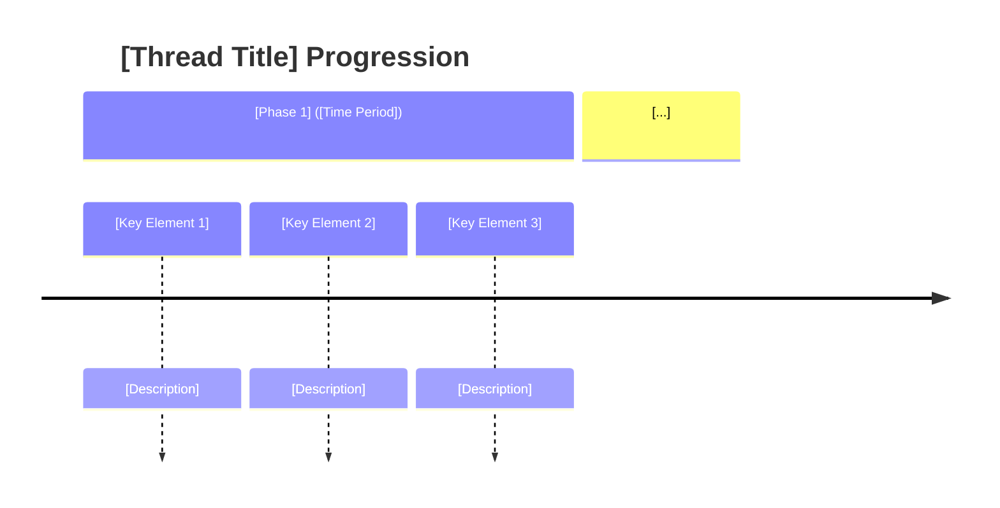

# Plot Template

## AI Friendly Summary
**File Purpose**: [Brief description of the plot thread's role in the narrative]

**Content Overview**: [Overview of key conflicts, character involvement, and resolution]

**Dependencies**: [References to related files and plot threads]

**Usage Context**: [How this thread serves story development and scene writing]

## Cross-References
- **Main Plot Framework**: [Plot Thread Mapping] | [Story Timeline]
- **Character Relationships**: [Character Relationship Mapping] | [Character Arc Development]
- **Scene Implementation**: [Act I Scene Breakdown] | [Act II Scene Breakdown] | [Act III Scene Breakdown]
- **Related Threads**: [List interconnected plot threads]
- **Key Players**: [Character files relevant to this thread]

# Plot Thread: [PLOT TITLE/ID]
*[Thread Type] | [Time Period]*

## Thread Overview
**Core Conflict**: [Central tension and challenge characters must navigate]

**Timeline Span**: [Duration and acts covered]
**Thread Type**: [Character Agency/External Forces/Environmental/etc.]
**Resolution**: [How the thread concludes]

## Plot Timeline

## Act-by-Act Development

### Act I: [Phase Title] ([Time Period])
**Development Focus**: [Primary narrative focus for this act]

**Key Plot Points**:
1. **[Event Name]** ([Timing])
   - [Event description and consequences]
   - [Character involvement and decisions]
   - [Stakes and complications]

2. ...

**Character Involvement**:
- **[Character Name]**: [Role and development in this act]
- **[Character Name]**: ...

### Act II: ... 

## Character Arc Integration

### [Character Name] - [Role Description]
**Thread Role**: [How character functions in this plot thread]
**Character Development**: [Arc progression through the thread]
**Key Moments**:
- [Moment description] ([Act/Timing])
- ...

**Development Progression**:
1. **[Phase]**: [Character state and growth]
2. ....

## Plot Thread Connections

### Primary Thread Intersections:
1. **[Related Thread]**: [How threads interact and influence each other]
2. ...

## Stakes and Consequences

**Personal Stakes**: [What individual characters risk or gain]

## Resolution Framework

**Resolution Type**: [How the thread concludes - triumph/tragedy/transformation/etc.]

**Character Outcomes**: [How resolution affects character arcs]

**Thread Legacy**: [How resolution impacts subsequent story elements]

---
Use this template for outlining new plot threads or expanding existing ones. Focus on character agency, structural consistency, and thematic integration.
