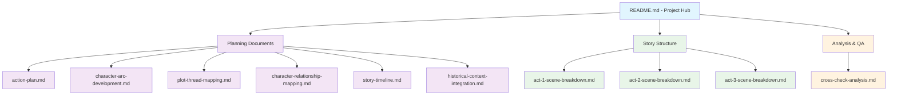

<!-- filepath: /Users/sami.j.p.heikkinen/Documents/src/summer-2025/da-dl/recursive-writing/the-crimson-veil/stories/political-intrigue-957-958/README.md -->
# Story Delegation: Political Intrigue of 957-958 AV

## AI Friendly Summary
**File Purpose**: Primary README file for the political intrigue story project, providing comprehensive overview of story parameters, scope, structure, and serving as the central navigation hub for all project files and cross-references.

**Content Overview**: Contains delegated story parameters (time period, location, theme, protagonist), narrative scope and timeline, character integration overview, file structure documentation, cross-reference index, and project navigation guidelines for efficient story development workflow.

**Dependencies**: Serves as the central hub connecting all project files including planning documents, scene breakdowns, character development, timeline, historical context, and analysis files. No external dependencies but references the broader universe bible.

**Usage Context**: Primary entry point for new team members, central navigation for writers and editors, project overview for stakeholders, and master reference for maintaining story coherence and scope throughout development process.

## Cross-Reference Index
- **Project Management**: [Action Plan](./action-plan.md) - Task coordination and milestone tracking
- **Quality Assurance**: [Cross-Check Analysis](./cross-check-analysis.md) - Progress tracking and validation
- **Story Structure**: 
  - [Act I Scene Breakdown](./act-1-scene-breakdown.md) - Introduction phase scenes
  - [Act II Scene Breakdown](./act-2-scene-breakdown.md) - Escalation phase scenes  
  - [Act III Scene Breakdown](./act-3-scene-breakdown.md) - Resolution phase scenes
- **Character Development**: [Character Arc Development](./character-arc-development.md) - Character transformation tracking
- **Plot Integration**: [Plot Thread Mapping](./plot-thread-mapping.md) - Plot coherence and threading
- **Timeline Coordination**: [Story Timeline](./story-timeline.md) - Chronological framework
- **Relationship Dynamics**: [Character Relationship Mapping](./character-relationship-mapping.md) - Political alliances and conflicts
- **Historical Context**: [Historical Context Integration](./historical-context-integration.md) - Universe continuity and background

## Project File Structure



## Project Development Status

| Phase | Components | Status | Files Count | Completion |
|-------|------------|--------|-------------|------------|
| **Foundation** | Core planning documents | ✅ Complete | 6/6 | 100% |
| **Structure** | Scene breakdowns | ✅ Complete | 3/3 | 100% |
| **Documentation** | Standards implementation | ✅ Complete | 8/8 | 100% |
| **Characters** | Character files | 📋 Planned | 0/7 | 0% |
| **Plots** | Plot detail files | 📋 Planned | 0/4 | 0% |
| **Scenes** | Individual scene files | 📋 Planned | 0/25 | 0% |

## DELEGATED STORY PARAMETERS

### Time Period
**957-958 AV (Annus Velocitas)**
- Immediately preceding the War of the Crimson Veil
- Political tensions at breaking point
- Diplomatic breakdown across the continent
- Succession crisis intensifying in Regnum Aethermoor

### Location
**Regnum Aethermoor (Central Kingdom)**
- Capital: Aethermoor City with the Throne Celestial
- Political center of the continent
- Home to the succession crisis
- Hub of diplomatic activity and court intrigue

### Theme
**Political Intrigue & Diplomatic Breakdown**
- Court maneuvering and political scheming
- Alliance formations and betrayals
- Intelligence gathering and espionage
- Diplomatic negotiations under pressure
- The personal cost of political ambition

### Protagonist
**Lady Lucretia Aurelia Corvina**
- Court diplomat and political insider
- Chief Diplomatic Liaison to Foreign Courts
- Duchess of Corvinium
- Royal bloodline with stake in succession
- Positioned to witness and influence critical events

## STORY SCOPE

### Narrative Arc
The 18-month period following the formal opening of succession deliberations through the final breakdown of diplomatic solutions, culminating in the first acts of war.

### Key Events Timeline
- **957 AV Early**: Succession deliberations begin
- **957 AV Mid**: First diplomatic missions to foreign courts
- **957 AV Late**: Alliance negotiations and secret agreements
- **958 AV Early**: Intelligence operations and court espionage
- **958 AV Mid**: Final diplomatic conferences fail
- **958 AV Late**: War preparations and first military actions

### Character Integration
- **Gareth Aurelius**: Rightful heir and key political figure
- **Cassius Ferox**: Military commander and rival faction leader
- **Caelestis Stellarum**: Mystical adviser with political influence
- **Foreign dignitaries**: Representatives from other kingdoms
- **Court nobles**: Supporting cast for political maneuvering

## CROSS-REFERENCES

### Universe Files
- `/characters/gareth-aurelius-prince.md` - Primary political figure
- `/characters/lucretia-aurelia-court-diplomat.md` - Protagonist
- `/characters/cassius-ferox-general.md` - Military rival
- `/characters/caelestis-stellarum-mystic.md` - Court adviser
- `/locations/regnum-aethermoor.md` - Primary setting
- `/timeline.md` - Historical context
- `/planning/political-intrigue-story-framework.md` - Story structure
- `/planning/political-crisis-events-timeline.md` - Plot events

### Story Directory Structure
```
/stories/political-intrigue-957-958/
├── README.md (this file)
├── scenes/
├── chapters/
├── character-arcs/
├── plot-threads/
├── research/
└── timeline/
```

## NEXT PHASE
Proceed with detailed scene-by-scene breakdown and narrative structure creation within this focused story directory.
