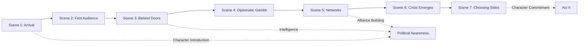

<!-- filepath: /Users/sami.j.p.heikkinen/Documents/src/summer-2025/da-dl/recursive-writing/the-crimson-veil/stories/political-intrigue-957-958/act-1-scene-breakdown.md -->
# Act I Scene-by-Scene Breakdown
*Political Intrigue Story | Period: 957 AV Early-Mid | 6 months duration*

## AI Friendly Summary
**File Purpose**: Provides detailed scene-by-scene breakdown for Act I of the political intrigue story, covering the first 6 months and 7 scenes of diplomatic introduction and crisis emergence.
**Content Overview**: Complete scene specifications including POV characters, objectives, conflicts, timeline placement, character involvement, and plot thread integration for each Act I scene.
**Dependencies**: References character-arc-development.md for character development, plot-thread-mapping.md for plot integration, and story-timeline.md for temporal alignment.
**Usage Context**: Direct reference for writing Act I scenes, ensuring consistent character development, proper conflict escalation, and accurate timeline placement.

## Cross-References
- **Character Development**: See [Character Arc Development](./character-arc-development.md) for character growth across Act I scenes
- **Plot Integration**: See [Plot Thread Mapping](./plot-thread-mapping.md) for plot thread involvement in each scene
- **Timeline Context**: See [Story Timeline](./story-timeline.md) for monthly event context surrounding each scene
- **Character Relationships**: See [Character Relationship Mapping](./character-relationship-mapping.md) for relationship development in scenes
- **Continuation**: See [Act II Scene Breakdown](./act-2-scene-breakdown.md) and [Act III Scene Breakdown](./act-3-scene-breakdown.md) for subsequent acts

## ACT I OVERVIEW
**Timeframe**: Early 957 AV - Mid 957 AV (6 months)
**Theme**: Introduction to Crisis and Characters
**Arc**: Establishing diplomatic tensions leading to succession crisis

## Act I Scene Progression

## Scene Structure Matrix

| Scene | Timeline | POV | Primary Conflict | Character Development | Plot Threads | Relationship Changes |
|-------|----------|-----|------------------|---------------------|-------------|---------------------|
| **1** | Month 1, Week 1 | Lucretia | Expectations vs Reality | Professional Confidence | Diplomatic Setup | Professional Introductions |
| **2** | Month 1, Week 2 | Lucretia | Formal vs Hidden Agendas | Growing Awareness | Succession Hints | Royal Family Dynamics |
| **3** | Month 1, Week 3 | Cassius | Information vs Discovery | Intelligence Introduction | Intelligence Networks | Lucretia-Cassius Alliance |
| **4** | Month 2, Week 1 | Lucretia | Bold Move vs Safety | Risk Taking | Diplomatic Crisis | Professional Risk |
| **5** | Month 2, Week 3 | Cassius | Network Building vs Exposure | Operational Development | Intelligence Operations | Network Establishment |
| **6** | Month 4, Week 2 | Court Official | Loyalty vs Opportunity | Political Awakening | Succession Crisis | Faction Formation |
| **7** | Month 6, Week 4 | Lucretia | Duty vs Conviction | Character Transformation | Alliance Formation | Personal Commitment |

---

## SCENE 1: THE DIPLOMAT'S ARRIVAL
**Date**: Early 957 AV (Month 1)
**Location**: Regnum Aethermoor Royal Court
**POV**: Lady Lucretia Aurelia Corvina
**Purpose**: Character introduction, world establishment

### Scene Elements:
- Lucretia arrives at court for diplomatic assignment
- Introduction to court politics and key players
- Establish her reputation and capabilities
- Hint at underlying tensions between kingdoms

### Key Characters Introduced:
- Lucretia (protagonist)
- Court officials and advisors
- Regional representatives

### Scene Beats:
1. Arrival ceremony and formal presentation
2. Initial court interactions and assessments
3. Private briefing on current political climate
4. First glimpse of deeper tensions

---

## SCENE 2: THE FIRST AUDIENCE
**Date**: Early 957 AV (Month 1)
**Location**: Royal Throne Room
**POV**: Lucretia
**Purpose**: Establish central conflict

### Scene Elements:
- Lucretia's formal presentation to court
- Discussion of trade disputes and border tensions
- First glimpse of succession concerns
- Introduction of political factions

### Key Characters:
- Ruling monarch (aging/ill)
- Court advisors with conflicting loyalties
- Foreign ambassadors

### Scene Beats:
1. Formal throne room presentation
2. Discussion of inter-kingdom trade issues
3. Subtle hints about royal health concerns
4. Observation of factional divisions

---

## SCENE 3: BEHIND CLOSED DOORS
**Date**: Early 957 AV (Month 2)
**Location**: Private chambers/council rooms
**POV**: Lucretia
**Purpose**: Reveal deeper political machinations

### Scene Elements:
- Private meetings with key political figures
- Intelligence gathering on succession plans
- Personal relationships begin forming
- First major political revelation

### Key Characters:
- Gareth Ironhold (military/political figure)
- Secret advisors and spies
- Potential heirs to throne

### Scene Beats:
1. Confidential briefing with trusted advisor
2. Introduction to Gareth Ironhold
3. Discovery of succession planning discussions
4. Personal connection with key player

---

## SCENE 4: THE DIPLOMATIC GAMBIT
**Date**: Mid 957 AV (Month 3)
**Location**: Diplomatic chambers
**POV**: Lucretia
**Purpose**: Escalate tensions

### Scene Elements:
- Major diplomatic negotiation attempt
- Revelation of competing kingdom interests
- Lucretia's skills tested under pressure
- First major failure or setback

### Key Characters:
- Foreign diplomatic corps
- Cassius (intelligence/military operations)
- Local political factions

### Scene Beats:
1. High-stakes negotiation session
2. Unexpected demands from foreign powers
3. Intelligence complications revealed
4. Diplomatic breakdown threatens peace

---

## SCENE 5: INTELLIGENCE NETWORKS
**Date**: Mid 957 AV (Month 4)
**Location**: Various locations (taverns, private homes)
**POV**: Lucretia or Cassius
**Purpose**: Expand plot complexity

### Scene Elements:
- Introduction to spy networks and intelligence operations
- Discovery of larger conspiracy
- Personal stakes become clear
- Alliance building begins

### Key Characters:
- Cassius (expanded role)
- Spy network contacts
- Opposition agents

### Scene Beats:
1. Meeting with intelligence operatives
2. Revelation of foreign interference
3. Personal threat to Lucretia discovered
4. Recruitment of trusted allies

---

## SCENE 6: THE SUCCESSION CRISIS EMERGES
**Date**: Mid 957 AV (Month 5)
**Location**: Royal Court
**POV**: Lucretia
**Purpose**: Major plot acceleration

### Scene Elements:
- Health crisis of current ruler
- Succession dispute becomes public
- Foreign kingdoms position themselves
- Lucretia's role becomes critical

### Key Characters:
- Royal family members
- Succession claimants
- Foreign powers

### Scene Beats:
1. Royal health emergency
2. Public announcement of succession concerns
3. Foreign ambassadors demand meetings
4. Lucretia positioned as key mediator

---

## SCENE 7: CHOOSING SIDES
**Date**: Mid 957 AV (Month 6)
**Location**: Multiple locations
**POV**: Lucretia
**Purpose**: Character development and plot commitment

### Scene Elements:
- Lucretia must choose political allegiances
- Personal relationships tested
- First major diplomatic breakdown
- Setup for Act II escalation

### Key Characters:
- All major players
- Personal allies and enemies
- Representatives of various factions

### Scene Beats:
1. Forced to choose between competing loyalties
2. Personal relationships strained by politics
3. Major diplomatic failure
4. Commitment to specific faction/approach

---

## ACT I RESOLUTION
**Status**: Political crisis established, sides chosen, war inevitable
**Character Arc**: Lucretia transformed from neutral diplomat to key player
**Plot Threads**: All major threads introduced and interconnected
**Transition**: Sets up escalating conflict for Act II

## SCENE CONNECTIONS
- Each scene builds character relationships progressively
- Political tension escalates through each encounter
- Intelligence operations become more complex and dangerous
- Personal stakes increase throughout the act

## WRITING NOTES
- Focus on political intrigue over action sequences
- Emphasize character relationships and motivations
- Build world through diplomatic interactions
- Maintain historical consistency with universe timeline
- Balance exposition with character development
