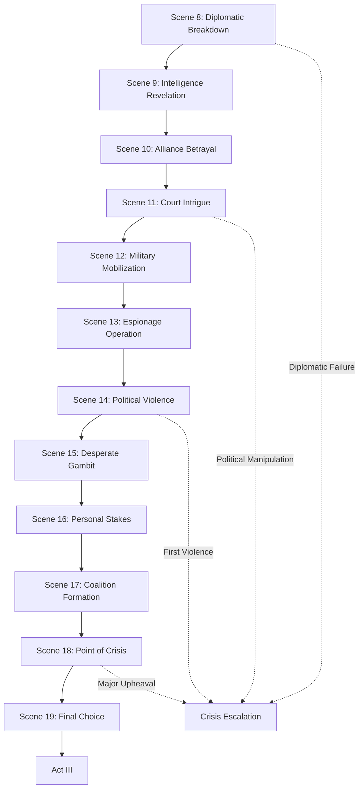

<!-- filepath: /Users/sami.j.p.heikkinen/Documents/src/summer-2025/da-dl/recursive-writing/the-crimson-veil/stories/political-intrigue-957-958/act-2-scene-breakdown.md -->
# Act II Scene-by-Scene Breakdown
*Political Intrigue Story | Period: 957 AV Late - 958 AV Mid | 8 months duration*

## AI Friendly Summary
**File Purpose**: Details all 12 scenes in Act II covering the crisis escalation phase from diplomatic breakdown to commitment point, spanning 8 months of intensifying political conflict.
**Content Overview**: Complete scene specifications for the middle act, including escalating conflicts, character transformations, alliance formations, and plot convergence toward inevitable war.
**Dependencies**: Builds on act-1-scene-breakdown.md character establishment, integrates with plot-thread-mapping.md escalation, and aligns with story-timeline.md monthly progression.
**Usage Context**: Essential guide for writing Act II scenes with proper conflict escalation, character development consistency, and smooth transition to Act III climax.

## Cross-References
- **Previous Act**: See [Act I Scene Breakdown](./act-1-scene-breakdown.md) for character establishment and initial conflict setup
- **Next Act**: See [Act III Scene Breakdown](./act-3-scene-breakdown.md) for climax and resolution scenes
- **Character Development**: See [Character Arc Development](./character-arc-development.md) for Act II character transformations
- **Plot Integration**: See [Plot Thread Mapping](./plot-thread-mapping.md) for plot thread escalation in Act II
- **Timeline Context**: See [Story Timeline](./story-timeline.md) for monthly event framework

## ACT II OVERVIEW
**Timeframe**: Mid 957 AV - Early 958 AV (8 months)  
**Theme**: Crisis Escalation and Alliance Formation
**Arc**: From diplomatic breakdown to point of no return

## Act II Escalation Pattern

## Act II Scene Intensity Matrix

| Scene | Month | Conflict Level | Character Stakes | Political Tension | Violence Risk | Story Impact |
|-------|-------|----------------|------------------|-------------------|---------------|-------------|
| **8** | 7 | High | Professional | International Crisis | Low | Plot Acceleration |
| **9** | 7 | High | Personal Danger | Espionage Exposure | Medium | Information Warfare |
| **10** | 8 | Very High | Betrayal Shock | Alliance Collapse | Medium | Trust Destruction |
| **11** | 9 | High | Political Survival | Internal Palace War | Low | Power Struggles |
| **12** | 10 | Very High | War Preparation | Military Escalation | High | Point of No Return |
| **13** | 11 | Extreme | Life Threatening | Intelligence Crisis | Very High | Network Collapse |
| **14** | 12 | Extreme | First Blood | Political Violence | Extreme | Moral Boundaries |
| **15** | 12 | Desperate | All or Nothing | Last Chance Gambit | High | Character Desperation |
| **16** | 13 | Personal | Relationship Crisis | Emotional Breakdown | Medium | Character Relationships |
| **17** | 13 | Strategic | Alliance Building | Coalition Politics | Medium | Final Preparations |
| **18** | 14 | Critical | Political Upheaval | Major Crisis Point | High | Turning Point |
| **19** | 14 | Transformative | Character Commitment | Side Choosing | Medium | Character Resolution |

---

## SCENE 8: DIPLOMATIC BREAKDOWN
**Date**: Late 957 AV (Month 7)
**Location**: Royal Council Chamber
**POV**: Lucretia
**Purpose**: Major plot acceleration - diplomacy fails

### Scene Elements:
- Final diplomatic mission collapses
- Foreign powers withdraw ambassadors  
- Succession dispute becomes international crisis
- Lucretia's role shifts from mediator to partisan

### Key Characters:
- Foreign ambassadors departing
- Royal council members choosing sides
- Succession claimants positioning themselves

### Scene Beats:
1. Tense final negotiation session
2. Diplomatic protocol breakdown
3. Ambassador withdrawal announcements
4. Lucretia forced to choose loyalties

---

## SCENE 9: INTELLIGENCE REVELATION
**Date**: Late 957 AV (Month 7)
**Location**: Secret meeting location
**POV**: Cassius
**Purpose**: Expose hidden conspiracy

### Scene Elements:
- Critical intelligence discovery about succession plot
- Foreign interference exposed
- Network of spies and agents revealed
- Personal danger to key characters

### Key Characters:
- Cassius and intelligence operatives
- Foreign agents and double agents
- Court officials with hidden loyalties

### Scene Beats:
1. Intelligence briefing with shocking revelations
2. Evidence of foreign manipulation
3. Discovery of assassination plots
4. Network exposure and counter-intelligence

---

## SCENE 10: ALLIANCE BETRAYAL
**Date**: Early 958 AV (Month 8)
**Location**: Noble estates and court
**POV**: Court Official
**Purpose**: Political backstabbing revealed

### Scene Elements:
- Trusted ally switches sides
- Political coalitions collapse and reform
- Personal relationships destroyed by politics
- New alliance structures emerge

### Key Characters:
- Betraying noble/official
- Shocked allies and victims
- New coalition leaders

### Scene Beats:
1. Secret meeting revealing betrayal
2. Public announcement of side-switching
3. Reaction from former allies
4. Scramble to form new alliances

---

## SCENE 11: COURT INTRIGUE
**Date**: Early 958 AV (Month 9)
**Location**: Royal palace - throne room and chambers
**POV**: Royal Family Member
**Purpose**: Internal palace power struggles

### Scene Elements:
- Palace faction warfare intensifies
- Royal family members take opposing sides
- Court positions redistributed based on loyalty
- Violence threatens within palace walls

### Key Characters:
- Competing royal family members
- Court officials maneuvering for position
- Palace guards with divided loyalties

### Scene Beats:
1. Family confrontation over succession
2. Redistribution of court positions
3. Threat of violence within palace
4. Security concerns and loyalty tests

---

## SCENE 12: MILITARY MOBILIZATION
**Date**: Early 958 AV (Month 10)  
**Location**: Military compounds and training grounds
**POV**: Gareth
**Purpose**: War preparations begin in earnest

### Scene Elements:
- Military units called to active duty
- Weapons and supplies stockpiled
- Officers declare for competing claimants
- First signs of civil war preparation

### Key Characters:
- Military commanders choosing sides
- Rank-and-file soldiers and their concerns
- Quartermasters and logistic officers

### Scene Beats:
1. Military mobilization orders
2. Officers declaring allegiances
3. Troop movements and positioning
4. Preparation for potential civil conflict

---

## SCENE 13: ESPIONAGE OPERATION
**Date**: Mid 958 AV (Month 11)
**Location**: Various clandestine locations
**POV**: Cassius
**Purpose**: High-risk intelligence mission

### Scene Elements:
- Critical spy mission to uncover enemy plans
- Personal risk and sacrifice required
- Information that could change the conflict
- Network loyalty and betrayal themes

### Key Characters:
- Cassius and his operatives
- Enemy agents and targets
- Informants and double agents

### Scene Beats:
1. Mission briefing and preparation
2. Infiltration and intelligence gathering
3. Unexpected complications and dangers
4. Escape with vital information

---

## SCENE 14: POLITICAL VIOLENCE
**Date**: Mid 958 AV (Month 12)
**Location**: Public spaces - markets, streets
**POV**: Lucretia
**Purpose**: First blood spilled - point of no return

### Scene Elements:
- Street violence between faction supporters
- First political assassinations occur
- Public order breaks down
- Martial law considered or implemented

### Key Characters:
- Faction supporters and agitators
- Victims of political violence
- City guards and law enforcement

### Scene Beats:
1. Peaceful demonstration turns violent
2. Assassination attempt or success
3. Street fighting between factions
4. Authority response and escalation

---

## SCENE 15: DESPERATE GAMBIT
**Date**: Late 958 AV (Month 12)
**Location**: Secret diplomatic venue
**POV**: Gareth
**Purpose**: Risky attempt to prevent civil war

### Scene Elements:
- Secret meeting between faction leaders
- High-stakes negotiation for peace
- Personal sacrifice offers considered
- Failure leads to inevitable conflict

### Key Characters:
- Leaders of competing factions
- Neutral mediators and observers
- Personal representatives of claimants

### Scene Beats:
1. Clandestine peace meeting arranged
2. Each side presents final terms
3. Negotiations break down over core issues
4. Final diplomatic failure confirmed

---

## SCENE 16: PERSONAL STAKES
**Date**: Late 958 AV (Month 13)
**Location**: Private residences and personal spaces
**POV**: Lucretia
**Purpose**: Character relationships tested by politics

### Scene Elements:
- Personal friendships strained by political choices
- Romantic relationships affected by faction loyalties
- Family members on opposing sides
- Personal cost of political commitment

### Key Characters:
- Lucretia's personal friends and lovers
- Family members with divided loyalties
- Former allies now opponents

### Scene Beats:
1. Difficult personal confrontations
2. Relationship choices forced by politics
3. Personal sacrifices for political beliefs
4. Isolation and commitment to cause

---

## SCENE 17: COALITION FORMATION
**Date**: Early 958 AV (Month 13)
**Location**: Noble estates and meeting halls
**POV**: Foreign Ambassador
**Purpose**: Final alliance building attempts

### Scene Elements:
- Last-minute coalition building
- Foreign powers declare support
- Military alliances formalized
- Final diplomatic positioning

### Key Characters:
- Coalition leaders and negotiators
- Foreign representatives
- Military commanders joining alliances

### Scene Beats:
1. Multi-party alliance negotiations
2. Foreign support declarations
3. Military pact formations
4. Final diplomatic positioning

---

## SCENE 18: POINT OF CRISIS
**Date**: Mid 958 AV (Month 14)
**Location**: Royal court and surrounding city
**POV**: Succession Claimant
**Purpose**: Major political upheaval - no turning back

### Scene Elements:
- Royal authority openly challenged
- Competing succession claims formalized
- Government institutions choose sides
- Constitutional crisis declared

### Key Characters:
- Succession claimants and their supporters
- Government officials and institutions
- Religious and legal authorities

### Scene Beats:
1. Open challenge to royal authority
2. Formal succession claims presented
3. Institutional breakdown
4. Constitutional crisis acknowledged

---

## SCENE 19: FINAL CHOICE
**Date**: Late 958 AV (Month 14)
**Location**: Multiple locations - final meetings
**POV**: Lucretia
**Purpose**: Characters commit to warring sides

### Scene Elements:
- All major characters make final commitments
- No possibility of neutrality remains
- Personal costs fully understood
- War becomes inevitable

### Key Characters:
- All major characters in final decision moments
- Faction leaders accepting new members
- Neutral parties forced to choose

### Scene Beats:
1. Final ultimatums presented
2. Character decision moments
3. Public declarations of loyalty
4. Bridge-burning and commitment

---

## ACT II RESOLUTION
**Status**: Diplomacy failed, alliances formed, war inevitable
**Character Arc**: All characters committed to specific factions
**Plot Threads**: All conflicts escalated beyond peaceful resolution
**Transition**: Sets up war preparation and final choices for Act III

## SCENE CONNECTIONS
- Escalating pattern of crisis building throughout act
- Character loyalties tested and solidified
- International involvement increases stakes
- Personal costs of political involvement explored
- Military and intelligence operations intensify

## WRITING NOTES
- Focus on mounting tension and impossible choices
- Show the personal cost of political commitment  
- Build toward inevitable war through failed diplomacy
- Maintain character development within political framework
- Balance action with political intrigue and character drama
