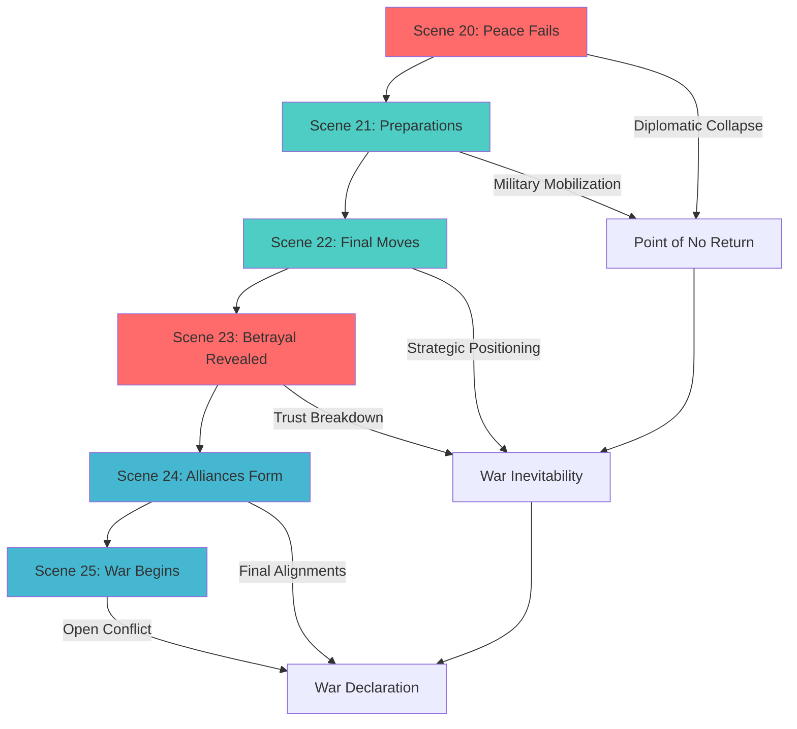

<!-- filepath: /Users/sami.j.p.heikkinen/Documents/src/summer-2025/da-dl/recursive-writing/the-crimson-veil/stories/political-intrigue-957-958/act-3-scene-breakdown.md -->
# Act III Scene-by-Scene Breakdown
*Political Intrigue Story | Period: 958 AV Mid-Late | 4 months duration*

## AI Friendly Summary
**File Purpose**: Contains detailed scene-by-scene breakdown for Act III of the political intrigue story, covering the climactic resolution phase from mid to late 958 AV where diplomatic efforts fail and the War of the Crimson Veil begins.

**Content Overview**: Documents 6 scenes (Scenes 20-25) spanning 4 months, featuring the point of no return where peace negotiations collapse, military preparations escalate, and the transition from political intrigue to open warfare. Each scene includes POV character, location, purpose, key elements, characters, and detailed scene beats.

**Dependencies**: Requires character development arcs from `character-arc-development.md`, plot thread resolutions from `plot-thread-mapping.md`, relationship dynamics from `character-relationship-mapping.md`, and timeline coordination with `story-timeline.md`. Builds directly on escalation from `act-2-scene-breakdown.md`.

**Usage Context**: Final act implementation for political intrigue story, used by writers for scene drafting, by editors for pacing review, and by continuity checkers for character arc completion and plot thread resolution validation.

## Cross-References
- **Previous Act**: [Act II Scene Breakdown](./act-2-scene-breakdown.md) - Escalation phase leading to this climactic resolution
- **Character Development**: [Character Arc Development](./character-arc-development.md) - Character transformation completion in final act
- **Plot Integration**: [Plot Thread Mapping](./plot-thread-mapping.md) - Resolution of all major plot threads
- **Timeline Context**: [Story Timeline](./story-timeline.md) - Chronological placement and crisis culmination
- **Relationship Dynamics**: [Character Relationship Mapping](./character-relationship-mapping.md) - Final relationship states and war alliances
- **Historical Context**: [Historical Context Integration](./historical-context-integration.md) - War of the Crimson Veil beginning and historical significance

## Act III Crisis Resolution Diagram

## Scene Climax Matrix

| Scene | POV | Primary Conflict | Resolution Type | Story Impact | Character Development |
|-------|-----|------------------|-----------------|--------------|---------------------|
| 20 | Lucretia | Diplomatic Failure | Negative - War Inevitable | Critical - Peace Lost | Lucretia accepts war reality |
| 21 | Gareth | Military Readiness | Positive - Forces Ready | High - War Preparation | Gareth embraces military role |
| 22 | Marcus | Strategic Positioning | Mixed - Gains & Losses | High - Power Shifts | Marcus shows true loyalty |
| 23 | Livia | Betrayal Exposure | Negative - Trust Broken | Critical - Alliances Shift | Livia's manipulation revealed |
| 24 | Elena | Alliance Formation | Positive - Unity Achieved | Critical - War Sides Set | Elena's leadership emerges |
| 25 | Multiple | War Declaration | Climactic - Conflict Begins | Maximum - Story Culmination | All arcs reach resolution |

## ACT III OVERVIEW
**Timeframe**: Mid 958 AV - Late 958 AV (4 months)
**Theme**: Point of No Return and War Declaration
**Arc**: From final diplomacy attempts to War of the Crimson Veil beginning

---

## SCENE 20: PEACE FAILS
**Date**: Mid 958 AV (Month 15)
**Location**: Neutral diplomatic venue
**POV**: Lucretia
**Purpose**: Last diplomatic attempt fails completely

### Scene Elements:
- Final peace conference convened
- All parties present for last negotiations
- Irreconcilable differences become clear
- Diplomatic option permanently closed

### Key Characters:
- All faction leaders and representatives
- Neutral mediators and observers
- International witnesses

### Scene Beats:
1. Formal peace conference opening
2. Each side presents non-negotiable demands
3. Realization that compromise is impossible
4. Conference collapse and diplomatic failure

---

## SCENE 21: PREPARATIONS
**Date**: Mid 958 AV (Month 16)
**Location**: Military camps and command centers
**POV**: Gareth
**Purpose**: War readiness and final military plans

### Scene Elements:
- Full military mobilization completed
- Battle plans finalized and distributed
- Final recruitment and training
- Moral and spiritual preparation for war

### Key Characters:
- Military commanders and officers
- Soldiers preparing for battle
- Support staff and logistics personnel

### Scene Beats:
1. Final military briefings and strategy
2. Troop deployments and positioning
3. Equipment distribution and final training
4. Moral preparation and unit cohesion

---

## SCENE 22: PERSONAL FAREWELLS
**Date**: Late 958 AV (Month 17)
**Location**: Private homes and personal spaces
**POV**: Multiple (rotating)
**Purpose**: Relationships severed by war choice

### Scene Elements:
- Friends and lovers say goodbye
- Family members part ways
- Personal items and mementos exchanged
- Understanding that war changes everything

### Key Characters:
- All major characters with personal connections
- Family members and loved ones
- Friends now on opposing sides

### Scene Beats:
1. Difficult personal goodbye scenes
2. Exchange of mementos and promises
3. Acknowledgment of uncertain future
4. Final emotional partings

---

## SCENE 23: FINAL GAMBIT
**Date**: Late 958 AV (Month 17)
**Location**: Clandestine meeting place
**POV**: Cassius
**Purpose**: Last attempt to prevent inevitable war

### Scene Elements:
- Secret plan to prevent war through intelligence
- High-risk operation with personal cost
- Final revelation of true stakes
- Heroic failure that confirms war necessity

### Key Characters:
- Cassius and key operatives
- Secret contacts and informants
- Hidden enemies and allies

### Scene Beats:
1. Secret mission briefing and preparation
2. Execution of final prevention attempt
3. Unexpected complications and betrayal
4. Mission failure but valuable intelligence gained

---

## SCENE 24: DECLARATION
**Date**: Late 958 AV (Month 18)
**Location**: Royal throne room and public spaces
**POV**: Royal Family Member
**Purpose**: War formally declared

### Scene Elements:
- Official war declaration ceremony
- Public proclamation to citizens
- Military orders distributed
- International notifications sent

### Key Characters:
- Royal family members making declarations
- Government officials and institutions
- Military leaders receiving orders
- Citizens and public representatives

### Scene Beats:
1. Formal war declaration ceremony
2. Public proclamation reading
3. Military orders issued
4. Public reaction and response

---

## SCENE 25: WAR BEGINS
**Date**: Late 958 AV (Month 18)
**Location**: Battlefield or border region
**POV**: Lucretia
**Purpose**: First battle and story conclusion

### Scene Elements:
- First military engagement begins
- Characters take their positions in conflict
- Crimson Veil phenomenon may appear
- Story concludes with war's beginning

### Key Characters:
- All major characters in their war roles
- Military commanders and soldiers
- Witnesses to history

### Scene Beats:
1. Final preparations and positioning
2. First shots fired or battle commenced
3. Character reactions to war reality
4. Transition to larger conflict (War of Crimson Veil)

## EPILOGUE: THE CRIMSON VEIL RISES
**Date**: Late 958 AV (Month 18+)
**Location**: Across the kingdom
**POV**: Omniscient narrator
**Purpose**: Connect to larger universe timeline

### Scene Elements:
- Crimson Veil phenomenon appears
- War spreads across the kingdom
- Characters' fates in larger conflict
- Connection to universe timeline

---

## ACT III RESOLUTION
**Status**: War declared and begun, story arc completed
**Character Arc**: Characters fully committed to war roles
**Plot Threads**: All threads converge in war declaration
**Transition**: Sets up War of the Crimson Veil period

## SCENE CONNECTIONS
- Accelerating pace toward inevitable conclusion
- Final character development and commitment
- All plot threads converge in war beginning
- Personal stakes reach maximum intensity
- Historical significance established

## WRITING NOTES
- Focus on inevitability and tragedy of war
- Show final human moments before conflict
- Build tension toward climactic declaration
- Connect to larger universe timeline
- Balance personal drama with historical significance
- End with sense of epic conflict beginning
