# Character Arc Development
*Political Intrigue Story | 957-958 AV*

## AI Friendly Summary
**File Purpose**: Details the character development arcs for all major characters across the 18-month political intrigue storyline, showing progression through three acts.
**Content Overview**: Comprehensive character arc analysis for Lucretia (primary), Gareth, Cassius, and supporting characters, including transformation themes, key moments, and relationship evolution.
**Dependencies**: Integrates with plot-thread-mapping.md for plot involvement, act-*-scene-breakdown.md files for scene-specific development, and character-relationship-mapping.md for interpersonal dynamics.
**Usage Context**: Essential reference during scene writing to ensure consistent character development and authentic character voice evolution throughout the narrative.

## Cross-References
- **Plot Integration**: See [Plot Thread Mapping](./plot-thread-mapping.md) for character involvement in major plot threads
- **Scene Development**: See [Act I Scene Breakdown](./act-1-scene-breakdown.md), [Act II Scene Breakdown](./act-2-scene-breakdown.md), [Act III Scene Breakdown](./act-3-scene-breakdown.md) for scene-specific character moments
- **Relationship Dynamics**: See [Character Relationship Mapping](./character-relationship-mapping.md) for interpersonal relationship evolution
- **Timeline Context**: See [Story Timeline](./story-timeline.md) for temporal alignment of character development milestones

## Character Arc Progression Overview

```mermaid
gantt
    title Character Development Timeline
    dateFormat X
    axisFormat %s
    
    section Lucretia
    Idealistic Diplomat    :active, luc1, 0, 6
    Reluctant Player      :luc2, 6, 12
    Political Operator    :luc3, 12, 18
    
    section Gareth
    Military Advisor      :gar1, 3, 9
    Political Strategist  :gar2, 9, 15
    Master Operator       :gar3, 15, 18
    
    section Cassius
    Intelligence Gatherer :cas1, 2, 8
    Network Controller    :cas2, 8, 14
    Exposed Player        :cas3, 14, 18
```

## Character Development Matrix

| Character | Starting Point | Act I Transform | Act II Transform | Act III Transform | End Point |
|-----------|---------------|-----------------|------------------|-------------------|-----------|
| **Lucretia** | Idealistic Diplomat | Aware Player | Reluctant Operator | Pragmatic Survivor | Political Master |
| **Gareth** | Military Advisor | Political Student | Strategic Thinker | Power Broker | Master Strategist |
| **Cassius** | Intelligence Officer | Network Builder | Information Broker | Exposed Operative | Survival Expert |
| **Court Officials** | Palace Servants | Faction Choosers | Power Seekers | War Preparers | Conflict Survivors |

## PRIMARY CHARACTER ARC: LADY LUCRETIA AURELIA CORVINA

### Arc Overview
**Starting Point**: Skilled but neutral diplomat with idealistic goals
**Ending Point**: Pragmatic political operator who chooses war over failed peace
**Central Theme**: The corruption of idealism by political necessity
**Character Growth**: From naive optimism to hardened realism

### Act I Arc (957 AV Early-Mid)
- **Scene 1-2**: Confident diplomat entering familiar territory with high hopes
- **Scene 3-4**: Growing awareness of deeper political currents and hidden agendas
- **Scene 5-6**: Personal investment in outcomes develops, stakes become personal
- **Scene 7**: First major moral compromise and political allegiance choice

### Act II Arc (957 AV Late - 958 AV Mid)
- Increasing political entanglement makes neutrality impossible
- Personal relationships complicate professional duties
- Major diplomatic failures force harder moral choices
- Intelligence operations blur ethical lines
- Betrayal and counter-betrayal become necessary tools

### Act III Arc (958 AV Mid-Late)
- Final transformation from diplomat to political operator
- Acceptance of war as inevitable and necessary outcome
- Personal cost of political survival becomes clear
- Resolution of character relationships through new lens
- Integration of hard-won wisdom with original values

### Key Character Moments:
1. **The Idealist** (Scene 1-2): Believes in diplomatic solutions
2. **The Realist** (Scene 3-4): Understands political complexity
3. **The Player** (Scene 5-6): Actively participates in political games
4. **The Survivor** (Act II): Adapts to harsh political realities
5. **The Operator** (Act III): Masters political manipulation

---

## SECONDARY CHARACTER: GARETH IRONHOLD

### Arc Overview
**Starting Point**: Ambitious military advisor seeking political influence
**Ending Point**: Master political strategist balancing military and diplomatic power
**Central Theme**: Military pragmatism applied to political sphere
**Character Growth**: From blunt soldier to sophisticated political operator

### Development Phases:
- **Early**: Direct military approach to political problems
- **Middle**: Learning subtlety and diplomatic nuance
- **Late**: Combining military strategy with political finesse

### Relationship with Lucretia:
- Initial: Professional respect and cautious alliance
- Development: Growing mutual trust and strategic partnership
- Resolution: Deep political bond transcending personal relationship

### Key Moments:
1. First meeting with Lucretia - mutual assessment
2. Joint planning sessions - building trust
3. Crisis management - proving reliability
4. Final positioning - securing mutual benefit

---

## SECONDARY CHARACTER: CASSIUS

### Arc Overview
**Starting Point**: Professional intelligence operative focused on information
**Ending Point**: Master of information warfare and political manipulation
**Central Theme**: Knowledge as both weapon and burden
**Character Growth**: From information gatherer to information architect

### Development Phases:
- **Intelligence Gathering**: Collecting and analyzing political information
- **Network Building**: Establishing spy networks and information sources
- **Information Warfare**: Using intelligence to influence political outcomes
- **Shadow Diplomacy**: Operating behind scenes to shape events

### Relationship Dynamics:
- **With Lucretia**: Professional partnership evolving to mutual dependence
- **With Gareth**: Complementary skills creating powerful alliance
- **With Opposition**: Cat-and-mouse games of intelligence and counter-intelligence

### Key Moments:
1. Introduction to Lucretia - establishing professional relationship
2. First major intelligence breakthrough - proving value
3. Network compromise - testing loyalty and resourcefulness
4. Final operation - demonstrating mastery of craft

---

## SUPPORTING CHARACTER TRAJECTORIES

### Court Officials
**Arc Theme**: Shifting loyalties as political winds change
- **Early**: Comfortable in established hierarchies
- **Middle**: Forced to choose sides as crisis develops
- **Late**: Adaptation to new political realities

### Foreign Representatives
**Arc Theme**: External pressure driving internal change
- **Early**: Routine diplomatic interactions
- **Middle**: Increasing demands and ultimatums
- **Late**: Open political maneuvering and influence

### Royal Family/Succession Claimants
**Arc Theme**: Personal ambition vs kingdom welfare
- **Early**: Hidden maneuvering and preparation
- **Middle**: Open competition and conflict
- **Late**: Winner-take-all struggle for power

### Spy Networks and Intelligence Operatives
**Arc Theme**: Professional loyalty vs personal survival
- **Early**: Following established protocols and hierarchies
- **Middle**: Adapting to changing political landscape
- **Late**: Independent operation for personal protection

---

## CHARACTER RELATIONSHIP DYNAMICS

### Political Alliances
- **Formation**: Based on mutual benefit and shared interests
- **Evolution**: Tested by changing circumstances and crises
- **Resolution**: Hardened by shared struggle and mutual success

### Personal Relationships
- **Complication**: Professional duties conflicting with personal feelings
- **Development**: Growing trust despite political pressures
- **Integration**: Personal bonds strengthening political alliances

### Conflict Dynamics
- **Multi-layered**: Personal grudges, political necessity, ideological differences
- **Escalation**: From subtle maneuvering to open confrontation
- **Resolution**: Victory through superior strategy and stronger alliances

---

## CHARACTER DEVELOPMENT MILESTONES

### Act I Milestones:
- [ ] Lucretia's idealism established and tested
- [ ] Gareth's military background and political ambitions introduced
- [ ] Cassius's intelligence network and capabilities revealed
- [ ] Supporting characters positioned for development

### Act II Milestones:
- [ ] Major character relationships established
- [ ] Personal stakes and motivations clarified
- [ ] Character growth through crisis and conflict
- [ ] Moral compromises and their consequences

### Act III Milestones:
- [ ] Character transformations completed
- [ ] Relationship dynamics resolved
- [ ] Personal costs of political success acknowledged
- [ ] Final character positions established for future stories

## WRITING NOTES
- Character development should drive plot progression
- Personal relationships must feel authentic despite political pressures
- Character growth should be gradual and believable
- Moral compromises should have clear consequences
- Supporting characters should have their own arcs and motivations
