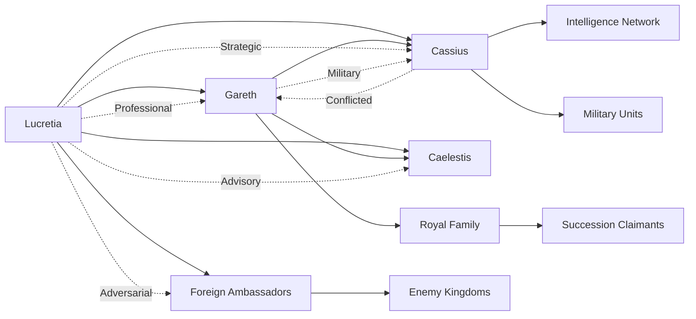

# Character Relationship Mapping
*Political Intrigue Story | 957-958 AV*

## AI Friendly Summary
**File Purpose**: Maps interpersonal relationships between all major characters, showing political alliances, personal connections, and adversarial dynamics that drive story conflict.
**Content Overview**: Detailed relationship networks for Lucretia and other main characters, political coalition structures, relationship evolution patterns, and key relationship dynamics affecting plot progression.
**Dependencies**: Supports character-arc-development.md character growth, references plot-thread-mapping.md for alliance impact on plots, and aligns with act-*-scene-breakdown.md files for relationship moments.
**Usage Context**: Critical for writing character interactions, ensuring authentic relationship dynamics, and tracking relationship changes throughout the narrative development.

## Cross-References
- **Character Development**: See [Character Arc Development](./character-arc-development.md) for individual character growth affecting relationships
- **Plot Impact**: See [Plot Thread Mapping](./plot-thread-mapping.md) for how relationships drive alliance formation and succession crisis threads
- **Scene Implementation**: See [Act I Scene Breakdown](./act-1-scene-breakdown.md), [Act II Scene Breakdown](./act-2-scene-breakdown.md), [Act III Scene Breakdown](./act-3-scene-breakdown.md) for relationship moments in specific scenes
- **Historical Context**: See [Historical Context Integration](./historical-context-integration.md) for background of existing relationships

## Character Relationship Network

## Relationship Dynamics Matrix

| Character | Lucretia | Gareth | Cassius | Court Officials | Foreign Powers |
|-----------|----------|--------|---------|----------------|----------------|
| **Lucretia** | - | Strategic Alliance | Professional Trust | Complex Navigation | Diplomatic Opposition |
| **Gareth** | Growing Partnership | - | Military Cooperation | Political Leadership | Succession Stakes |
| **Cassius** | Mutual Respect | Loyalty Questions | - | Information Brokering | Intelligence Warfare |
| **Court Officials** | Professional Respect | Faction Loyalty | Resource Access | Internal Politics | Foreign Influence |
| **Foreign Powers** | Diplomatic Target | Succession Interest | Intelligence Value | Corruption Opportunities | Power Competition |

## Relationship Evolution Timeline

| Phase | Lucretia-Gareth | Lucretia-Cassius | Court Dynamics | Foreign Relations |
|-------|-----------------|------------------|----------------|------------------|
| **Act I** | Professional Respect | Strategic Cooperation | Faction Formation | Diplomatic Tensions |
| **Act II** | Political Partnership | Trust Complications | Alliance Hardening | Active Opposition |
| **Act III** | Mutual Dependence | Survival Alliance | War Preparation | Enemy Consolidation |

## PRIMARY CHARACTER RELATIONSHIPS

### Lady Lucretia Aurelia Corvina (Protagonist)

**Professional Relationships**:
- **King Aldric the Just**: Sovereign and employer, formal loyalty
- **Gareth Aurelius**: Political ally and succession candidate, growing trust
- **Cassius Ferox**: Military counterpart, strategic partnership
- **Caelestis Stellarum**: Court adviser, intellectual collaboration
- **Court Officials**: Mixed loyalties, professional networking

**Personal Relationships**:
- **Her Daughter**: Primary personal motivation and vulnerability
- **Late Husband**: Memory influences current decisions
- **Personal Servants**: Loyal household providing support and intelligence
- **Childhood Friends**: Now political allies or rivals in court

**Adversarial Relationships**:
- **Foreign Ambassadors**: Professional opposition and manipulation
- **Rival Court Factions**: Political competition and intrigue
- **Enemy Spies**: Intelligence warfare and counter-operations
- **Succession Rivals**: Political opponents to Gareth's claim

---

## POLITICAL ALLIANCES

### The Loyalist Coalition (Supporting Legitimate Succession)

**Core Leadership**:
- **Gareth Aurelius**: Rightful heir and political leader
- **Lucretia Aurelia Corvina**: Chief diplomatic strategist
- **Duke Aldwin of Eastern Marches**: Border defense specialist
- **Archbishop Traditional**: Religious orthodox support

**Military Component**:
- **Cassius Ferox**: Professional military commander (complex loyalty)
- **Captain Marcus Aurelius**: Caravan guard and security specialist
- **Royal Guard Units**: Palace and government protection forces
- **Feudal Loyal Houses**: Traditional nobility supporting crown

**Diplomatic Assets**:
- **Foreign Embassy Allies**: Kingdoms supporting stable succession
- **Merchant Guild Leaders**: Economic interests in political stability
- **Academic Institutions**: Royal University and scholarly support
- **Religious Orthodox Hierarchy**: Traditional religious establishment

### The Usurper Alliance (Alternative Claims)

**Political Leadership**:
- **Duke Roderick of Southmarch**: Ambitious southern lord
- **Duchess Cersei Goldmane**: Western military commander
- **Count Edmund of Northwatch**: Northern border defender with personal ambitions

**Foreign Support**:
- **Kingdom of Thornwick**: Backing alternative claimants for political advantage
- **République de Portlune**: Naval and economic support for compliant candidates
- **Eastern Extremist Factions**: Religious movements supporting supernatural claims

**Military Elements**:
- **Mercenary Companies**: Professional soldiers for hire
- **Rebel Noble Houses**: Feudal lords seeking political advancement
- **Foreign Military Advisers**: International support for regime change

### Neutral Powers (Maintaining Independence)

**Economic Interests**:
- **Master Aldred the Merchant**: Trade guild leadership
- **Western Port Authorities**: Maritime commerce protection
- **Agricultural Consortium**: Food production and distribution

**Regional Autonomy**:
- **Mountain Clan Leaders**: Isolationist tendencies
- **Border Town Mayors**: Local governance priorities
- **Monastic Orders**: Religious independence from political conflicts

---

## PERSONAL RELATIONSHIPS

### Romantic and Family Connections

**Lucretia's Personal Circle**:
- **Her Daughter**: Teenage daughter requiring protection and education
- **Late Husband's Family**: In-laws with political connections and expectations
- **Childhood Friends**: Now adult peers in court positions
- **Personal Confessor**: Religious adviser providing spiritual guidance

**Political Marriage Considerations**:
- **Potential Suitors**: Nobles seeking political alliance through marriage
- **Foreign Diplomatic Matches**: International marriage proposals for alliances
- **Widow's Independence**: Choice between remarriage and political autonomy

### Gareth Aurelius's Relationships

**Political Bonds**:
- **Brotherhood Oath Partners**: Cassius Ferox and Brennos mac Cuinn
- **Mentor Relationships**: Elder statesmen providing guidance
- **Rival Claimants**: Personal and political competition

**Personal Connections**:
- **Court Friends**: Peers and social circle in royal environment
- **Military Comrades**: Fellow officers and strategic partners
- **Religious Advisers**: Spiritual guidance for leadership responsibilities

### Cassius Ferox's Network

**Military Brotherhood**:
- **Officer Corps**: Professional military relationships
- **Veteran Soldiers**: Loyalty and shared experience bonds
- **Foreign Military Contacts**: International professional networks

**Political Ambiguity**:
- **Multiple Loyalties**: Professional duty vs. personal ambition
- **Intelligence Contacts**: Spy networks and information sources
- **Strategic Partnerships**: Temporary alliances based on mutual benefit

---

## CONFLICT DYNAMICS

### Internal Court Tensions

**Succession Faction Rivalries**:
- **Legitimists vs. Pretenders**: Constitutional vs. power-based claims
- **Traditional vs. Reform**: Conservative vs. progressive political approaches
- **Religious vs. Secular**: Theological vs. pragmatic governance priorities

**Personal Animosities**:
- **Old Family Feuds**: Generational conflicts affecting current politics
- **Professional Jealousies**: Court position competition and advancement
- **Romantic Rivalries**: Personal relationships affecting political alliances

**Class Conflicts**:
- **Nobility vs. Merchant Classes**: Feudal privilege vs. economic power
- **Military vs. Diplomatic**: Different approaches to conflict resolution
- **Urban vs. Rural**: Different economic and social priorities

### External Pressure Points

**Foreign Interference**:
- **Thornwick Expansionism**: Territorial ambitions creating border tensions
- **République Economic Warfare**: Trade blockade and commercial pressure
- **Eastern Mysticism**: Religious and supernatural influence campaigns

**Intelligence Warfare**:
- **Spy Network Penetration**: Foreign agents infiltrating domestic politics
- **Information Manipulation**: Propaganda and disinformation campaigns
- **Counter-Intelligence Operations**: Domestic security protecting state secrets

**Military Pressures**:
- **Border Skirmishes**: Limited conflicts testing military readiness
- **Alliance Obligations**: International treaty requirements and support
- **Resource Competition**: Economic warfare affecting military capabilities

---

## RELATIONSHIP EVOLUTION THROUGHOUT STORY

### Act I Development (957 AV Early-Mid)

**Relationship Formation**:
- Lucretia establishes professional relationship with Gareth
- Initial trust-building with Cassius through shared strategic goals
- Foreign diplomatic relationships become more complex and adversarial
- Personal friendships tested by political pressures

**Alliance Building**:
- Loyalist coalition forms around shared succession support
- Professional relationships deepen through crisis management
- Personal bonds strengthen through mutual dependency
- Opposition relationships become clearly defined

### Act II Development (957 AV Late - 958 AV Mid)

**Relationship Testing**:
- Political crises strain personal and professional bonds
- Betrayals and loyalty shifts create new alliance patterns
- Romantic possibilities complicate political calculations
- Family relationships become political vulnerabilities

**Coalition Hardening**:
- Alliance members prove loyalty through shared hardship
- Opposition relationships become openly hostile
- Neutral parties forced to choose sides under pressure
- International relationships deteriorate into conflict preparation

### Act III Development (958 AV Mid-Late)

**Relationship Resolution**:
- Final loyalty tests determine permanent alliance structure
- Personal relationships integrated with political realities
- Professional partnerships become personal bonds of trust
- Enemy relationships escalate to open warfare

**War Transition**:
- Diplomatic relationships transform into military alliances
- Personal bonds provide foundation for wartime cooperation
- Opposition relationships become military targets
- Neutral parties absorbed into war coalition structure

---

## RELATIONSHIP IMPACT ON PLOT

### Political Consequences

**Alliance Effectiveness**:
- Strong personal relationships enable successful political cooperation
- Trust deficits prevent effective opposition coordination
- Personal animosities create exploitable political weaknesses
- Romantic relationships become political assets or liabilities

**Information Flow**:
- Personal relationships determine intelligence sharing patterns
- Trust levels affect strategic planning and coordination
- Family connections create information security vulnerabilities
- Professional relationships enable counter-intelligence operations

### Character Development

**Growth Through Relationships**:
- Political partnerships force personal growth and adaptation
- Adversarial relationships test character strength and values
- Family relationships provide motivation and moral anchor
- Professional relationships develop leadership and negotiation skills

**Moral Complexity**:
- Personal loyalty conflicts with political necessity
- Professional duty challenges personal relationships
- Family protection requires political compromise
- Friendship bonds tested by political opposition

---

## RELATIONSHIP MAPPING CHECKLIST

### Accuracy Verification
- [ ] Character relationships consistent with established lore
- [ ] Political alliances reflect historical period realities
- [ ] Personal relationships support character development
- [ ] Conflict dynamics drive plot progression naturally

### Development Tracking
- [ ] Relationship evolution planned across story timeline
- [ ] Personal and political relationships integrated effectively
- [ ] Conflict relationships escalate appropriately
- [ ] Alliance relationships strengthen through shared experience

### Plot Integration
- [ ] Relationships drive major plot developments
- [ ] Personal stakes raise political conflict intensity
- [ ] Character bonds enable collaborative problem-solving
- [ ] Relationship conflicts create dramatic tension

## WRITING NOTES
- Character relationships should feel authentic and developed
- Political alliances must be based on realistic mutual interests
- Personal relationships provide emotional stakes for political conflicts
- Relationship evolution drives character development throughout story
- Conflict relationships create ongoing tension and dramatic obstacles
