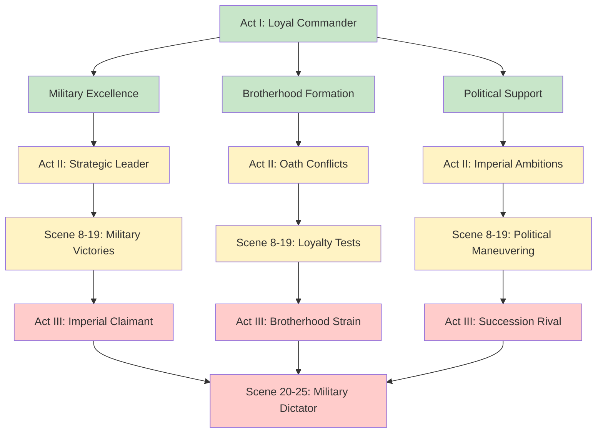

# Character Profile: Cassius Ferox

## AI Friendly Summary
**File Purpose**: Comprehensive character profile for Cassius Ferox, Supreme Commander and key secondary character representing military ambition and potential rival to Gareth's succession claim, serving as the complex military leader archetype in the political intrigue story.

**Content Overview**: Contains detailed specifications for military commander including Supreme Commander title and political position, physical description emphasizing commanding presence, personality traits focused on ambition and military genius, complex motivations around imperial leadership, key relationships including Brotherhood oath and political tensions, military backstory and rise to power, and strategic abilities.

**Dependencies**: Integrates with `character-arc-development.md` for Cassius's evolution from ally to potential rival, `character-relationship-mapping.md` for Brotherhood dynamics and military alliances, political tensions with Lucretia, and scene implementations showing progression from military cooperation to political competition.

**Usage Context**: Reference for writers creating Cassius's military leadership scenes, political maneuvering, Brotherhood oath conflicts, strategic planning sessions, and complex relationship dynamics with other major characters throughout the succession crisis narrative.

## Cross-References
- **Character Development**: [Character Arc Development](../character-arc-development.md) - Cassius's transformation from loyal commander to ambitious rival
- **Military Dynamics**: [Character Relationship Mapping](../character-relationship-mapping.md) - Brotherhood bonds and political tensions
- **Scene Implementation**:
  - [Act I Scene Breakdown](../act-1-scene-breakdown.md) - Military presence and Brotherhood establishment
  - [Act II Scene Breakdown](../act-2-scene-breakdown.md) - Strategic leadership and political maneuvering
  - [Act III Scene Breakdown](../act-3-scene-breakdown.md) - War preparation and succession rivalry
- **Timeline Context**: [Story Timeline](../story-timeline.md) - Military campaigns and political rise
- **Related Characters**:
  - [Gareth Aurelius](./gareth-ironhold.md) - Brotherhood oath partner and potential rival
  - [Lucretia Aurelia Corvina](./lucretia-aurelia-corvina.md) - Political tension and mutual wariness
  - [Supporting Court Officials](./supporting-court-officials.md) - Military and political networks

## Military-Political Evolution

## Military Leadership Matrix

| Command Aspect | Proficiency | Strategic Application | Political Impact |
|----------------|-------------|----------------------|------------------|
| **Tactical Brilliance** | Genius (10/10) | Battlefield innovation | Legendary reputation |
| **Strategic Planning** | Expert (9/10) | Campaign coordination | Military dominance |
| **Troop Loyalty** | Exceptional (9/10) | Personal devotion | Power base strength |
| **Political Maneuvering** | Advanced (8/10) | Senate manipulation | Rising influence |
| **Coalition Building** | Proficient (7/10) | Alliance formation | Expanding support |
| **Diplomatic Skill** | Competent (6/10) | Military diplomacy | International respect |

## Name:
**Cassius Ferox** *(Cassius: Empty/Vain + Ferox: Fierce/Wild)*
- **Military Title**: Supreme Commander of the Golden Legion
- **Political Position**: Senator-General of the Solarian Republic
- **Popular Name**: "The Iron Eagle of Solaria"
- **Court Title**: Bearer of Ancient Military Honors

## Role/Archetype:
Ambitious Military Commander, Rising Political Leader, Potential Dictator, Brotherhood Oath Partner

## Physical Description:
A commanding figure in his late thirties with piercing hazel eyes that seem to calculate every strategic advantage. Cassius stands tall with broad shoulders earned from years wielding sword and shield alongside his men. His dark hair is cropped in military fashion, often crowned with a circlet of golden oak leaves - symbol of his victories. Battle scars mark his left arm and jaw, proudly displayed rather than hidden. He moves with the confident grace of a natural athlete, equally comfortable in ornate senatorial robes or practical military armor. His most distinctive feature is his ability to project absolute authority through posture and gaze alone.

## Personality Traits:
- **Boundless Ambition**: Driven to achieve greatness and leave lasting legacy, following in the footsteps of his legendary ancestor
- **Charismatic Leader**: Natural ability to inspire loyalty and devotion in followers through personal courage and shared hardship
- **Military Genius**: Combines personal valor with strategic brilliance, innovative tactics, and inspirational battlefield presence
- **Political Pragmatist**: Skilled at building coalitions and making necessary compromises to achieve strategic objectives
- **Risk-Taker**: Willing to gamble everything for chance at ultimate power and historical significance
- **Complex Loyalty**: Torn between duty to the Republic, personal ambition, and brotherhood oaths

## Motivations/Goals:
- **Primary**: Unite the fragmented kingdoms under Solarian leadership to end the chaos of the Crimson Veil
- **Secondary**: Reform the antiquated Senatorial system into a more efficient imperial structure capable of decisive action
- **Personal**: Surpass the legendary achievements of his ancestor, Aurelius the Great, founder of the Republic's military might
- **Hidden**: Secretly believes the Crimson Veil's supernatural effects can be harnessed to create a perfect society
- **Immediate**: Honor the Brotherhood Oath with Gareth Aurelius and Brennos mac Cuinn while pursuing his larger ambitions

## Key Relationships:
- **Brotherhood Oath Partners**: Gareth Aurelius and Brennos mac Cuinn - bound by sacred oath of 958 AV that transcends political differences
- **Lucretia Aurelia Corvina**: Professional respect mixed with mutual wariness about ultimate intentions and loyalties
- **Golden Legion Officers**: Veteran commanders and centurions who form his core military support
- **Solarian Senate**: Political body he serves but increasingly views as obstacle to necessary decisive action
- **Foreign Military Contacts**: International professional networks built through campaigns and diplomatic missions
- **Valdric Thorasson**: Intellectual rival and occasional collaborator in strategic planning

## Backstory:
Born in Aurelia Province of the Solarian Republic, son of a minor patrician family with military traditions. Raised on stories of his ancestor Aurelius the Great, he enlisted as a junior officer at 18 and distinguished himself in the Barbarian Border Wars through tactical innovation and personal valor. His first command at the Battle of Three Rivers saved a besieged garrison through brilliant night tactics, launching his political rise.

Key victories include the Siege of Castrum Ferrum (broke a six-month siege in three days) and the Campaign of the Eastern Marches (conquered three rebellious city-states in a single season). He used his military reputation to win election as military tribune, then senator, building a coalition of veterans and common citizens. The Brotherhood Oath of 958 AV created complex loyalties that now influence his strategic calculations during the succession crisis.

## Abilities/Skills:
- **Supreme Military Command**: Mastery of both grand strategy and tactical battlefield leadership
- **Political Coalition Building**: Expert at forming alliances and managing competing interests
- **Economic Warfare**: Understanding of logistics, supply lines, and resource management on imperial scale
- **Diplomatic Negotiation**: Skilled at military diplomacy and alliance building with foreign powers
- **Intelligence Operations**: Coordination of military intelligence and strategic reconnaissance
- **Cultural Integration**: Ability to incorporate diverse military traditions into unified command structure

## Conflicts/Flaws:
- **Ambition vs. Honor**: Brotherhood oath with Gareth conflicts with his larger imperial ambitions
- **Republican Ideals vs. Imperial Necessity**: Torn between democratic traditions and need for decisive centralized authority
- **Trust Issues**: Years of political maneuvering have made genuine relationships difficult
- **Impatience**: Desire for quick solutions sometimes conflicts with long-term strategic thinking
- **Pride**: Confidence in his abilities can blind him to others' valuable contributions
- **Moral Flexibility**: Willingness to make harsh choices for greater good may alienate idealistic allies

## Arc/Development Notes:
### Political Intrigue Story Arc (957-958 AV):
- **Act I**: Respected military commander building political support while honoring brotherhood oath
- **Act II**: Growing tension between personal ambition and loyalty to Gareth as political crisis deepens
- **Act III**: Forced to choose between supporting rightful succession or seizing power for himself
- **Character Growth**: Learning the difference between conquest and true leadership, between taking power and earning it
- **Key Dilemma**: Whether to preserve democratic ideals or establish strong centralized authority during crisis
- **Critical Decision**: Whether to cross his personal "Rubicon" and march on the capital to seize emergency powers

### Story Role:
- **Military Asset**: Commands the most professional and effective fighting force in the fragmented kingdoms
- **Political Wild Card**: His loyalty cannot be taken for granted by any faction
- **Brotherhood Anchor**: His oath with Gareth and Brennos provides emotional center for alliance building
- **Imperial Ambition**: Represents the vision of unified continental empire under efficient leadership

### Potential Character Arc Climax:
The assassination of King Aldric forces him to choose: honor the brotherhood oath by supporting Gareth's rightful claim, or exploit the chaos to establish Solarian dominance. His decision shapes not only his personal destiny but the entire future of continental politics.

---
Character profile adapted for "The Crimson Veil: Political Intrigue" (957-958 AV)
