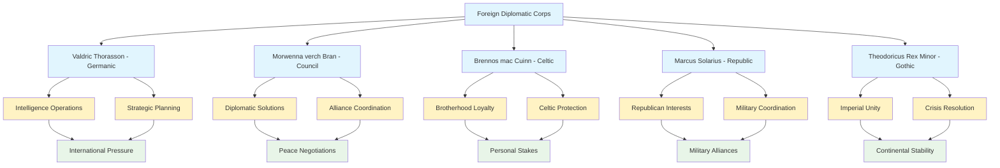

# Character Profile: Foreign Ambassadors

## AI Friendly Summary
**File Purpose**: Comprehensive profile for foreign ambassadors representing various kingdoms and political entities in the political intrigue story, serving as international perspective characters who bring external pressure, intelligence operations, and diplomatic complexity to the succession crisis narrative.

**Content Overview**: Contains detailed profiles for five primary ambassadors including Valdric Thorasson (Germanic Kingdoms), Lady Morwenna verch Bran (Council of Kingdoms), Commander Brennos mac Cuinn (Celtic Highland), Senator Marcus Solarius (Solarian Republic), and Theodoricus Rex Minor (Gothic Empire), covering their diplomatic missions, cultural backgrounds, intelligence objectives, and roles in international crisis management.

**Dependencies**: Integrates with `character-relationship-mapping.md` for international diplomatic networks, `character-arc-development.md` for ambassador evolution through crisis, `historical-context-integration.md` for international political context, and scene breakdowns for diplomatic negotiations, intelligence operations, and international crisis moments.

**Usage Context**: Reference for writers creating diplomatic scenes, international negotiations, intelligence gathering moments, cultural exchange dialogue, foreign perspective scenes, and international pressure dynamics throughout the political intrigue story.

## Cross-References
- **International Relations**: [Character Relationship Mapping](../character-relationship-mapping.md) - Diplomatic networks and international alliances
- **Historical Context**: [Historical Context Integration](../historical-context-integration.md) - International political background and kingdom relationships
- **Scene Implementation**:
  - [Act I Scene Breakdown](../act-1-scene-breakdown.md) - Initial diplomatic missions and international introductions
  - [Act II Scene Breakdown](../act-2-scene-breakdown.md) - Crisis negotiations and international pressure
  - [Act III Scene Breakdown](../act-3-scene-breakdown.md) - Final diplomatic attempts and war alliance formation
- **Character Networks**:
  - [Lucretia Aurelia Corvina](./lucretia-aurelia-corvina.md) - Primary diplomatic contact and international coordination
  - [Gareth Aurelius](./gareth-ironhold.md) - Brotherhood relationship with Brennos and succession support
  - [Cassius Ferox](./cassius.md) - Military diplomatic connections and republican alliance

## International Diplomatic Network

## Diplomatic Mission Matrix

| Ambassador | Kingdom/Entity | Primary Mission | Intelligence Role | Crisis Strategy | Personal Stakes |
|------------|---------------|-----------------|-------------------|-----------------|-----------------|
| **Valdric Thorasson** | Germanic Kingdoms | Strategic Coordination | Master Intelligence | Centralized Authority | Political Legacy |
| **Morwenna verch Bran** | Council of Kingdoms | Diplomatic Settlement | Alliance Networks | Negotiated Peace | Institutional Preservation |
| **Brennos mac Cuinn** | Celtic Highland | Celtic Protection | Military Intelligence | Brotherhood Honor | Personal Loyalty |
| **Marcus Solarius** | Solarian Republic | Republican Influence | Military Coordination | Strategic Alliance | National Interest |
| **Theodoricus Rex Minor** | Gothic Empire | Imperial Unity | Royal Intelligence | Continental Stability | Imperial Authority |

## Name:
**The Diplomatic Corps** - International representatives navigating the succession crisis

### Primary Ambassadors:

**Ambassador Valdric Thorasson** (Germanic Kingdoms Representative)
- **Position**: Chief Minister of Intelligence and Strategic Affairs, representing multiple Germanic courts
- **Expertise**: Master political strategist known as "The Gray Eminence"
- **Agenda**: Establishing centralized authority under King Valerius's rule

**Lady Morwenna verch Bran** (Council of Kingdoms Representative)
- **Position**: Noble Political Matriarch leading diplomatic alliance faction
- **Background**: Architect of the Treaty of Seven Crowns and Council of Kingdoms
- **Goal**: Negotiated settlement that preserves diplomatic institutions

**Commander Brennos mac Cuinn** (Celtic Highland Representative)
- **Position**: Celtic Noble Commander representing highland clan confederation
- **Special Status**: Brotherhood Oath partner with Gareth Aurelius and Cassius Ferox
- **Mission**: Protecting Celtic interests while honoring personal loyalties

**Senator Marcus Solarius** (Solarian Republic Representative)
- **Position**: Military diplomat representing republican interests
- **Connection**: Works closely with Cassius Ferox's political faction
- **Objective**: Ensuring Solarian influence in continental settlement

**Theodoricus Rex Minor** (Gothic Empire Representative)
- **Position**: Younger brother of Emperor Theodoricus Ferrum
- **Authority**: Speaks for unified Gothic imperial interests
- **Strategy**: Promoting imperial unity as solution to Crimson Veil crisis

## Role/Archetype:
International Representatives, Cultural Bridges, Political Negotiators, Intelligence Operatives

## Physical Description:
A diverse group representing different cultural traditions and court styles. Valdric appears as a lean, gray-haired strategist in dark, well-tailored Germanic clothing. Morwenna displays the elegant fashion of a noble matriarch in rich Celtic court dress. Brennos maintains the practical military appearance of a highland commander. Marcus Solarius wears formal republican senatorial robes. Theodoricus Rex Minor displays Gothic imperial regalia appropriate to his royal status.

## Personality Traits:
- **Cultural Sophistication**: Each expert in their homeland's traditions while adaptable to foreign court customs
- **Political Calculation**: Skilled at advancing national interests while maintaining diplomatic relationships
- **Strategic Intelligence**: Exceptional ability to gather information and assess political developments
- **Diplomatic Immunity**: Understanding of international law and protocol that protects their operations
- **Multilingual Communication**: Fluent in multiple languages necessary for continental diplomacy
- **Crisis Adaptation**: Ability to shift from routine diplomacy to crisis management as war approaches

## Motivations/Goals:
- **National Interests**: Advance their kingdoms' strategic objectives through diplomatic influence
- **Intelligence Gathering**: Collect information about Aethermoor's internal politics and military capabilities
- **Alliance Building**: Form coalitions that serve their homelands' long-term interests
- **Crisis Prevention**: Avoid continental war that would damage all kingdoms' prosperity
- **Personal Survival**: Navigate dangerous political situation without compromising their positions at home

## Key Relationships:
- **Lucretia Aurelia Corvina**: Primary diplomatic contact and intelligence source within Aethermoor court
- **King Aldric the Just**: Current monarch whose decisions affect all continental kingdoms
- **Prince Gareth Aurelius**: Likely successor whose character and intentions they must assess
- **Cassius Ferox**: Military commander whose ambitions could reshape continental balance of power
- **Their Home Courts**: Rulers and advisors who depend on accurate intelligence and effective representation
- **Each Other**: Complex web of alliances, rivalries, and mutual dependencies among foreign representatives

## Backstory:
This diplomatic corps assembled in response to Aethermoor's succession crisis and its potential impact on continental stability. Each ambassador brings decades of experience in international relations and deep knowledge of their homeland's interests. Valdric Thorasson represents the sophisticated Germanic approach to political strategy. Morwenna verch Bran embodies the diplomatic tradition that created the Council of Kingdoms. Brennos mac Cuinn balances Celtic independence with personal loyalty through the Brotherhood Oath. Marcus Solarius advances republican ideals through military diplomacy. Theodoricus Rex Minor promotes imperial unity as the solution to continental chaos.

Their presence transforms Aethermoor's internal succession crisis into an international diplomatic challenge with far-reaching consequences.

## Abilities/Skills:
- **International Law**: Expert knowledge of diplomatic precedents and treaty obligations
- **Cultural Navigation**: Ability to operate effectively across different court systems and social customs
- **Intelligence Operations**: Sophisticated networks for gathering and analyzing political information
- **Economic Leverage**: Understanding of trade relationships and financial pressure as diplomatic tools
- **Military Assessment**: Evaluation of military capabilities and strategic implications of political changes
- **Crisis Negotiation**: Experience managing diplomatic relations during periods of extreme political tension

## Conflicts/Flaws:
- **Divided Loyalties**: Tension between diplomatic friendship and national strategic interests
- **Cultural Prejudices**: Underlying assumptions about superior political systems from their homelands
- **Information Limitations**: Dependence on local sources who may have their own agendas
- **Diplomatic Constraints**: Bound by instructions from home courts that may not reflect current realities
- **Personal Relationships**: Professional diplomatic relationships complicated by genuine personal connections
- **Resource Competition**: Competing for influence and access to key political figures

## Arc/Development Notes:
### Political Intrigue Story Arc (957-958 AV):
- **Act I**: Routine diplomatic monitoring evolves into active crisis management as succession uncertainty grows
- **Act II**: Increasing pressure from home courts to secure advantages while preventing continental war
- **Act III**: Forced to choose between diplomatic protocol and practical survival as assassination triggers warfare
- **Character Growth**: Learning when international cooperation trumps narrow national interests
- **Key Function**: Represent external pressures and opportunities that complicate Aethermoor's internal politics

### Story Role:
- **International Context**: Demonstrate how internal succession crisis affects continental balance of power
- **Intelligence Network**: Provide alternative sources of information and analysis for key decision-makers
- **Cultural Perspective**: Offer different approaches to political problems based on varied governmental traditions
- **Plot Complications**: Create additional layers of intrigue through competing national interests

### Diplomatic Dynamics:
- **Alliance Patterns**: Temporary partnerships based on shared immediate interests rather than permanent friendship
- **Information Trading**: Exchange of intelligence and analysis that benefits multiple parties
- **Cultural Exchange**: Cross-pollination of political ideas and governmental innovations
- **Crisis Cooperation**: Potential for unprecedented international collaboration to address Crimson Veil phenomenon

### Individual Character Arcs:
- **Valdric**: Balancing manipulation with genuine cooperation for continental stability
- **Morwenna**: Defending diplomatic institutions against military solutions
- **Brennos**: Honoring personal oaths while protecting Celtic independence
- **Marcus**: Promoting republican ideals through military efficiency
- **Theodoricus Rex**: Advancing imperial unity without appearing threatening to sovereignty

---
Character profile adapted for "The Crimson Veil: Political Intrigue" (957-958 AV)
