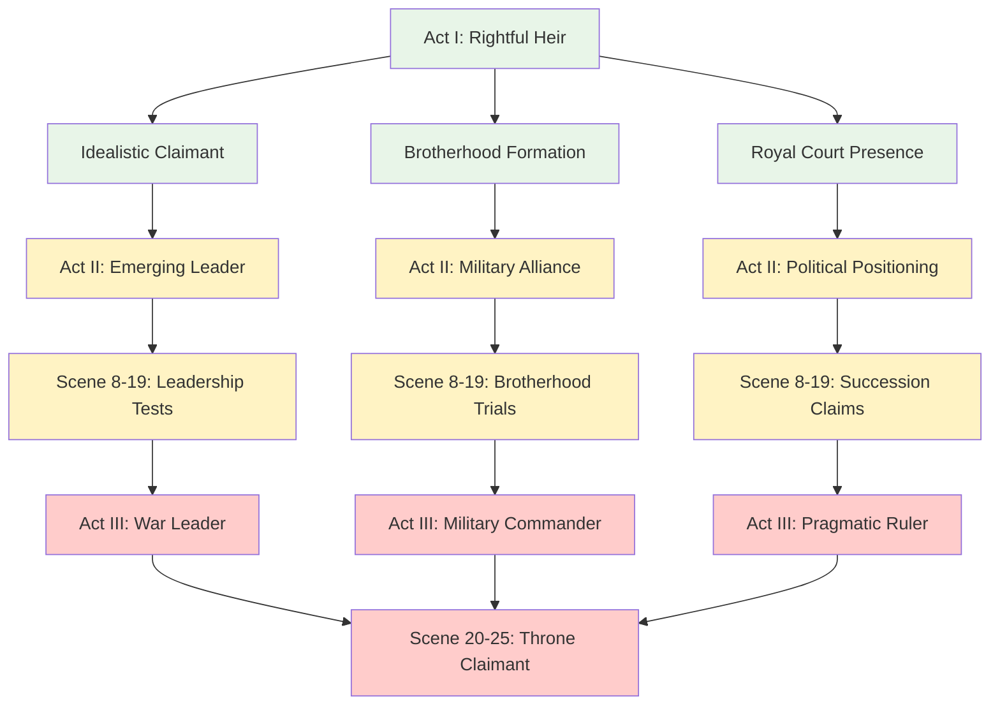

# Character Profile: Gareth Aurelius (Ironhold)

## AI Friendly Summary
**File Purpose**: Comprehensive character profile for Prince Gareth Aurelius, rightful heir and key secondary character in the political intrigue story, serving as the idealistic ruler archetype whose claim to the throne drives much of the succession crisis narrative.

**Content Overview**: Contains detailed character specifications including royal lineage and military titles, physical description emphasizing noble accessibility, personality traits focused on benevolent leadership, political motivations around righteous governance, key relationships including brotherhood bonds and political alliances, backstory establishing legitimate claim, and leadership abilities.

**Dependencies**: Integrates with `character-arc-development.md` for Gareth's political development, `character-relationship-mapping.md` for alliance dynamics, Brotherhood relationships with Cassius and Brennos, and scene implementations across all acts showing his evolution from idealistic prince to pragmatic war leader.

**Usage Context**: Reference for writers creating Gareth's dialogue and actions, political scenes involving succession claims, military leadership moments, moral dilemma scenes, and relationship development with other major characters throughout the story.

## Cross-References
- **Character Development**: [Character Arc Development](../character-arc-development.md) - Gareth's transformation from idealistic heir to pragmatic leader
- **Political Dynamics**: [Character Relationship Mapping](../character-relationship-mapping.md) - Succession claim relationships and Brotherhood bonds
- **Scene Implementation**:
  - [Act I Scene Breakdown](../act-1-scene-breakdown.md) - Introduction as rightful heir and early political positioning
  - [Act II Scene Breakdown](../act-2-scene-breakdown.md) - Military leadership emergence and alliance building
  - [Act III Scene Breakdown](../act-3-scene-breakdown.md) - War preparation and final political choices
- **Timeline Context**: [Story Timeline](../story-timeline.md) - Succession crisis development and Brotherhood formation
- **Related Characters**:
  - [Lucretia Aurelia Corvina](./lucretia-aurelia-corvina.md) - Political mentor and diplomatic advisor
  - [Cassius Ferox](./cassius.md) - Brotherhood bond and military alliance
  - [Supporting Court Officials](./supporting-court-officials.md) - Royal court relationships

## Leadership Development Progression

## Royal Legitimacy Factors

| Legitimacy Aspect | Strength | Evidence | Political Impact |
|------------------|----------|----------|------------------|
| **Bloodline Claim** | Absolute (10/10) | Aurelius Diadem recognition | Unquestioned royal right |
| **Popular Support** | High (8/10) | Common people loyalty | Strong power base |
| **Military Backing** | Growing (7/10) | Brotherhood alliance | Increasing strength |
| **Noble Recognition** | Variable (6/10) | Some houses support | Political negotiations needed |
| **Moral Authority** | Exceptional (9/10) | Virtuous leadership | Inspiration across factions |
| **International Standing** | Developing (5/10) | Foreign court awareness | Diplomatic potential |

## Name:
**Prince Gareth Aurelius** *(Gareth: Gentle/Firm + Aurelius: Golden)*
- **Royal Title**: Rightful Heir to the Golden Throne of Aureliania
- **Military Title**: Prince-Regent of Eastern Aurelian Territories
- **Popular Name**: "The Benevolent Prince" / "Ironhold" (for his unwavering moral stance)
- **Court Title**: Bearer of the Aurelius Diadem of Righteous Rule

## Role/Archetype:
Idealistic Ruler, Righteous Claimant, Benevolent King, Military Leader

## Physical Description:
A man in his early thirties with the noble bearing expected of royal blood, yet possessing an accessibility that draws common folk to his cause. Prince Gareth has auburn hair typical of his Welsh lineage and warm brown eyes that reflect genuine concern for others' welfare. His face bears a few scars from battles fought personally alongside his men, refusing the safety of distant command. He dresses simply for a prince, preferring practical clothing that allows him to move freely among his people. His most distinctive feature is his smile - warm, genuine, and completely without artifice. He carries the golden Aurelius Diadem, but wears it only on formal occasions, preferring to lead through example rather than symbols of authority.

## Personality Traits:
- **Benevolent Ruler**: Genuinely cares about subjects' welfare, rules with compassion following both Welsh and Roman traditions
- **Charismatic Inspiration**: Natural ability to inspire loyalty and devotion through personal courage and moral example
- **Humble Authority**: Power worn lightly, accessible to common people, following Welsh traditions of approachable leadership
- **Persistent Idealist**: Maintains moral principles even when pragmatically disadvantageous, believing virtue ultimately triumphs
- **Brotherhood Builder**: Forms deep personal bonds that transcend political expedience, honoring both Welsh kinship and Roman friendship
- **Righteous Claimant**: Believes in legitimate authority based on virtue and bloodline rather than mere force

## Motivations/Goals:
- **Primary**: Restore righteous governance and protect innocent people from the chaos of the Crimson Veil
- **Secondary**: Unite the realm under just and benevolent leadership, combining Welsh clan traditions with Roman imperial order
- **Personal**: Honor ancestors and fulfill destiny as rightful ruler of the Aurelian bloodline
- **Hidden**: Deep fear of failing those who depend on him for protection, haunted by stories of fallen heroes

## Key Relationships:
- **Sworn Brothers**: Cassius Ferox and Brennos mac Cuinn - companions bound by oath stronger than blood (Brotherhood Oath of 958 AV)
- **Lucretia Aurelia Corvina**: Political mentor and advisor who supports his claim while coaching him in political realism
- **King Aldric the Just**: His patron and the current monarch whom he serves loyally while preparing for succession
- **Common People**: Citizens who see him as protector and hope for better future, especially Welsh clansmen and Roman citizens
- **Allied Lords**: Rulers who share commitment to righteous governance across cultural boundaries
- **Order of the Golden Dawn**: Ceremonial guards who protect the Aurelius Diadem and validate his claim

## Backstory:
Born into the ancient Aurelian royal house but raised in humble circumstances during political upheaval in his youth. He witnessed suffering caused by corrupt and tyrannical rulers during the early years of the Crimson Veil crisis, which shaped his commitment to benevolent leadership. The Brotherhood Oath of 958 AV with Cassius Ferox and Brennos mac Cuinn formed life-changing bonds across cultural boundaries. He gradually gained acceptance as legitimate heir through demonstration of virtue and royal bloodline verification, supported by the mystical validation of the Aurelius Diadem which glows in his presence.

## Abilities/Skills:
- **Inspirational Leadership**: Natural charisma combining Welsh bardic tradition with Roman gravitas
- **Diplomatic Mediation**: Building coalitions based on shared moral principles across cultural and political boundaries
- **Strategic Patience**: Long-term planning focused on sustainable rather than quick victories
- **Personnel Management**: Identifying and nurturing talent in subordinates regardless of their cultural background
- **Moral Authority**: Ethical behavior that attracts support from unexpected sources, transcending factional divisions
- **Military Command**: Capable battlefield leader who fights alongside his men rather than commanding from safety

## Conflicts/Flaws:
- **Idealistic Naivety**: Sometimes trusts unworthy people or misreads situations due to his belief in basic human goodness
- **Cultural Tension**: Balancing Welsh clan traditions with Roman imperial expectations creates internal conflicts
- **Burden of Legacy**: Weight of ancestral expectations and royal bloodline responsibilities affects decision-making
- **Merciful Nature**: Reluctance to use necessary force against enemies may prolong conflicts and endanger followers
- **Brotherhood Loyalty**: Devotion to sworn companions sometimes conflicts with broader political necessities
- **Political Inexperience**: Requires guidance from mentors like Lucretia to navigate complex court intrigue

## Arc/Development Notes:
### Political Intrigue Story Arc (957-958 AV):
- **Act I**: Idealistic prince learning political realities while building support for his eventual succession
- **Act II**: Facing increasingly difficult choices as diplomatic solutions fail and war becomes inevitable
- **Act III**: Stepping into leadership role as King Aldric is assassinated and the succession crisis explodes into open warfare
- **Character Growth**: Learning when flexibility serves justice better than rigid adherence to ideal principles
- **Key Challenge**: Balancing his inherent goodness with the harsh realities of political survival
- **Critical Moment**: The Brotherhood Oath ceremony that binds him to Cassius and Brennos despite their different approaches

### Story Role:
- **Political Symbol**: Represents legitimate authority and traditional succession rights
- **Moral Center**: Provides ethical framework against which other characters' choices are measured
- **Coalition Builder**: His charisma and legitimacy unite diverse factions under righteous banner
- **Character Development**: Learns political pragmatism without losing core moral principles

---
Character profile adapted for "The Crimson Veil: Political Intrigue" (957-958 AV)
