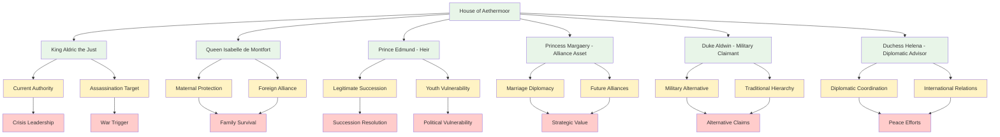

# Character Profile: Royal Family Members

## AI Friendly Summary
**File Purpose**: Comprehensive profile for members of the House of Aethermoor royal family who are central to the succession crisis narrative, providing the legitimate ruling bloodline around which the political intrigue story revolves, including both immediate family members and extended royal relations.

**Content Overview**: Contains detailed profiles for six primary royal family members including King Aldric the Just (current monarch), Queen Isabelle de Montfort (queen consort), Prince Edmund and Princess Margaery (potential heirs), Duke Aldwin (military claimant), and Duchess Helena (diplomatic advisor), covering their positions, relationships, political roles, and tragic fates during the succession crisis.

**Dependencies**: Integrates with `character-arc-development.md` for royal family evolution through crisis, `character-relationship-mapping.md` for succession dynamics and family loyalties, `story-timeline.md` for royal family tragic events including King Aldric's assassination, and scene breakdowns for royal court scenes, succession discussions, and family tragedy moments.

**Usage Context**: Reference for writers creating royal court scenes, succession crisis dialogue, family relationship dynamics, legitimate authority moments, royal protocol scenes, and the tragic climax surrounding King Aldric's assassination that triggers the War of the Crimson Veil.

## Cross-References
- **Succession Crisis**: [Character Arc Development](../character-arc-development.md) - Royal family tragedy and succession resolution
- **Family Dynamics**: [Character Relationship Mapping](../character-relationship-mapping.md) - Royal bloodline relationships and succession claims
- **Historical Events**: [Story Timeline](../story-timeline.md) - King Aldric's assassination and royal family fate
- **Scene Implementation**:
  - [Act I Scene Breakdown](../act-1-scene-breakdown.md) - Royal court establishment and family introduction
  - [Act II Scene Breakdown](../act-2-scene-breakdown.md) - Succession pressure and family conflict
  - [Act III Scene Breakdown](../act-3-scene-breakdown.md) - Royal tragedy and succession resolution
- **Character Networks**:
  - [Lucretia Aurelia Corvina](./lucretia-aurelia-corvina.md) - Royal cousin relationship and court coordination
  - [Gareth Aurelius](./gareth-ironhold.md) - Legitimate heir claim and royal succession support

## Royal Family Succession Dynamics

## Royal Succession Claims Matrix

| Royal Member | Succession Position | Political Strength | Age/Experience | Crisis Role | Tragic Fate |
|--------------|-------------------|------------------|----------------|-------------|-------------|
| **King Aldric** | Current Monarch | Absolute Authority | Mature/Experienced | Crisis Leadership | Assassination Victim |
| **Prince Edmund** | Primary Heir | Legitimate Claim | 16/Inexperienced | Succession Candidate | Potential Target |
| **Princess Margaery** | Secondary Heir | Marriage Asset | 14/Too Young | Diplomatic Tool | Protected Asset |
| **Duke Aldwin** | Extended Claimant | Military Support | Mature/Military | Alternative Ruler | Survival Uncertain |
| **Duchess Helena** | Non-Claimant | Diplomatic Networks | Mature/Diplomatic | Peace Advocate | Survival Likely |
| **Queen Isabelle** | Regent Potential | Maternal Authority | Mature/Foreign | Family Protector | Widow's Position |

## Name:
**The House of Aethermoor** - Royal family members central to the succession crisis

### Primary Royal Family:

**King Aldric the Just**
- **Position**: Current reigning monarch of Regnum Aethermoor
- **Relationship**: Cousin to Lucretia Aurelia Corvina
- **Character**: Peaceful ruler whose diplomatic nature may be unsuited to the approaching crisis
- **Fate**: Destined to be assassinated during the peace conference, triggering the War of the Crimson Veil

**Queen Isabelle de Montfort**
- **Position**: Queen Consort and mother of potential heirs
- **Background**: French noble marriage alliance that secured western borders
- **Role**: Attempts to protect her children's inheritance rights during succession crisis
- **Conflict**: Growing tension between maternal instincts and political necessities

**Prince Edmund Aldricson**
- **Position**: Younger son with questionable claim due to age and political inexperience
- **Age**: Sixteen years old, considered too young for effective rule during crisis
- **Supporters**: Traditional legitimists who favor strict hereditary succession
- **Vulnerability**: Potential target for elimination by rival claimants

**Princess Margaery Aldricsdóttir**
- **Position**: King's daughter, potential political marriage alliance asset
- **Age**: Fourteen years old, represents future diplomatic possibilities
- **Strategic Value**: Marriage prospects could secure crucial foreign alliances
- **Protection**: Closely guarded due to her value as both heir and diplomatic tool

### Extended Royal Relations:

**Duke Aldwin of Eastern Marches**
- **Position**: King's brother and backup claimant
- **Role**: Border defense specialist and military conservative
- **Faction**: Supports traditional feudal hierarchy and military solutions
- **Conflict**: Tension with more diplomatic approaches to the crisis

**Duchess Helena of Westlands**
- **Position**: King's sister and foreign policy advisor
- **Expertise**: International relations and cultural diplomacy
- **Alliance**: Works closely with Lucretia on diplomatic initiatives
- **Concern**: Fears war will destroy carefully built international relationships

## Role/Archetype:
Legitimate Rulers, Succession Candidates, Political Symbols, Crisis Victims

## Physical Description:
The royal family displays the classical features expected of ancient bloodlines. King Aldric appears as a dignified middle-aged ruler with prematurely gray hair and kind eyes that reflect his peaceful nature. Queen Isabelle maintains the elegant appearance of French nobility with careful attention to diplomatic fashion. Prince Edmund shows the promise of future royal bearing but lacks the gravitas of experienced leadership. Princess Margaery displays the beauty and intelligence that make her valuable for marriage alliances. Duke Aldwin has the weathered appearance of a military commander, while Duchess Helena embodies the sophisticated elegance of a diplomat.

## Personality Traits:
- **Traditional Authority**: Deep belief in legitimate succession based on bloodline and established law
- **Family Loyalty**: Strong bonds that sometimes conflict with broader political necessities
- **Royal Responsibility**: Understanding that their personal choices affect the entire kingdom's future
- **Political Pressure**: Constant awareness of being observed and judged by multiple factions
- **Cultural Sophistication**: Education and refinement appropriate to their royal status
- **Crisis Adaptation**: Varying ability to adjust from ceremonial roles to practical leadership during emergency

## Motivations/Goals:
- **Dynastic Survival**: Preserve the royal bloodline and legitimate succession through the crisis
- **Kingdom Protection**: Maintain Aethermoor's independence and prosperity despite external threats
- **Family Safety**: Protect younger members from political violence and assassination attempts
- **Legacy Preservation**: Ensure royal traditions and cultural values survive political transformation
- **Peace Maintenance**: Attempt to resolve conflicts through negotiation rather than warfare

## Key Relationships:
- **Lucretia Aurelia Corvina**: Cousin and chief diplomatic advisor who guides royal policy
- **Prince Gareth Aurelius**: Rightful heir and potential successor who represents continuity
- **Cassius Ferox**: Military commander whose loyalty cannot be completely trusted
- **Noble Houses**: Aristocratic families whose support is essential for political legitimacy
- **Foreign Powers**: International relationships that could provide aid or pose threats
- **Common People**: Citizens whose loyalty ultimately determines royal survival

## Backstory:
The current royal family represents the culmination of centuries of Aethermoor monarchical tradition. King Aldric inherited the throne during a period of relative peace and focused on diplomatic solutions to continental problems. His marriage to Queen Isabelle secured important western alliances but created potential succession complications. The royal children grew up during the early manifestations of the Crimson Veil phenomenon, making them aware of supernatural threats alongside traditional political challenges.

Duke Aldwin and Duchess Helena represent alternative leadership styles within the royal family - military conservatism versus diplomatic innovation. Their support or opposition to specific policies can significantly influence royal decisions during the crisis.

## Abilities/Skills:
- **Royal Authority**: Legitimate political power and symbolic importance for kingdom stability
- **Diplomatic Networks**: International relationships built through royal marriages and treaty obligations
- **Cultural Leadership**: Influence over noble houses and religious institutions through traditional loyalty
- **Economic Resources**: Access to royal treasury and taxation authority for crisis management
- **Military Command**: Theoretical authority over kingdom's armed forces and feudal obligations
- **Legal Precedent**: Deep knowledge of succession law and constitutional traditions

## Conflicts/Flaws:
- **Political Inexperience**: Younger members lack practical experience for crisis leadership
- **Peaceful Inclinations**: King Aldric's diplomatic nature may be insufficient for military crisis
- **Family Divisions**: Different approaches to crisis management create internal royal conflicts
- **Succession Uncertainty**: Multiple potential heirs create opportunities for factional manipulation
- **Foreign Influence**: Queen's French background creates suspicion about divided loyalties
- **Traditional Constraints**: Royal protocol and ceremonial obligations limit flexibility during emergency

## Arc/Development Notes:
### Political Intrigue Story Arc (957-958 AV):
- **Act I**: Royal family attempts to manage succession crisis through traditional diplomatic channels
- **Act II**: Growing pressure forces them to consider more decisive action as diplomatic solutions fail
- **Act III**: King Aldric's assassination destroys family unity and triggers succession war
- **Character Growth**: Each member forced to choose between family loyalty and kingdom survival
- **Key Transformation**: Evolution from ceremonial monarchy to practical wartime leadership

### Story Role:
- **Legitimacy Source**: Provide traditional authority that validates political decisions
- **Crisis Catalyst**: Royal family dynamics drive major plot developments
- **Moral Center**: Represent traditional values against which other characters' choices are measured
- **Succession Stakes**: Their survival or elimination determines kingdom's future political structure

### Individual Character Development:
- **King Aldric**: Tragic figure whose peaceful nature leads to his assassination
- **Queen Isabelle**: Mother forced to become political strategist to protect her children
- **Prince Edmund**: Young heir who must rapidly mature into wartime leadership
- **Princess Margaery**: Valuable political asset who may become active player rather than passive piece
- **Duke Aldwin**: Military conservative who represents traditional aristocratic values
- **Duchess Helena**: Diplomatic innovator who attempts to preserve international relationships

### Family Dynamics:
- **Generational Conflict**: Different approaches to crisis management between older and younger family members
- **Gender Roles**: Traditional expectations versus practical necessities for female family members
- **Inheritance Politics**: Competition and cooperation among potential heirs and their supporters
- **Crisis Unity**: Potential for family solidarity in face of external threats versus internal divisions

---
Character profile adapted for "The Crimson Veil: Political Intrigue" (957-958 AV)
