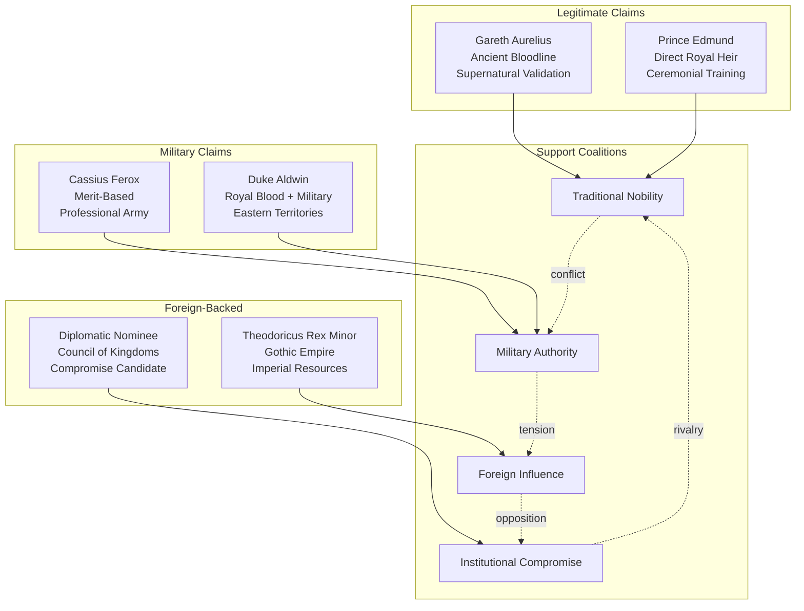

<!-- filepath: /Users/sami.j.p.heikkinen/Documents/src/summer-2025/da-dl/recursive-writing/the-crimson-veil/stories/political-intrigue-957-958/characters/succession-claimants.md -->

## AI Friendly Summary
**File Purpose**: Comprehensive character profiles for all succession claimants competing for the throne of Regnum Aethermoor during the political crisis of 957-958 AV. Documents the diverse power bases, legitimacy claims, and strategic positions of six primary candidates.

**Content Overview**: Details legitimate heirs (Gareth Aurelius, Prince Edmund), ambitious usurpers (Cassius Ferox, Duke Aldwin), and foreign-backed candidates (Theodoricus Rex Minor, diplomatic nominee). Includes individual character arcs, succession dynamics, and political coalition analysis.

**Dependencies**: References plot developments from [story timeline](../story-timeline.md), character relationships from [relationship mapping](../character-relationship-mapping.md), and individual character files for [Gareth Ironhold](gareth-ironhold.md), [Cassius](cassius.md), and [royal family members](royal-family-members.md).

**Usage Context**: Essential for understanding political motivations driving Acts II-III escalation, planning succession warfare scenes, and developing claimant-specific dialogue and strategic decisions throughout the crisis narrative.

## Cross-References
- **Main Documentation**: [Political Intrigue Story Overview](../README.md) | [Story Timeline](../story-timeline.md)
- **Character Development**: [Character Arc Development](../character-arc-development.md) | [Character Relationship Mapping](../character-relationship-mapping.md)
- **Related Characters**: [Gareth Ironhold](gareth-ironhold.md) | [Cassius](cassius.md) | [Royal Family Members](royal-family-members.md)
- **Plot Structure**: [Act 2 Scene Breakdown](../act-2-scene-breakdown.md) | [Act 3 Scene Breakdown](../act-3-scene-breakdown.md)
- **Supporting Cast**: [Supporting Court Officials](supporting-court-officials.md) | [Foreign Ambassadors](foreign-ambassadors.md)

# Character Profile: Succession Claimants

## Name:
**The Rival Claimants** - Primary competitors for the throne of Regnum Aethermoor

### Legitimate Claimants:

**Prince Gareth Aurelius** (Primary Rightful Heir)
- **Claim**: Ancient Aurelian bloodline with proven royal heritage
- **Support Base**: Traditional nobility, military honor, Celtic and Roman citizens
- **Validation**: Bearer of the Aurelius Diadem of Righteous Rule
- **Strengths**: Moral authority, international recognition, supernatural validation
- **Challenges**: Political inexperience, idealistic nature, potential military disadvantage

**Prince Edmund Aldricson** (Direct Royal Heir)
- **Claim**: King Aldric's son and immediate bloodline successor
- **Support Base**: Strict legitimists, court traditionalists, hereditary succession advocates
- **Strengths**: Undisputed bloodline, ceremonial training, royal protocol knowledge
- **Challenges**: Youth (age 16), political inexperience, lack of military support

### Ambitious Usurpers:

**Cassius Ferox** (Military Strongman)
- **Claim**: Merit-based leadership through military achievement and republican authority
- **Support Base**: Professional soldiers, Solarian citizens, efficiency advocates
- **Strengths**: Military genius, administrative experience, international military network
- **Challenges**: Lack of traditional legitimacy, Brotherhood Oath complications, republican constraints

**Duke Aldwin of Eastern Marches** (Military Conservative)
- **Claim**: King's brother with military experience and border defense credibility
- **Support Base**: Military nobles, feudal traditionalists, eastern territory lords
- **Strengths**: Royal blood, military competence, established power base
- **Challenges**: Limited charisma, narrow support base, traditional thinking

### Foreign-Backed Candidates:

**Theodoricus Rex Minor** (Imperial Unity Candidate)
- **Claim**: Representative of Gothic Empire seeking to incorporate Aethermoor
- **Support Base**: Imperial efficiency advocates, anti-chaos faction, Germanic nobles
- **Strengths**: Imperial resources, administrative expertise, continental vision
- **Challenges**: Foreign allegiance, cultural resistance, imperial domination fears

**Lady Morwenna's Nominee** (Diplomatic Compromise)
- **Claim**: Council of Kingdoms-approved candidate for negotiated settlement
- **Support Base**: Peace faction, diplomatic institutions, merchant guilds
- **Strengths**: International backing, economic support, compromise appeal
- **Challenges**: Lack of individual charisma, complexity of coalition management

## Role/Archetype:
Political Competitors, Dynastic Representatives, Power Seekers, Crisis Opportunists

## Physical Description:
Each claimant represents different political traditions and power bases. Gareth Aurelius displays the noble bearing of righteous kingship with the golden diadem validating his claim. Prince Edmund shows royal breeding but lacks the gravitas of experienced leadership. Cassius Ferox projects military authority through his commanding presence and battle scars. Duke Aldwin appears as a weathered military veteran with practical leadership experience. Theodoricus Rex Minor displays Gothic imperial regalia representing continental unity. Lady Morwenna's diplomatic nominee embodies compromise and institutional authority.

## Personality Traits:
- **Competing Ambitions**: Each driven by different visions of effective leadership during crisis
- **Political Calculation**: Sophisticated understanding of power dynamics and coalition building
- **Crisis Opportunism**: Ability to exploit political chaos for personal advancement
- **Factional Leadership**: Skills in managing diverse support bases with conflicting interests
- **Legitimacy Claims**: Different approaches to justifying their right to rule
- **Strategic Thinking**: Long-term planning for post-succession political structure

## Motivations/Goals:
- **Power Acquisition**: Achieve supreme political authority through various legitimate or practical means
- **Crisis Resolution**: End political chaos through their preferred form of strong leadership
- **Legacy Building**: Establish lasting political structures that reflect their values and vision
- **Factional Rewards**: Satisfy supporters' expectations for advancement and reward
- **Kingdom Transformation**: Reshape Aethermoor according to their political philosophy
- **Personal Vindication**: Prove their worthiness for supreme leadership role

## Key Relationships:
- **Support Networks**: Each claimant depends on different coalitions of nobles, military leaders, and interest groups
- **Rival Competitors**: Complex web of alliances and opposition among the various claimants
- **Foreign Backers**: International support that provides resources but creates obligation
- **King Aldric**: Current monarch whose death will trigger open succession warfare
- **Lucretia Aurelia Corvina**: Chief diplomat whose support could legitimize any claimant
- **Military Commanders**: Professional soldiers whose loyalty determines practical power

## Backstory:
The succession crisis emerged from the combination of traditional royal bloodlines, military achievement, foreign intervention, and institutional compromise. Gareth Aurelius represents the ancient legitimate claim validated by supernatural authority. Prince Edmund embodies strict hereditary succession from the current ruling family. Cassius Ferox built his claim through military merit and republican ideology. Duke Aldwin offers experienced military leadership within royal bloodlines. Theodoricus Rex Minor advances imperial unity through Gothic efficiency. The diplomatic nominee represents institutional compromise over individual charisma.

Each claimant's backstory reflects different political traditions and approaches to legitimate authority, creating multiple valid but competing visions for Aethermoor's future.

## Abilities/Skills:
- **Political Coalition Building**: Each claimant skilled at assembling and maintaining diverse support bases
- **Military Command**: Varying levels of direct military experience and ability to command armed forces
- **Diplomatic Relations**: Different approaches to international relationships and alliance building
- **Administrative Competence**: Practical experience in governance and bureaucratic management
- **Cultural Appeal**: Ability to inspire loyalty based on shared values and traditions
- **Crisis Leadership**: Capacity for decisive action during emergency situations

## Conflicts/Flaws:
- **Mutually Exclusive Claims**: Only one claimant can ultimately achieve supreme power
- **Support Base Limitations**: Each faction's strengths create corresponding weaknesses and blind spots
- **Foreign Dependencies**: International backing creates obligations that may conflict with kingdom interests
- **Personal Rivalries**: Individual conflicts that complicate potential political compromises
- **Legitimacy Questions**: Each claim vulnerable to specific criticisms about right to rule
- **Coalition Instability**: Support networks may fragment under pressure of extended conflict

## Arc/Development Notes:
### Political Intrigue Story Arc (957-958 AV):
- **Act I**: Multiple claimants position themselves as potential successors while King Aldric still rules
- **Act II**: Escalating competition and alliance building as succession becomes more urgent
- **Act III**: Open warfare after King Aldric's assassination eliminates peaceful transition possibility
- **Character Growth**: Each claimant forced to choose between pure ambition and kingdom welfare
- **Key Transformation**: Evolution from political maneuvering to military conflict

### Story Role:
- **Conflict Drivers**: Their competing claims create the central tension driving political crisis
- **Factional Representatives**: Each embodies different political philosophies and approaches to governance
- **Plot Catalysts**: Their actions and decisions trigger major story developments
- **Character Foils**: Their different approaches highlight the moral choices facing other characters

### Individual Character Arcs:

**Gareth Aurelius**:
- Growth from idealistic prince to practical war leader
- Challenge of maintaining moral principles during political crisis
- Brotherhood loyalty versus political necessity

**Prince Edmund**:
- Rapid maturation from protected heir to embattled claimant
- Learning difference between ceremonial kingship and practical leadership
- Family loyalty versus personal survival

**Cassius Ferox**:
- Tension between republican ideals and imperial ambition
- Brotherhood oath versus personal political goals
- Military efficiency versus diplomatic tradition

**Duke Aldwin**:
- Conservative military thinking versus innovative crisis response
- Family loyalty versus personal ambition
- Traditional feudalism versus administrative efficiency

**Theodoricus Rex Minor**:
- Imperial unity vision versus local cultural resistance
- Foreign allegiance versus adopted kingdom loyalty
- Administrative efficiency versus personal relationships

**Diplomatic Nominee**:
- Institutional compromise versus charismatic leadership
- International backing versus domestic legitimacy
- Peaceful transition versus decisive action

### Succession Dynamics:
- **Alliance Patterns**: Temporary partnerships based on shared interests rather than permanent friendship
- **Elimination Process**: Political and military pressure that removes weaker claimants
- **Legitimacy Competition**: Different bases for authority compete for popular and noble acceptance
- **Crisis Escalation**: Peaceful competition evolves into violent conflict as stakes increase

## Succession Competition Dynamics

## Claimant Strength Analysis

| Claimant | Legitimacy Score | Military Support | International Backing | Popular Appeal | Weakness |
|----------|------------------|------------------|-----------------------|----------------|----------|
| **Gareth Aurelius** | 9/10 | 7/10 | 8/10 | 8/10 | Political inexperience |
| **Prince Edmund** | 8/10 | 4/10 | 6/10 | 5/10 | Youth and inexperience |
| **Cassius Ferox** | 6/10 | 9/10 | 7/10 | 7/10 | Republican constraints |
| **Duke Aldwin** | 7/10 | 8/10 | 5/10 | 6/10 | Limited charisma |
| **Theodoricus Rex Minor** | 4/10 | 6/10 | 9/10 | 3/10 | Foreign allegiance |
| **Diplomatic Nominee** | 5/10 | 3/10 | 8/10 | 4/10 | Lack of individual appeal |

## Support Base Composition

| Faction | Primary Claimant | Secondary Option | Key Motivations |
|---------|------------------|------------------|-----------------|
| **Traditional Nobility** | Gareth Aurelius | Prince Edmund | Hereditary legitimacy, supernatural validation |
| **Professional Military** | Cassius Ferox | Duke Aldwin | Military competence, efficient leadership |
| **Celtic Citizens** | Gareth Aurelius | Cassius Ferox | Cultural identity, proven leadership |
| **Roman Citizens** | Cassius Ferox | Gareth Aurelius | Administrative efficiency, republican ideals |
| **Germanic Nobles** | Theodoricus Rex Minor | Duke Aldwin | Imperial unity, continental vision |
| **Merchant Guilds** | Diplomatic Nominee | Cassius Ferox | Economic stability, trade security |
| **Court Officials** | Prince Edmund | Diplomatic Nominee | Institutional continuity, procedural legitimacy |
| **Border Lords** | Duke Aldwin | Gareth Aurelius | Military defense, territorial security |

## Succession Timeline Involvement

| Phase | Gareth | Edmund | Cassius | Aldwin | Theodoricus | Diplomatic |
|-------|--------|--------|---------|---------|-------------|------------|
| **Early Positioning (957 AV)** | ⭐⭐⭐ | ⭐⭐ | ⭐⭐⭐ | ⭐⭐ | ⭐ | ⭐ |
| **Alliance Building** | ⭐⭐⭐ | ⭐ | ⭐⭐⭐ | ⭐⭐⭐ | ⭐⭐ | ⭐⭐⭐ |
| **Crisis Escalation** | ⭐⭐⭐ | ⭐⭐ | ⭐⭐⭐ | ⭐⭐⭐ | ⭐⭐ | ⭐⭐ |
| **Open Warfare (958 AV)** | ⭐⭐⭐ | ⭐ | ⭐⭐⭐ | ⭐⭐⭐ | ⭐⭐ | ⭐ |

*⭐⭐⭐ = Primary involvement | ⭐⭐ = Significant role | ⭐ = Supporting role*

---
Character profile adapted for "The Crimson Veil: Political Intrigue" (957-958 AV)
