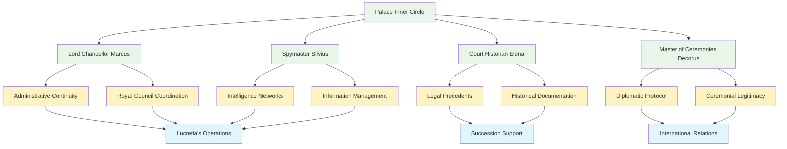

# Character Profile: Supporting Court Officials

## AI Friendly Summary
**File Purpose**: Comprehensive profile for supporting court officials who serve as secondary characters providing institutional continuity, specialized expertise, and bureaucratic support throughout the political intrigue story, representing the administrative backbone of the royal court.

**Content Overview**: Contains detailed profiles for four primary court officials including Lord Chancellor Marcus Corvinus, Spymaster Silvius Umbra, Court Historian Elena Scriptorum, and Master of Ceremonies Lord Decorus, covering their positions, relationships, roles in diplomatic operations, and institutional knowledge that supports the main characters' political activities.

**Dependencies**: Integrates with `character-relationship-mapping.md` for court hierarchy dynamics, `character-arc-development.md` for supporting character evolution, scene breakdowns for official court proceedings, protocol scenes, and administrative support moments throughout the story.

**Usage Context**: Reference for writers creating court scenes, administrative dialogue, protocol moments, institutional continuity scenes, and background character interactions that provide realistic bureaucratic texture to the political intrigue narrative.

## Cross-References
- **Character Networks**: [Character Relationship Mapping](../character-relationship-mapping.md) - Court hierarchy and administrative relationships
- **Character Development**: [Character Arc Development](../character-arc-development.md) - Supporting character evolution through crisis
- **Scene Implementation**:
  - [Act I Scene Breakdown](../act-1-scene-breakdown.md) - Court establishment and administrative scenes
  - [Act II Scene Breakdown](../act-2-scene-breakdown.md) - Crisis management and institutional support
  - [Act III Scene Breakdown](../act-3-scene-breakdown.md) - War preparation and administrative transition
- **Main Characters**:
  - [Lucretia Aurelia Corvina](./lucretia-aurelia-corvina.md) - Primary patron and coordination relationship
  - [Gareth Aurelius](./gareth-ironhold.md) - Future ruler support and legitimacy documentation
  - [Cassius Ferox](./cassius.md) - Military administrative coordination

## Court Administrative Network

## Administrative Expertise Matrix

| Official | Specialization | Court Function | Story Support Role | Crisis Contribution |
|----------|---------------|----------------|-------------------|-------------------|
| **Marcus Corvinus** | Royal Administration | Council Secretary | Bureaucratic Continuity | Succession Documentation |
| **Silvius Umbra** | Intelligence Operations | Information Networks | Diplomatic Intelligence | Crisis Intelligence |
| **Elena Scriptorum** | Historical Precedents | Record Keeping | Legal Legitimacy | Succession Law Expertise |
| **Lord Decorus** | Diplomatic Protocol | Ceremonial Affairs | International Relations | Foreign Court Coordination |

## Name:
**The Palace Inner Circle** - Key supporting characters who facilitate court operations and political machinations

### Primary Court Officials:

**Lord Chancellor Marcus Aurelius Corvinus**
- **Position**: Chief Administrative Officer and Royal Council Secretary
- **Relationship**: Lucretia's late husband's cousin, loyal to Corvina family interests
- **Role**: Manages official court proceedings and provides bureaucratic continuity

**Spymaster Silvius Umbra**
- **Position**: Director of Royal Intelligence Networks
- **Background**: Former merchant who built extensive information networks across kingdoms
- **Specialty**: Coordinates intelligence gathering for Lucretia's diplomatic operations

**Court Historian Elena Scriptorum**
- **Position**: Keeper of Royal Records and Precedents
- **Value**: Expert on succession law and historical precedents for current crisis
- **Loyalty**: Devoted to preserving legitimate royal bloodlines

**Master of Ceremonies Lord Decorus**
- **Position**: Protocol expert and diplomatic etiquette advisor
- **Function**: Ensures proper ceremonial conduct for foreign diplomatic missions
- **Network**: Connections with court officials across all major kingdoms

## Role/Archetype:
Palace Insiders, Bureaucratic Experts, Information Networks, Protocol Specialists

## Physical Description:
A diverse group of middle-aged court professionals who dress in formal court attire appropriate to their stations. Marcus Corvinus appears dignified in rich burgundy robes marking his chancellor rank. Silvius Umbra dresses modestly to blend into various social circles for intelligence gathering. Elena Scriptorum wears the traditional scholar's robes with ink-stained fingers from constant writing. Lord Decorus displays impeccable fashion sense and ceremonial knowledge through his carefully chosen court regalia.

## Personality Traits:
- **Institutional Loyalty**: Devoted to preserving court traditions and royal continuity above personal interests
- **Professional Competence**: Each expert in their specialized areas of court administration
- **Political Discretion**: Understand the importance of confidentiality and careful information management
- **Adaptive Service**: Skilled at serving different rulers while maintaining institutional continuity
- **Cultural Knowledge**: Deep understanding of court customs, legal precedents, and diplomatic protocols
- **Careful Communication**: Expert at saying exactly what needs to be said and nothing more

## Motivations/Goals:
- **Primary**: Maintain stable court operations during the succession crisis and political upheaval
- **Secondary**: Preserve institutional knowledge and traditions through the coming transition
- **Personal**: Protect their own positions and families during dangerous political changes
- **Professional**: Ensure accurate record-keeping and proper protocol observance for historical legitimacy

## Key Relationships:
- **Lucretia Aurelia Corvina**: Their primary patron and coordinator, who relies on their specialized knowledge
- **King Aldric the Just**: Current monarch whom they serve loyally while preparing for succession
- **Prince Gareth Aurelius**: Future ruler whose legitimacy they help document and support
- **Foreign Court Officials**: Professional networks that enable diplomatic intelligence gathering
- **Palace Staff**: Lower-level servants and functionaries who provide additional information sources
- **Noble Houses**: Various aristocratic families whose interests must be balanced and managed

## Backstory:
This group of career court officials has served through multiple political transitions and crises, building the institutional knowledge necessary to keep the royal court functioning regardless of who sits on the throne. Marcus Corvinus inherited his position through family connections but proved his competence during previous succession crises. Silvius Umbra rose from merchant background through demonstrated ability to gather and analyze political intelligence. Elena Scriptorum earned her position through scholarly excellence and unparalleled knowledge of legal precedents. Lord Decorus represents the old court traditions while adapting to changing diplomatic needs.

Each has witnessed the gradual buildup to the current crisis and understands their crucial role in either preserving or transforming the kingdom's political structure.

## Abilities/Skills:
- **Administrative Expertise**: Managing complex bureaucratic processes and royal court operations
- **Information Networks**: Gathering, verifying, and distributing intelligence across multiple sources
- **Legal Knowledge**: Understanding succession law, diplomatic precedents, and international agreements
- **Protocol Mastery**: Ensuring proper ceremonial conduct and diplomatic etiquette
- **Record Management**: Maintaining accurate documentation for historical and legal purposes
- **Crisis Adaptation**: Continuing essential operations during political upheaval and uncertainty

## Conflicts/Flaws:
- **Divided Loyalties**: Torn between institutional continuity and personal relationships with specific leaders
- **Professional Limitations**: Lack of independent power base makes them vulnerable to political changes
- **Information Overload**: Access to dangerous knowledge that could endanger them if mishandled
- **Bureaucratic Thinking**: Sometimes prioritize proper procedure over urgent practical necessities
- **Risk Aversion**: Prefer stability and tradition over necessary but dangerous political innovations
- **Personal Vulnerability**: Families and positions at risk if they choose the wrong side in succession crisis

## Arc/Development Notes:
### Political Intrigue Story Arc (957-958 AV):
- **Act I**: Efficient court administrators managing routine diplomatic and bureaucratic challenges
- **Act II**: Growing awareness of the succession crisis's severity and their crucial role in documenting legitimacy
- **Act III**: Forced to choose between institutional loyalty and personal survival as war approaches
- **Character Growth**: Learning when to bend rules and when to maintain rigid protocols for political stability
- **Key Function**: Provide institutional memory and procedural expertise that enables smooth political transitions

### Story Role:
- **Information Hub**: Channel crucial intelligence and documentation to key decision-makers
- **Legitimacy Validators**: Their support or opposition can make or break claims to succession
- **Operational Continuity**: Ensure court functions continue regardless of political upheaval
- **Cultural Preservation**: Maintain traditions and precedents that provide stability during crisis

### Character Dynamics:
- **Mutual Dependency**: Each official relies on others' specialized knowledge for complete court operations
- **Professional Rivalry**: Occasional competition for influence and access to key political figures
- **Shared Vulnerability**: Understanding that their survival depends on backing the eventual winner
- **Collective Wisdom**: Combined knowledge represents centuries of accumulated court experience

---
Character profile adapted for "The Crimson Veil: Political Intrigue" (957-958 AV)
