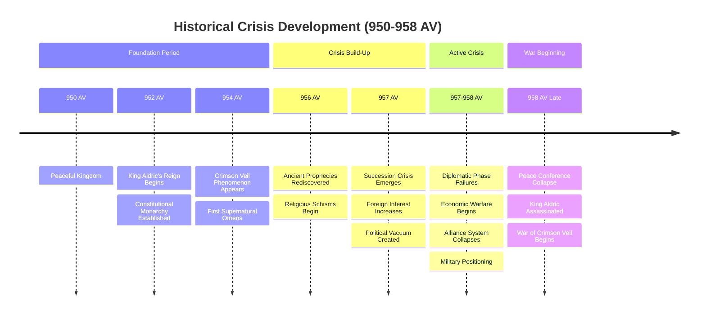

<!-- filepath: /Users/sami.j.p.heikkinen/Documents/src/summer-2025/da-dl/recursive-writing/the-crimson-veil/stories/political-intrigue-957-958/historical-context-integration.md -->
# Historical Context Integration
*Political Intrigue Story | 957-958 AV*

## AI Friendly Summary
**File Purpose**: Provides comprehensive historical context integration for the political intrigue story, documenting the broader historical framework, major events, and causal relationships that shaped the 957-958 AV crisis period leading to the War of the Crimson Veil.

**Content Overview**: Contains timeline cross-references spanning 950-958 AV, major historical events during the story period, kingdom-specific historical backgrounds, cultural context analysis, supernatural phenomenon documentation, and historical precedent analysis for political crisis resolution.

**Dependencies**: Integrates with `story-timeline.md` for chronological accuracy, `character-arc-development.md` for historical character motivations, `plot-thread-mapping.md` for event causality, and all scene breakdown files for historical detail implementation.

**Usage Context**: Essential reference for maintaining historical consistency across all story elements, used by writers for period-accurate details, by editors for historical verification, and by worldbuilding coordinators for broader universe continuity.

## Cross-References
- **Timeline Integration**: [Story Timeline](./story-timeline.md) - Chronological coordination and crisis progression
- **Character Context**: [Character Arc Development](./character-arc-development.md) - Historical motivations and background influences
- **Plot Integration**: [Plot Thread Mapping](./plot-thread-mapping.md) - Historical event causality and plot thread origins
- **Scene Context**: [Act I](./act-1-scene-breakdown.md), [Act II](./act-2-scene-breakdown.md), [Act III](./act-3-scene-breakdown.md) - Historical detail implementation
- **Relationship Context**: [Character Relationship Mapping](./character-relationship-mapping.md) - Historical relationship foundations
- **Analysis Integration**: [Cross-Check Analysis](./cross-check-analysis.md) - Historical consistency validation

## Historical Crisis Escalation Timeline

## Kingdom Historical Impact Matrix

| Kingdom/Region | Pre-Crisis Status | Crisis Role | Historical Precedent | Post-Crisis Position |
|---------------|------------------|-------------|---------------------|-------------------|
| Regnum Aethermoor | Stable Monarchy | Crisis Center | Succession Wars (843 AV) | Civil War State |
| Thornwick | Minor Border Power | Aggressive Expansion | Territorial Disputes (901 AV) | War Participant |
| Ravenshield | Trade Alliance | Marriage Diplomacy | Alliance Wars (789 AV) | Neutral Mediator |
| Drakheimr | Isolationist Tendency | Complete Withdrawal | Great Isolation (634 AV) | Total Isolation |
| République Maritime | Economic Power | Naval Blockade | Trade Wars (876 AV) | Economic Warfare |
| Altyngöl Nomads | Seasonal Conflicts | Border Escalation | Nomad Wars (723 AV) | Active Belligerent |
| Tír na Síthe | Diplomatic Observers | Strategic Withdrawal | Elven Isolations (multiple) | Isolationist |

## TIMELINE CROSS-REFERENCES

### Pre-Crisis Historical Foundation (950-957 AV)

**952 AV**: King Aldric the Just begins reign
- Establishes stable rule in Regnum Aethermoor
- Constitutional monarchy with feudal vassalage system
- Sets foundation for succession crisis when he fails to produce clear heir

**954 AV**: First signs of The Crimson Veil phenomenon
- Red mists appear over Lake Crimson
- Supernatural omens begin affecting political stability
- Religious interpretations create theological divisions

**956 AV**: Ancient prophecies rediscovered
- Scholars debate meanings of supernatural events
- Religious schisms emerge over interpretation
- Political uncertainty increases as supernatural fears spread

**957 AV**: Succession crisis formally begins
- No clear heir to throne creates political vacuum
- Multiple claimants and supporters begin positioning
- Foreign kingdoms start taking interest in internal affairs

### Major Historical Events During Story Period

**957 AV - Early Diplomatic Phase**:
- **Thornwick Gambit** (Month 2): Border revision demands backed by foreign power
- **Ravenshield Marriage Proposal** (Month 4): Political alliance through marriage
- **Eastern Kingdoms Trade Disruption** (Month 6): Economic warfare begins

**957 AV - Escalating Tensions**:
- **Religious Schism Crisis** (Month 8): Theological divisions undermine political unity
- **Drakheimr Isolation Incident** (Month 10): Dwarven kingdom withdraws completely
- **Noble Houses Positioning Crisis** (Month 12): Internal rebellion threatens kingdom

**958 AV - Desperate Prevention Phase**:
- **Altyngöl Border War** (Month 2): Nomadic conflicts escalate
- **Tír na Síthe Withdrawal** (Month 4): Elven kingdoms become isolationist
- **République Naval Blockade** (Month 6): Economic warfare intensifies
- **Council of Kingdoms Summit** (Month 8): Final peace conference fails

**958 AV - Climactic Events**:
- **Night of Crimson Shadows** (Month 10): Assassination plot discovered
- **Death of Kings** (Month 11): King Aldric assassinated during peace conference
- **Crown of Thorns** (Month 12): Gareth Aurelius claims throne amid chaos

---

## POLITICAL FACTION DETAILS

### Internal Factions (Regnum Aethermoor)

**Loyalist Coalition** (Supporting Gareth Aurelius):
- Legitimate succession supporters
- Traditional nobles and military
- Religious orthodox faction
- Administrative bureaucracy

**Usurper Alliance** (Alternative claimants):
- Ambitious nobles seeking power
- Foreign-backed pretenders
- Military commanders with personal armies
- Mercenary and opportunistic elements

**Neutral Powers** (Maintaining independence):
- Merchant guilds focused on trade
- Regional governors seeking autonomy
- Religious orders avoiding politics
- Academic and scholarly institutions

### External Threats and Influences

**Kingdom of Thornwick**:
- Historically aggressive expansionist policies
- Secretly backed by République de Portlune naval power
- Seeks territorial revision of century-old border agreements
- Uses diplomatic cover for military preparations

**République de Portlune**:
- Maritime republic with economic warfare capabilities
- Naval blockade tactics to strangle trade
- Commercial espionage and intelligence operations
- Democratic council governance conflicts with monarchy

**Drakheimr Holds** (The Silent Mountains):
- Isolationist dwarven confederation since 289 AV
- Complete withdrawal from human affairs
- Discovery of ancient threats related to Crimson Veil
- Mountain fortress immunity to political pressure

**Eastern Kingdoms** (Tír na Síthe - Sylvan Courts):
- Celtic-influenced elven territories
- Mysterious withdrawal from diplomatic contact
- Ancient magical knowledge and supernatural awareness
- Environmental concerns about Crimson Veil effects

**Khanate of Goldenvale** (Altyngöl):
- Nomadic confederation with hybrid settled culture
- Traditional grazing lands affected by Crimson Veil
- Border warfare escalating into full conflict
- Khan system with tribal confederation governance

---

## GEOGRAPHIC CONSIDERATIONS

### Strategic Locations

**Caer Aurelius** (Capital City):
- Golden-walled city built on ancient Roman foundations
- Political center with royal palace and administrative buildings
- Great Cathedral as seat of religious authority
- Royal University as center of learning and magical research

**Border Regions**:
- **Eastern Marches**: Frontier with Tír na Síthe territories
- **Western Coast**: Maritime boundaries with République de Portlune
- **Northern Mountains**: Border with isolationist Drakheimr Holds
- **Southern Plains**: Contested territory with Kingdom of Thornwick

**The King's Road**:
- Major trade artery connecting all regions
- Critical for economic and military logistics
- Vulnerable to disruption during political crisis
- Key intelligence and communication route

**Lake Crimson**:
- Supernatural phenomenon origin point
- Religious and political significance
- Source of red mists affecting kingdom
- Strategic location for control of phenomenon

### Economic Factors

**Trade Dependencies**:
- Eastern spice and luxury goods from Tír na Síthe
- Northern metals and crafted goods from Drakheimr
- Western maritime trade through République ports
- Southern agricultural products from contested regions

**Military Resources**:
- Central agricultural heartland supports large populations
- Professional armies supplemented by feudal levies
- Mountain fortifications for defensive positions
- River and road networks for troop movement

**Diplomatic Infrastructure**:
- Embassy quarter in capital city
- Diplomatic immunity and protocols
- Intelligence networks and spy operations
- Religious and cultural exchange programs

---

## CULTURAL AND RELIGIOUS CONTEXT

### Religious Landscape

**Orthodox Church** (Traditional Authority):
- Great Cathedral as rival to former papal power
- Conservative interpretation of religious texts
- Support for legitimate political succession
- Resistance to supernatural explanations

**Reform Movements** (New Spiritual Interpretations):
- Prophet-led movements interpreting Crimson Veil
- Charismatic religious leadership
- Populist appeal to common people
- Challenge to established religious hierarchy

**Foreign Religious Influence**:
- Eastern mysticism from Tír na Síthe traditions
- Northern clan spirituality from Drakheimr
- Western secular governance from République
- Southern militaristic theology from Thornwick

### Cultural Tensions

**Generational Conflicts**:
- Traditional feudal values vs. emerging nationalism
- Religious orthodoxy vs. supernatural mysticism
- Diplomatic solutions vs. military pragmatism
- Noble privilege vs. common welfare

**Class Dynamics**:
- Nobility seeking to maintain feudal privileges
- Merchant classes supporting trade and stability
- Common people affected by economic disruption
- Military officers advancing through professional merit

**Educational and Intellectual Movements**:
- Royal University as center of learning
- Scholarly debate over ancient prophecies
- Technological advancement vs. traditional methods
- International exchange of ideas and knowledge

---

## INTELLIGENCE AND INFORMATION WARFARE

### Spy Networks and Operations

**Domestic Intelligence**:
- Court informants and loyal servants
- Religious order intelligence gathering
- Military reconnaissance and counter-intelligence
- Merchant guild information networks

**Foreign Intelligence**:
- Embassy staff with dual diplomatic/spy roles
- Trade representatives gathering economic intelligence
- Religious pilgrims and scholars as information sources
- Military attachés monitoring foreign capabilities

**Counter-Intelligence**:
- Detection of foreign spy networks
- Protection of sensitive political information
- Disinformation campaigns against enemies
- Security for diplomatic negotiations

### Information as Political Weapon

**Diplomatic Intelligence**:
- Secret treaty negotiations and terms
- Foreign kingdom internal politics and weaknesses
- Military capabilities and strategic planning
- Economic vulnerabilities and trade dependencies

**Domestic Political Intelligence**:
- Noble house loyalties and secret alliances
- Religious faction activities and planning
- Popular opinion and potential unrest
- Succession claimant support and resources

**Supernatural Intelligence**:
- Crimson Veil phenomenon investigation
- Ancient prophecy research and interpretation
- Religious movement monitoring and analysis
- Magical and supernatural threat assessment

---

## MILITARY AND STRATEGIC CONSIDERATIONS

### Armed Forces Structure

**Royal Army** (Professional Forces):
- Standing army loyal to crown
- Professional officer corps
- Standardized equipment and training
- Castle and fortress garrison troops

**Feudal Levies** (Nobleman Obligations):
- Noble house military obligations
- Local militia and defensive forces
- Seasonal agricultural/military cycles
- Variable loyalty based on political allegiance

**Specialized Forces**:
- Intelligence and reconnaissance units
- Diplomatic protection and embassy guards
- Elite units for special operations
- Foreign mercenary and auxiliary troops

### Strategic Vulnerabilities

**Internal Weaknesses**:
- Succession crisis undermining military unity
- Noble house divided loyalties
- Economic disruption affecting supply lines
- Religious divisions weakening morale

**External Threats**:
- Multiple hostile kingdoms on different borders
- Naval blockade strangling maritime trade
- Nomadic raiders disrupting agricultural regions
- Supernatural phenomena affecting military effectiveness

**Geographic Challenges**:
- Defending multiple frontiers simultaneously
- Mountain and river barriers limiting movement
- Seasonal weather affecting campaign timing
- Supply line protection across vast territories

---

## INTEGRATION CHECKLIST

### Historical Accuracy
- [ ] Timeline events align with established chronology
- [ ] Political developments follow logical progression
- [ ] Character motivations consistent with historical period
- [ ] Cultural and religious elements authentic to setting

### Political Consistency
- [ ] Faction loyalties remain stable unless plot-driven
- [ ] Foreign kingdom policies consistent with established lore
- [ ] Economic and military factors realistic for medieval period
- [ ] Diplomatic protocols appropriate for feudal monarchy

### Geographic Authenticity
- [ ] Travel times and distances realistic
- [ ] Strategic locations properly utilized
- [ ] Economic geography supports political developments
- [ ] Cultural boundaries respect established kingdoms

### Character Integration
- [ ] Existing characters behave consistently with established personalities
- [ ] New characters fit within established social structures
- [ ] Political relationships reflect historical context
- [ ] Personal motivations align with broader political forces

## RESEARCH NOTES
- All events build toward inevitable War of Crimson Veil
- Political breakdown follows historical patterns of succession crises
- Supernatural elements enhance rather than replace political realism
- Character development occurs through historical participation
- Multiple plot threads converge through historical inevitability
