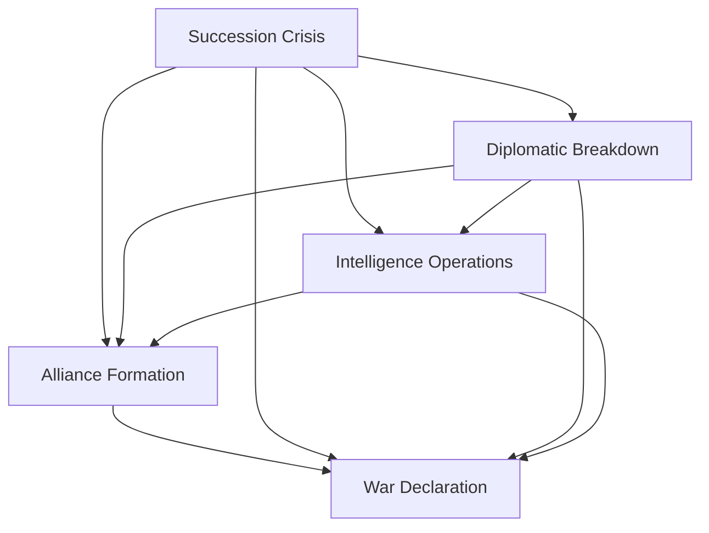

# Plot Thread Mapping
*Political Intrigue Story | 957-958 AV*

## AI Friendly Summary
**File Purpose**: Maps the four primary plot threads of the political intrigue story and their interconnections across the 18-month narrative timeline.
**Content Overview**: Details succession crisis, diplomatic breakdown, intelligence operations, and alliance formation threads with character involvement and key plot points for each thread.
**Dependencies**: References character-arc-development.md for character progression, act-*-scene-breakdown.md files for scene mapping, and story-timeline.md for temporal alignment.
**Usage Context**: Used during scene writing and narrative development to ensure plot thread consistency and proper weaving of multiple storylines throughout the three-act structure.

## Cross-References
- **Character Development**: See [Character Arc Development](./character-arc-development.md) for detailed character progression analysis
- **Scene Implementation**: See [Act I Scene Breakdown](./act-1-scene-breakdown.md), [Act II Scene Breakdown](./act-2-scene-breakdown.md), [Act III Scene Breakdown](./act-3-scene-breakdown.md) for scene-by-scene plot thread integration
- **Timeline Alignment**: See [Story Timeline](./story-timeline.md) for month-by-month plot thread progression
- **Character Relationships**: See [Character Relationship Mapping](./character-relationship-mapping.md) for interpersonal dynamics affecting plot threads

## PLOT THREAD OVERVIEW

### Primary Threads
1. **Succession Crisis Thread** - Central political conflict
2. **Diplomatic Breakdown Thread** - International relations deterioration
3. **Intelligence Operations Thread** - Information warfare and espionage
4. **Alliance Formation Thread** - Political coalition building

### Thread Interconnections

- All threads converge to drive the story toward inevitable war
- Character development occurs through participation in multiple threads
- Resolution of threads creates domino effects on other storylines

### Plot Thread Distribution Table

| Thread | Act I | Act II | Act III | Primary Characters | Key Scenes |
|--------|--------|--------|---------|-------------------|------------|
| Succession Crisis | Emergence | Escalation | Resolution | Lucretia, Gareth, Court Officials | 6, 11, 18, 24 |
| Diplomatic Breakdown | Initial Tensions | Failed Negotiations | Final Attempts | Lucretia, Foreign Ambassadors | 1, 8, 20 |
| Intelligence Operations | Network Building | Critical Intelligence | Exposure/Consequences | Cassius, Operatives | 3, 9, 13, 23 |
| Alliance Formation | Initial Contacts | Coalition Building | Final Alliances | All Characters | 7, 17, 21 |

---

## THREAD 1: SUCCESSION CRISIS

### Thread Arc: Internal Political Stability Collapse

**Act I Development:**
- Royal health concerns emerge
- Potential heirs position themselves
- Foreign powers take interest
- Court factions form around candidates

**Act II Development:**
- Open succession dispute erupts
- Foreign intervention escalates
- Violence threatens political process
- Lucretia becomes key power broker

**Act III Development:**
- Succession decided through political maneuvering
- New ruler consolidates power
- Opposition prepares for military resistance
- War becomes inevitable outcome

### Key Plot Points:
1. **Royal Health Crisis** (Scene 6, Act I)
2. **Succession Announcement** (Early Act II)
3. **Foreign Intervention** (Mid Act II)
4. **Succession Resolution** (Late Act II)
5. **Opposition Resistance** (Act III)
6. **War Declaration** (End Act III)

### Character Involvement:
- **Lucretia**: Key diplomatic mediator and power broker
- **Gareth**: Military advisor to succession candidates
- **Cassius**: Intelligence operations supporting preferred candidate
- **Court Officials**: Choose sides and provide support
- **Foreign Powers**: Attempt to influence outcome

---

## THREAD 2: DIPLOMATIC BREAKDOWN

### Thread Arc: International Relations Deterioration

**Act I Development:**
- Trade disputes and border tensions
- Failed negotiation attempts
- Foreign demands increase
- Diplomatic protocols breakdown

**Act II Development:**
- Embassy incidents and expulsions
- Economic warfare and sanctions
- Military posturing and threats
- Alliance system activation

**Act III Development:**
- Complete diplomatic isolation
- Foreign military preparations
- Ultimatum delivery and rejection
- Declaration of hostile intent

### Key Plot Points:
1. **Failed Trade Negotiations** (Scene 4, Act I)
2. **Embassy Crisis** (Early Act II)
3. **Economic Sanctions** (Mid Act II)
4. **Military Ultimatum** (Late Act II)
5. **Diplomatic Expulsions** (Early Act III)
6. **War Ultimatum** (End Act III)

### Character Involvement:
- **Lucretia**: Primary diplomatic representative attempting to prevent breakdown
- **Foreign Ambassadors**: Deliver increasingly harsh demands
- **Gareth**: Advises on military implications of diplomatic failures
- **Cassius**: Gathers intelligence on foreign military preparations

---

## THREAD 3: INTELLIGENCE OPERATIONS

### Thread Arc: Information Warfare Escalation

**Act I Development:**
- Routine intelligence gathering
- Discovery of foreign spy networks
- Counter-intelligence operations begin
- Information becomes weaponized

**Act II Development:**
- Major intelligence breaches
- Spy network compromises
- Assassination attempts and sabotage
- Information warfare intensifies

**Act III Development:**
- Total intelligence warfare
- Network destruction and rebuilding
- Critical intelligence for war planning
- Final intelligence operations for advantage

### Key Plot Points:
1. **Spy Network Discovery** (Scene 5, Act I)
2. **Intelligence Breach** (Early Act II)
3. **Counter-Intelligence Success** (Mid Act II)
4. **Network Compromise** (Late Act II)
5. **Intelligence War** (Early Act III)
6. **War Intelligence** (End Act III)

### Character Involvement:
- **Cassius**: Primary intelligence operative and network manager
- **Lucretia**: Uses intelligence for diplomatic advantage
- **Gareth**: Applies intelligence to military planning
- **Foreign Agents**: Conduct operations against domestic interests
- **Spy Networks**: Provide information and conduct operations

---

## THREAD 4: ALLIANCE FORMATION

### Thread Arc: Political Coalition Building

**Act I Development:**
- Initial faction identification
- Personal relationship building
- Mutual interest alignment
- Preliminary alliance formation

**Act II Development:**
- Alliance stress testing through crises
- Betrayals and loyalty shifts
- Coalition strengthening and expansion
- Foreign alliance interference

**Act III Development:**
- Final alliance consolidation
- Opposition coalition formation
- Alliance system polarization
- War alliance activation

### Key Plot Points:
1. **Initial Alliance Formation** (Scene 7, Act I)
2. **Alliance Testing** (Early Act II)
3. **Coalition Expansion** (Mid Act II)
4. **Foreign Interference** (Late Act II)
5. **Alliance Polarization** (Early Act III)
6. **War Coalition** (End Act III)

### Character Involvement:
- **Lucretia**: Key alliance architect and negotiator
- **Gareth**: Military component of alliance building
- **Cassius**: Intelligence support for alliance operations
- **Court Factions**: Form core of domestic alliances
- **Foreign Powers**: Attempt to disrupt or control alliances

---

## THREAD INTERSECTION POINTS

### Major Convergence Events:

**The Royal Crisis** (End Act I):
- Succession crisis thread creates urgency
- Diplomatic breakdown accelerates as foreign powers intervene
- Intelligence operations intensify to manage crisis
- Alliance formation becomes critical for survival

**The Intelligence War** (Mid Act II):
- Intelligence operations affect all other threads
- Succession crisis influenced by leaked information
- Diplomatic breakdown accelerated by intelligence revelations
- Alliance formation guided by intelligence advantages

**The Final Breakdown** (End Act II):
- All threads reach crisis point simultaneously
- Diplomatic solutions become impossible
- Succession resolution triggers opposition response
- Intelligence operations prepare for military conflict
- Alliances polarize into war coalitions

**War Preparation** (Act III):
- All threads converge toward military resolution
- Political crisis drives military necessity
- Diplomatic failure justifies military action
- Intelligence operations support war planning
- Alliances become military coalitions

---

## THREAD RESOLUTION TRACKING

### Success Metrics:
- [ ] Each thread maintains narrative momentum
- [ ] Thread intersections create dramatic tension
- [ ] Character development occurs through thread participation
- [ ] Thread resolutions feel inevitable and satisfying
- [ ] All threads contribute to war outcome

### Plot Thread Checklist:
- [ ] Succession crisis drives internal political conflict
- [ ] Diplomatic breakdown creates international pressure
- [ ] Intelligence operations provide thriller elements
- [ ] Alliance formation gives characters agency and choice
- [ ] Thread convergence creates climactic tension
- [ ] Resolution sets up war scenario naturally

## WRITING NOTES
- Track thread development across scenes
- Ensure each scene advances multiple threads
- Balance thread prominence throughout story
- Use thread intersections for major plot beats
- Maintain thread consistency with character arcs
