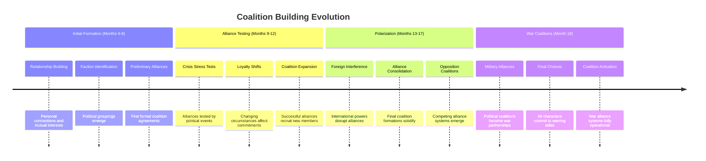
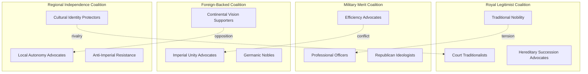

## AI Friendly Summary
**File Purpose**: Detailed development of the alliance formation plot thread, tracking the complex political coalition building that evolves from diplomatic partnerships through factional alliances to military coalitions during the 957-958 AV crisis.

**Content Overview**: Chronicles progression from initial relationship building through alliance stress testing to final war coalition formation, including character agency in alliance choices, betrayal dynamics, and the transformation of political partnerships into military alliances.

**Dependencies**: References [plot thread mapping](../plot-thread-mapping.md) for thread interconnections, [character relationship mapping](../character-relationship-mapping.md) for alliance foundations, and [story timeline](../story-timeline.md) for alliance evolution chronology.

**Usage Context**: Essential for writing political negotiation scenes, developing character choice moments, planning betrayal and loyalty reveals, and ensuring realistic progression from political cooperation to military confederation.

## Cross-References
- **Main Plot Framework**: [Plot Thread Mapping](../plot-thread-mapping.md) | [Story Timeline](../story-timeline.md)
- **Character Relationships**: [Character Relationship Mapping](../character-relationship-mapping.md) | [Character Arc Development](../character-arc-development.md)
- **Scene Implementation**: [Act I Scene Breakdown](../act-1-scene-breakdown.md) | [Act II Scene Breakdown](../act-2-scene-breakdown.md) | [Act III Scene Breakdown](../act-3-scene-breakdown.md)
- **Related Threads**: [Succession Crisis](succession-crisis.md) | [Diplomatic Breakdown](diplomatic-breakdown.md) | [Intelligence Operations](intelligence-operations.md)
- **Alliance Players**: [Supporting Court Officials](../characters/supporting-court-officials.md) | [Foreign Ambassadors](../characters/foreign-ambassadors.md) | [Succession Claimants](../characters/succession-claimants.md)

# Plot Thread: Alliance Formation
*Political Coalition Building | 957-958 AV*

## Thread Overview
**Core Conflict**: Characters must navigate complex alliance building while personal relationships, political necessities, and changing circumstances constantly reshape coalition possibilities, ultimately forcing everyone into irreconcilable military alliances.

**Timeline Span**: Months 6-18 (emerges late Act I, dominates Act II-III)
**Thread Type**: Character Agency/Choice - provides characters meaningful decisions with consequences
**Resolution**: Political alliances become military coalitions for civil war

## Alliance Formation Timeline

## Act-by-Act Development

### Act I: Alliance Foundation Building (Months 6-7)
**Development Focus**: Establishing personal relationships and mutual interests

**Key Plot Points**:
1. **Initial Alliance Formation** (Month 6, Scene 7)
   - Personal relationships form foundation for political partnerships
   - Mutual interests identified and preliminary agreements reached
   - Trust building through shared information and small commitments

2. **Faction Identification** (Month 7)
   - Court groups coalesce around shared political philosophies
   - Succession preferences drive alliance formation
   - Foreign relationships influence domestic coalition building

**Alliance Types at Formation**:
- **Personal Alliances**: Based on friendship, trust, and shared values
- **Political Alliances**: Based on mutual interests and complementary capabilities
- **Strategic Alliances**: Based on short-term advantages and enemy opposition
- **Cultural Alliances**: Based on shared cultural identity and traditions

**Character Involvement**:
- **Lucretia**: Key alliance architect and diplomatic facilitator
- **Gareth**: Military component provides security guarantees for alliances
- **Cassius**: Intelligence sharing creates alliance trust and leverage
- **Court Officials**: Core membership of domestic political alliances
- **Foreign Powers**: Attempt to create favorable alliance structures

### Act II: Alliance Testing and Evolution (Months 8-14)
**Development Focus**: Alliance stress testing through crisis and coalition expansion

**Key Plot Points**:
1. **Alliance Testing** (Months 8-9)
   - Political crises test alliance commitment and reliability
   - Weak alliances fracture under pressure
   - Strong alliances demonstrate value through crisis response

2. **Coalition Expansion** (Months 10-11)
   - Successful alliances recruit additional members
   - Alliance networks grow through relationship chains
   - Resource pooling increases alliance effectiveness

3. **Foreign Interference** (Months 12-13)
   - International powers attempt to disrupt domestic alliances
   - Foreign resources used to seduce alliance members
   - External pressure tests alliance loyalty

4. **Loyalty Shifts** (Month 13, Scene 17)
   - Changing circumstances force alliance reevaluation
   - Personal relationships tested by political necessities
   - Some alliances dissolve while others strengthen

5. **Coalition Formation** (Month 14)
   - Multiple small alliances merge into larger coalitions
   - Political blocs become clearly defined
   - Opposition coalition structures emerge

**Alliance Evolution Patterns**:
- **Strengthening**: Crisis response proves alliance value
- **Expansion**: Successful alliances attract new members
- **Fragmentation**: Pressure reveals fundamental incompatibilities
- **Merger**: Small alliances combine for increased effectiveness
- **Betrayal**: Strategic abandonment for perceived advantage

**Character Involvement**:
- **Lucretia**: Manages complex multi-party alliance negotiations
- **Gareth**: Military alliance component becomes increasingly important
- **Cassius**: Intelligence operations support alliance decision-making
- **All Characters**: Face alliance loyalty vs. personal interest decisions

### Act III: Alliance Polarization and War Coalitions (Months 15-18)
**Development Focus**: Final alliance consolidation and military coalition formation

**Key Plot Points**:
1. **Alliance Consolidation** (Month 15)
   - Political coalitions reach final membership composition
   - Moderate positions become impossible to maintain
   - Characters forced to choose sides in polarized environment

2. **Opposition Coalition Formation** (Month 16, Scene 21)
   - Competing alliance systems become irreconcilable
   - Military preparations require alliance resource pooling
   - Political partnerships transform into war coalitions

3. **Alliance Polarization** (Month 17, Scene 22)
   - All moderate alliance options eliminated
   - Characters face final loyalty decisions
   - Personal relationships severed by alliance necessities

4. **War Coalition Activation** (Month 18, Scenes 24-25)
   - Political alliances become military partnerships
   - Resource and command structures established
   - Alliance systems fully operational for warfare

**Final Coalition Structure**:
- **Royal Legitimist Coalition**: Traditional monarchy supporters
- **Military Merit Coalition**: Professional military and efficiency advocates
- **Foreign-Backed Coalition**: International influence alliance
- **Regional Independence Coalition**: Local autonomy advocates

**Character Involvement**:
- **All Major Characters**: Final alliance decisions determine war-time loyalties
- **Lucretia**: Personal cost of alliance failure in diplomatic context
- **Gareth**: Military leadership determines coalition viability
- **Cassius**: Intelligence networks serve chosen alliance exclusively

## Character Arc Integration

### Lucretia Aurelia Corvina - Alliance Architect
**Alliance Role**: Primary diplomatic architect of complex multi-party coalitions
**Character Development**: From optimistic coalition builder to tragic witness of alliance destruction
**Key Moments**:
- Building initial diplomatic alliances (Act I)
- Managing alliance crisis and expansion (Act II)
- Witnessing alliance polarization and war formation (Act III)

**Alliance Building Progression**:
1. **Relationship Foundation**: Personal connections enable political partnerships
2. **Coalition Architecture**: Diplomatic skills create complex alliance structures
3. **Crisis Management**: Alliance preservation through political challenges
4. **Tragic Failure**: Alliance system collapse into irreconcilable war coalitions

### Gareth Ironhold - Military Alliance Anchor
**Alliance Role**: Military component provides security and enforcement capability
**Character Development**: From alliance supporter to military coalition leader
**Key Alliance Decisions**:
- Providing military credibility to political alliances (Act I)
- Military resource sharing creates alliance interdependence (Act II)
- Leading military coalition formation (Act III)

### Cassius - Intelligence-Informed Alliance Strategy
**Alliance Role**: Intelligence operations guide alliance formation and betrayal detection
**Character Development**: From alliance information broker to partisan intelligence operative
**Intelligence-Alliance Integration**:
- Information sharing builds alliance trust (Act I)
- Counter-intelligence protects alliance security (Act II)
- Intelligence operations serve final alliance loyalty (Act III)

## Alliance Structure Analysis

### Alliance Foundation Types:
| Foundation Type | Strength | Flexibility | Durability | Vulnerability |
|-----------------|----------|-------------|------------|---------------|
| **Personal Relationships** | High trust | Low flexibility | High if maintained | Personal conflicts |
| **Mutual Interests** | Practical value | Medium flexibility | Medium-term | Interest changes |
| **Strategic Necessity** | High utility | High flexibility | Short-term | Alternative strategies |
| **Cultural Identity** | Deep loyalty | Low flexibility | Very high | Cultural evolution |
| **Resource Sharing** | Economic value | Medium flexibility | Economic dependent | Resource scarcity |

### Coalition Evolution Patterns:
1. **Personal → Political**: Friendship enables formal alliance
2. **Bilateral → Multilateral**: Two-party agreements expand to group coalitions
3. **Domestic → International**: Local alliances attract foreign partners
4. **Political → Military**: Crisis necessitates military cooperation
5. **Cooperative → Competitive**: Alliance systems oppose each other

## Alliance Decision Framework

### Character Alliance Choices:
| Character Type | Primary Motivations | Alliance Preferences | Breaking Points |
|----------------|-------------------|---------------------|-----------------|
| **Diplomats** | Peace and stability | Inclusive coalitions | War inevitability |
| **Military Officers** | Security and effectiveness | Competence-based alliances | Command authority conflicts |
| **Court Officials** | Power and influence | Access to decision-making | Personal security threats |
| **Foreign Representatives** | National interests | Home government priorities | Diplomatic recall |
| **Succession Claimants** | Throne acquisition | Support maximization | Legitimacy challenges |

### Alliance Stress Tests:
- **Resource Crises**: Economic pressure tests resource-sharing commitments
- **Loyalty Conflicts**: Personal relationships vs. alliance obligations
- **Foreign Pressure**: International interference in domestic alliances
- **Military Crises**: Security threats require military alliance activation
- **Succession Disputes**: Political conflicts test alliance cohesion

## Plot Thread Connections

### Primary Thread Intersections:
1. **Succession Crisis**: Alliance formation around succession candidates drives political coalitions
2. **Diplomatic Breakdown**: Failed diplomacy necessitates alliance building for security
3. **Intelligence Operations**: Information sharing and protection enable alliance formation and betrayal

### Scene-by-Scene Thread Presence:
- **Scene 7 (Act I)**: Initial alliance formation through personal relationships
- **Scene 17 (Act II)**: Coalition building and alliance expansion
- **Scene 21 (Act III)**: War coalition formation and military partnerships
- **Scene 22 (Act III)**: Personal relationship costs of alliance polarization

## Alliance Network Mapping

### Coalition Membership Structure:

## Writing Guidelines

### Dialogue Considerations:
- Alliance negotiation language and diplomatic terminology
- Personal relationship dynamics vs. political necessities
- Betrayal justifications and loyalty explanations
- Coalition membership benefits and obligations

### Atmosphere and Tone:
- Hope and optimism in early alliance building
- Growing tension as alliance interests conflict
- Tragic necessity as alliances polarize into war coalitions
- Personal cost of political alliance decisions

### Key Themes:
- Personal relationships vs. political necessities
- Coalition building as survival strategy
- Trust and betrayal in political partnerships
- Transformation of cooperation into competition

## Critical Success Factors

### Plot Thread Integrity:
- [ ] Alliance formation feels politically realistic
- [ ] Character alliance choices driven by genuine motivations
- [ ] Alliance evolution follows logical progression
- [ ] Coalition polarization creates genuine tension
- [ ] War alliance formation feels inevitable

### Character Development:
- [ ] Characters grow through alliance decision-making
- [ ] Personal relationships tested by political alliance needs
- [ ] Alliance betrayals and loyalties drive character transformation
- [ ] Character agency meaningful in alliance formation

### Political Authenticity:
- [ ] Alliance structures appropriate to political setting
- [ ] Coalition benefits and costs realistically portrayed
- [ ] Foreign influence in alliances historically plausible
- [ ] Military coalition formation technically accurate

---
*Part of Political Intrigue Story (957-958 AV) plot development framework*
