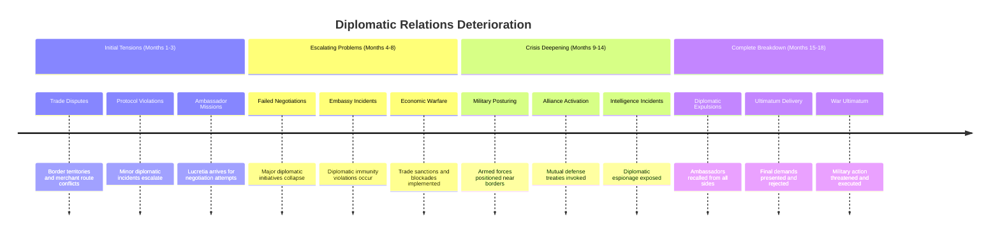

## AI Friendly Summary
**File Purpose**: Detailed development of the diplomatic breakdown plot thread, tracking the failure of international negotiations and the deterioration of peaceful relations leading to warfare in the 957-958 AV political crisis.

**Content Overview**: Chronicles progression from initial trade disputes through embassy crises to complete diplomatic isolation, including Lucretia's central role, foreign ambassador motivations, and timeline integration across the 18-month narrative.

**Dependencies**: References [plot thread mapping](../plot-thread-mapping.md) for thread interconnections, [character development](../character-arc-development.md) for diplomatic character arcs, and [story timeline](../story-timeline.md) for international relations chronology.

**Usage Context**: Critical for writing diplomatic scenes, developing Lucretia's character arc, planning foreign ambassador dialogue, and ensuring realistic progression from negotiation to warfare throughout the story.

## Cross-References
- **Main Plot Framework**: [Plot Thread Mapping](../plot-thread-mapping.md) | [Story Timeline](../story-timeline.md)
- **Character Development**: [Lucretia Aurelia Corvina](../characters/lucretia-aurelia-corvina.md) | [Foreign Ambassadors](../characters/foreign-ambassadors.md)
- **Scene Implementation**: [Act I Scene Breakdown](../act-1-scene-breakdown.md) | [Act II Scene Breakdown](../act-2-scene-breakdown.md) | [Act III Scene Breakdown](../act-3-scene-breakdown.md)
- **Related Threads**: [Succession Crisis](succession-crisis.md) | [Intelligence Operations](intelligence-operations.md) | [Alliance Formation](alliance-formation.md)
- **Historical Context**: [Historical Context Integration](../historical-context-integration.md)

# Plot Thread: Diplomatic Breakdown
*International Relations Deterioration | 957-958 AV*

## Thread Overview
**Core Conflict**: Despite Lucretia's skilled diplomatic efforts, international negotiations systematically fail due to underlying territorial ambitions, succession interference, and irreconcilable national interests, culminating in complete diplomatic isolation and war justification.

**Timeline Span**: Months 1-18 (primary thread throughout entire story)
**Thread Type**: Character-driven/Thematic - provides protagonist's perspective and moral stakes
**Resolution**: Complete diplomatic failure that morally justifies but tragically necessitates warfare

## Diplomatic Breakdown Timeline

## Act-by-Act Development

### Act I: Initial Diplomatic Tensions (Months 1-6)
**Development Focus**: Establishing diplomatic challenges and Lucretia's mission

**Key Plot Points**:
1. **Trade Dispute Origins** (Month 1, Scene 1)
   - Border territory conflicts affecting merchant routes
   - Resource access rights disputed between kingdoms
   - Economic interests driving political tensions

2. **Lucretia's Diplomatic Mission** (Months 1-2, Scenes 1-4)
   - Arrival as chief diplomatic representative
   - Initial assessment of international situation
   - First negotiation attempts and early challenges

3. **Protocol Breakdown** (Month 3, Scene 3)
   - Minor diplomatic incidents escalate unnecessarily
   - Cultural misunderstandings exploited for political gain
   - Diplomatic immunity violations begin occurring

4. **Failed Trade Negotiations** (Month 4, Scene 4)
   - Major economic summit ends in complete failure
   - Underlying territorial ambitions revealed
   - International cooperation proves impossible

**Character Involvement**:
- **Lucretia**: Primary diplomatic representative attempting to preserve peace
- **Foreign Ambassadors**: Represent national interests that conflict with peaceful resolution
- **Court Officials**: Provide domestic perspective on international relations
- **Gareth**: Advises on military implications of diplomatic failures

### Act II: Diplomatic Crisis Escalation (Months 7-14)
**Development Focus**: Systematic failure of all peaceful resolution attempts

**Key Plot Points**:
1. **Embassy Crisis** (Month 7, Scene 8)
   - Diplomatic immunity violations become systematic
   - Embassy staff expelled or imprisoned
   - International law breaks down completely

2. **Economic Warfare Implementation** (Months 8-9)
   - Trade sanctions imposed by all sides
   - Economic blockades affect civilian populations
   - Merchant guilds demand military protection

3. **Military Ultimatum** (Months 10-11, Scene 12)
   - Armed forces positioned near disputed borders
   - Military threats replace diplomatic negotiations
   - Alliance systems activated for mutual defense

4. **Intelligence Warfare Exposure** (Month 12, Scene 13)
   - Diplomatic espionage operations revealed
   - Ambassador credentials used for intelligence gathering
   - Trust between nations completely destroyed

5. **Final Negotiation Failure** (Months 13-14, Scenes 16-19)
   - Last-ditch diplomatic summits collapse
   - Compromise proposals rejected by all sides
   - Peaceful resolution declared impossible

**Character Involvement**:
- **Lucretia**: Desperately attempts to salvage any possibility of peace
- **Foreign Ambassadors**: Face increasing pressure from home governments
- **Cassius**: Intelligence operations compromise diplomatic efforts
- **Court Officials**: Prepare for war as diplomatic option disappears

### Act III: Complete Diplomatic Breakdown (Months 15-18)
**Development Focus**: Final collapse and transition to warfare

**Key Plot Points**:
1. **Diplomatic Expulsions** (Month 15, Scene 20)
   - All foreign ambassadors recalled by home governments
   - Diplomatic missions closed and staff evacuated
   - International communication channels severed

2. **War Ultimatum Delivery** (Month 16, Scene 21)
   - Final demands presented with military deadlines
   - Territorial concessions demanded as war price
   - Ultimatum terms designed to be unacceptable

3. **Ultimatum Rejection** (Month 17, Scene 23)
   - National sovereignty requires ultimatum rejection
   - Military response becomes only available option
   - Diplomatic failure complete and irreversible

4. **War Declaration** (Month 18, Scenes 24-25)
   - Formal declaration of hostile intent
   - Military operations begin immediately
   - Diplomatic relations cease entirely

**Character Involvement**:
- **Lucretia**: Experiences personal failure as peace proves impossible
- **Foreign Ambassadors**: Return home to report diplomatic failure
- **All Characters**: Face consequences of diplomatic breakdown through war

## Character Arc Integration

### Lucretia Aurelia Corvina - Failed Peacekeeper
**Diplomatic Role**: Primary architect of peace efforts and witness to their failure
**Character Development**: From confident diplomat to tragic figure unable to prevent war
**Key Moments**:
- Initial optimism about diplomatic solutions (Act I)
- Growing frustration with intractable positions (Act II)
- Personal devastation at complete diplomatic failure (Act III)

**Diplomatic Mission Progression**:
1. **Confident Arrival**: Believes diplomatic skill can resolve conflicts
2. **Growing Challenges**: Discovers conflicts deeper than initially understood
3. **Desperate Measures**: Attempts increasingly radical compromises
4. **Tragic Failure**: Accepts personal responsibility for diplomatic breakdown

### Foreign Ambassadors - Competing National Interests
**Diplomatic Role**: Represent irreconcilable national ambitions disguised as negotiable positions
**Character Development**: From diplomatic colleagues to enemy representatives
**Key Relationships**:
- Professional respect for Lucretia despite opposing interests
- Personal friendships destroyed by political necessities
- Cultural differences exploited for political advantage

## Diplomatic Failure Analysis

### Root Causes of Breakdown:
| Factor | Impact Level | Timeline | Resolution Attempts |
|--------|--------------|----------|-------------------|
| **Territorial Ambitions** | Critical | Throughout | Multiple partition proposals failed |
| **Resource Competition** | High | Months 1-8 | Economic sharing agreements rejected |
| **Succession Interference** | Critical | Months 4-18 | Non-interference pacts violated |
| **Cultural Conflicts** | Medium | Throughout | Cultural exchange programs insufficient |
| **Economic Warfare** | High | Months 8-18 | Trade agreement proposals failed |
| **Military Posturing** | Critical | Months 10-18 | Demilitarization proposals rejected |

### Diplomatic Initiatives Attempted:
1. **Economic Cooperation Proposals** - Rejected due to territorial disputes
2. **Cultural Exchange Programs** - Undermined by espionage activities
3. **Territorial Partition Plans** - Unacceptable to all parties involved
4. **Non-Interference Agreements** - Violated immediately after signing
5. **Demilitarization Proposals** - Rejected as national security threats
6. **Compromise Candidates** - Lacked sufficient support from any faction

## Plot Thread Connections

### Primary Thread Intersections:
1. **Succession Crisis**: Foreign interference in succession destroys diplomatic trust
2. **Intelligence Operations**: Espionage activities compromise diplomatic immunity
3. **Alliance Formation**: Failed diplomacy drives military alliance formation

### Scene-by-Scene Thread Presence:
- **Scene 1 (Act I)**: Diplomatic mission establishment
- **Scene 4 (Act I)**: Major diplomatic failure
- **Scene 8 (Act II)**: Embassy crisis and breakdown
- **Scene 20 (Act III)**: Final diplomatic collapse

## Foreign Relations Complexity

### Major International Players:
| Kingdom/Empire | Territorial Goals | Diplomatic Strategy | Breaking Point |
|----------------|------------------|-------------------|----------------|
| **Gothic Empire** | Regional hegemony | Imperial unity proposals | Sovereignty rejection |
| **Celtic Territories** | Cultural autonomy | Federal arrangement | Assimilation demands |
| **Roman Territories** | Administrative efficiency | Bureaucratic integration | Republican independence |
| **Border Kingdoms** | Security guarantees | Mutual defense treaties | Territorial claims |

### Diplomatic Protocol Breakdown:
- **Immunity Violations**: Diplomatic staff arrested and expelled
- **Communication Sabotage**: Official channels compromised by intelligence operations
- **Cultural Insensitivity**: Deliberate violations of cultural customs
- **Economic Hostility**: Trade sanctions targeting diplomatic personnel

## Writing Guidelines

### Dialogue Considerations:
- Formal diplomatic language vs. underlying tensions
- Cultural communication styles and misunderstandings
- Escalating hostility disguised as diplomatic courtesy
- Personal relationships strained by political necessities

### Atmosphere and Tone:
- Growing frustration with intractable positions
- Professional courtesy masking fundamental hostility
- Tragic inevitability of diplomatic failure
- Personal cost of political necessities

### Key Themes:
- Limits of diplomatic skill against fundamental conflicts
- Personal cost of political failure
- Tragedy of good intentions insufficient to prevent war
- Professional duty vs. personal relationships

## Critical Success Factors

### Plot Thread Integrity:
- [ ] Diplomatic failure feels historically inevitable
- [ ] Lucretia's efforts appear genuine and skilled
- [ ] Foreign positions remain logically consistent
- [ ] Escalation follows realistic diplomatic progression
- [ ] Breakdown justifies but doesn't glorify warfare

### Character Development:
- [ ] Lucretia grows through diplomatic challenges
- [ ] Foreign ambassadors remain sympathetic despite opposition
- [ ] Personal relationships tested by political necessities
- [ ] Professional failure drives character transformation

### Thematic Resonance:
- [ ] Diplomatic idealism vs. political realism explored
- [ ] Personal cost of political failure demonstrated
- [ ] Tragedy of well-intentioned efforts emphasized
- [ ] War presented as failure, not triumph

---
*Part of Political Intrigue Story (957-958 AV) plot development framework*
