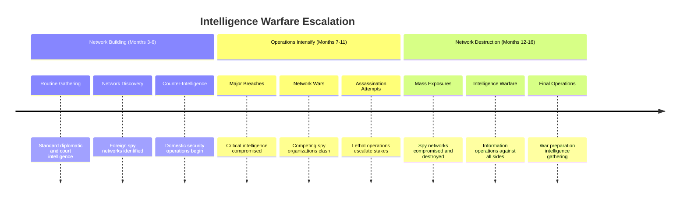

## AI Friendly Summary
**File Purpose**: Detailed development of the intelligence operations plot thread, tracking the escalation of information warfare and espionage activities throughout the 957-958 AV political crisis, centered on Cassius's intelligence network operations.

**Content Overview**: Documents progression from routine intelligence gathering through major network breaches to total intelligence warfare, including spy network dynamics, counter-intelligence operations, and the role of information in driving political decisions.

**Dependencies**: References [plot thread mapping](../plot-thread-mapping.md) for thread interconnections, [character development](../character-arc-development.md) for Cassius's arc, and [story timeline](../story-timeline.md) for operational chronology.

**Usage Context**: Essential for writing espionage scenes, developing Cassius's character progression, planning information warfare elements, and maintaining thriller tension throughout the political narrative.

## Cross-References
- **Main Plot Framework**: [Plot Thread Mapping](../plot-thread-mapping.md) | [Story Timeline](../story-timeline.md)
- **Character Development**: [Cassius](../characters/cassius.md) | [Supporting Court Officials](../characters/supporting-court-officials.md)
- **Scene Implementation**: [Act I Scene Breakdown](../act-1-scene-breakdown.md) | [Act II Scene Breakdown](../act-2-scene-breakdown.md) | [Act III Scene Breakdown](../act-3-scene-breakdown.md)
- **Related Threads**: [Succession Crisis](succession-crisis.md) | [Diplomatic Breakdown](diplomatic-breakdown.md) | [Alliance Formation](alliance-formation.md)
- **Intelligence Context**: [Foreign Ambassadors](../characters/foreign-ambassadors.md) - espionage targets and operatives

# Plot Thread: Intelligence Operations
*Information Warfare Escalation | 957-958 AV*

## Thread Overview
**Core Conflict**: Information becomes weaponized as competing intelligence networks gather secrets, influence political decisions, and ultimately expose each other in a spiral of espionage warfare that destroys trust and accelerates the march toward war.

**Timeline Span**: Months 3-16 (emerges Act I, peaks Act II, concludes Act III)
**Thread Type**: Thriller/Suspense - provides tension and reveals hidden motivations
**Resolution**: Intelligence networks destroyed or exposed, setting stage for open warfare

## Intelligence Operations Timeline

## Act-by-Act Development

### Act I: Intelligence Network Foundation (Months 3-6)
**Development Focus**: Establishing intelligence capabilities and discovering threats

**Key Plot Points**:
1. **Routine Intelligence Gathering** (Month 3, Scene 3)
   - Cassius establishes domestic intelligence operations
   - Court officials provide insider information
   - Foreign ambassador activities monitored

2. **Foreign Spy Network Discovery** (Month 5, Scene 5)
   - Major foreign intelligence operation exposed
   - Foreign agents identified within court structure
   - Counter-intelligence operations initiated

3. **Information Weaponization** (Month 6)
   - Intelligence used to influence succession decisions
   - Diplomatic negotiations affected by leaked information
   - Information becomes tool of political warfare

**Intelligence Network Structure**:
- **Domestic Assets**: Court officials, palace staff, military officers
- **Foreign Targets**: Embassy personnel, visiting diplomats, trade delegations
- **Information Flow**: Multi-directional intelligence sharing and manipulation

**Character Involvement**:
- **Cassius**: Primary intelligence operative and network manager
- **Court Officials**: Sources and targets of intelligence operations
- **Foreign Ambassadors**: Dual roles as diplomatic representatives and intelligence assets
- **Lucretia**: Unknowing provider and consumer of intelligence information

### Act II: Intelligence Warfare Escalation (Months 7-14)
**Development Focus**: Competing networks clash and operations turn lethal

**Key Plot Points**:
1. **Major Intelligence Breach** (Month 7, Scene 9)
   - Critical domestic intelligence compromised
   - Foreign penetration of security apparatus revealed
   - Network security becomes primary concern

2. **Counter-Intelligence Success** (Month 9)
   - Foreign spy network infiltrated and compromised
   - Double agents revealed and eliminated
   - Intelligence advantage temporarily achieved

3. **Espionage Operations** (Month 11, Scene 13)
   - High-risk intelligence missions conducted
   - Diplomatic immunity exploited for espionage
   - Professional relationships destroyed by exposure

4. **Network Compromise** (Month 12)
   - Major domestic intelligence assets exposed
   - Foreign counter-intelligence operations successful
   - Trust networks completely destroyed

5. **Assassination Attempts** (Months 13-14)
   - Intelligence operations turn lethal
   - Spy network personnel become targets
   - Political assassination attempts escalate stakes

**Intelligence Operations Categories**:
- **Political Intelligence**: Succession planning, court faction dynamics
- **Military Intelligence**: Force dispositions, alliance capabilities
- **Economic Intelligence**: Trade routes, resource access, financial networks
- **Personal Intelligence**: Individual vulnerabilities, relationship leverage

**Character Involvement**:
- **Cassius**: Managing increasingly dangerous and complex operations
- **Foreign Agents**: Conducting parallel intelligence operations
- **Court Officials**: Caught between competing intelligence pressures
- **Lucretia**: Intelligence operations affect diplomatic effectiveness

### Act III: Intelligence Network Destruction (Months 15-16)
**Development Focus**: Total intelligence warfare and network collapse

**Key Plot Points**:
1. **Intelligence War** (Month 15)
   - All sides engage in total intelligence warfare
   - Network destruction becomes primary objective
   - Information warfare replaces diplomatic communication

2. **Mass Network Exposure** (Month 16)
   - Spy networks exposed through counter-intelligence
   - Professional intelligence operatives burned and eliminated
   - Trust completely destroyed between all parties

3. **War Intelligence Preparation** (Month 16, Scene 21)
   - Intelligence operations shift to war preparation
   - Military intelligence becomes priority focus
   - Strategic information gathering for combat planning

**Final Intelligence Status**:
- **Domestic Networks**: Severely compromised but partially operational
- **Foreign Networks**: Destroyed or expelled from kingdom
- **Information Flow**: Limited to military and survival intelligence
- **Trust Levels**: Zero confidence in any information source

**Character Involvement**:
- **Cassius**: Network destruction forces exposure and new loyalties
- **Foreign Agents**: Withdrawal or elimination from operational theater
- **All Characters**: Information warfare affects all decision-making

## Character Arc Integration

### Cassius - Intelligence Professional to Exposed Operative
**Intelligence Role**: Primary domestic intelligence operative managing complex network operations
**Character Development**: From shadowy professional to exposed political player
**Key Moments**:
- Building intelligence capabilities (Act I)
- Managing competing network pressures (Act II)
- Network destruction and personal exposure (Act III)

**Professional Evolution**:
1. **Shadow Operative**: Unknown intelligence professional
2. **Network Manager**: Coordinating complex multi-source operations
3. **War Planner**: Shifting to military intelligence support
4. **Exposed Player**: Professional cover blown, forced into open political role

### Supporting Characters - Intelligence Assets and Targets
**Court Officials**: Sources, targets, and victims of intelligence operations
**Foreign Ambassadors**: Professional diplomats conducting parallel espionage
**Palace Staff**: Unwitting sources and deliberate intelligence assets

## Intelligence Network Analysis

### Network Structure and Capabilities:
| Network Type | Assets | Capabilities | Vulnerabilities | Exposure Risk |
|--------------|--------|--------------|-----------------|---------------|
| **Domestic Court** | Palace officials, military officers | Internal politics, succession plans | Personal relationships | High - close proximity |
| **Foreign Embassy** | Diplomatic staff, trade delegations | International relations, military plans | Diplomatic immunity | Medium - protected status |
| **Professional Spies** | Trained operatives, deep cover assets | Specialized intelligence, sabotage | Professional exposure | Low - trained security |
| **Economic Networks** | Merchants, trade officials | Economic intelligence, resource data | Commercial interests | Medium - business conflicts |

### Intelligence Categories:
1. **Political Intelligence**: Court factions, succession planning, policy decisions
2. **Military Intelligence**: Force dispositions, alliance capabilities, strategic planning
3. **Economic Intelligence**: Trade routes, resource access, financial vulnerabilities
4. **Personal Intelligence**: Individual weaknesses, relationship leverage, blackmail material

## Information Warfare Dynamics

### Intelligence Cycle Progression:

### Network Warfare Tactics:
- **Penetration**: Placing assets within enemy organizations
- **Deception**: Providing false information to mislead opponents
- **Disruption**: Interfering with enemy intelligence operations
- **Elimination**: Removing enemy intelligence capabilities
- **Exposure**: Revealing enemy networks to destroy effectiveness

## Plot Thread Connections

### Primary Thread Intersections:
1. **Succession Crisis**: Intelligence operations influence succession decisions and expose claimant vulnerabilities
2. **Diplomatic Breakdown**: Espionage activities compromise diplomatic immunity and trust
3. **Alliance Formation**: Intelligence gathering guides alliance decisions and reveals betrayals

### Scene-by-Scene Thread Presence:
- **Scene 3 (Act I)**: Intelligence operations establishment
- **Scene 5 (Act I)**: Major foreign network discovery
- **Scene 9 (Act II)**: Critical intelligence breach
- **Scene 13 (Act II)**: High-risk espionage operation
- **Scene 23 (Act III)**: Final intelligence gambit

## Intelligence Operations Categories

### Operational Types and Methods:
| Operation Type | Methods | Targets | Success Metrics | Risk Level |
|----------------|---------|---------|-----------------|------------|
| **Court Surveillance** | Palace staff, official monitoring | Political decisions, personal relationships | Information accuracy, access level | Low-Medium |
| **Diplomatic Espionage** | Embassy penetration, communication interception | Foreign policy, military plans | Strategic advantage, early warning | Medium-High |
| **Counter-Intelligence** | Network penetration, double agents | Enemy spy networks, foreign operations | Network disruption, asset protection | High |
| **Military Intelligence** | Reconnaissance, strategic analysis | Force dispositions, alliance capabilities | Tactical advantage, threat assessment | Medium |

## Writing Guidelines

### Dialogue Considerations:
- Professional intelligence terminology and methods
- Coded communication and subtle information exchange
- Trust and betrayal in professional relationships
- Technical aspects of espionage operations

### Atmosphere and Tone:
- Paranoia and constant surveillance awareness
- Professional relationships hiding ulterior motives
- Tension between personal and professional loyalties
- Escalating stakes as operations turn lethal

### Key Themes:
- Information as weapon and currency
- Professional duty vs. personal relationships
- Consequences of surveillance state mentality
- Trust destruction through espionage

## Critical Success Factors

### Plot Thread Integrity:
- [ ] Intelligence operations feel professionally realistic
- [ ] Network escalation follows logical progression
- [ ] Information affects political decisions meaningfully
- [ ] Espionage creates genuine thriller tension
- [ ] Network destruction sets up war scenario

### Character Development:
- [ ] Cassius grows through intelligence challenges
- [ ] Professional relationships tested by espionage
- [ ] Personal costs of intelligence work explored
- [ ] Moral ambiguity of information warfare addressed

### Technical Authenticity:
- [ ] Intelligence methods appropriate to historical setting
- [ ] Network operations follow realistic tradecraft
- [ ] Counter-intelligence responses logically developed
- [ ] Information flow affects story progression

---
*Part of Political Intrigue Story (957-958 AV) plot development framework*
