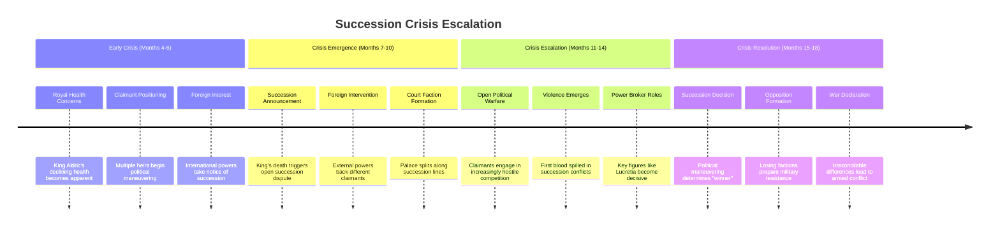

## AI Friendly Summary
**File Purpose**: Detailed development of the succession crisis plot thread, the central political conflict driving the political intrigue story from 957-958 AV. Documents the collapse of royal succession stability and its escalation into civil warfare.

**Content Overview**: Tracks progression from royal health concerns through succession disputes to war declaration, including character involvement, key plot points, scene connections, and timeline integration across all three acts.

**Dependencies**: References [plot thread mapping](../plot-thread-mapping.md) for thread interconnections, [character arc development](../character-arc-development.md) for character progression, and [story timeline](../story-timeline.md) for temporal coordination.

**Usage Context**: Essential for writing succession-related scenes, developing political dialogue, planning character motivations around royal claims, and ensuring consistent escalation of the central conflict throughout the narrative.

## Cross-References
- **Main Plot Framework**: [Plot Thread Mapping](../plot-thread-mapping.md) | [Story Timeline](../story-timeline.md)
- **Character Development**: [Character Arc Development](../character-arc-development.md) | [Succession Claimants](../characters/succession-claimants.md)
- **Scene Implementation**: [Act I Scene Breakdown](../act-1-scene-breakdown.md) | [Act II Scene Breakdown](../act-2-scene-breakdown.md) | [Act III Scene Breakdown](../act-3-scene-breakdown.md)
- **Related Threads**: [Diplomatic Breakdown](diplomatic-breakdown.md) | [Intelligence Operations](intelligence-operations.md) | [Alliance Formation](alliance-formation.md)
- **Supporting Characters**: [Royal Family Members](../characters/royal-family-members.md) | [Supporting Court Officials](../characters/supporting-court-officials.md)

# Plot Thread: Succession Crisis
*Central Political Conflict | 957-958 AV*

## Thread Overview
**Core Conflict**: The death of King Aldric triggers a disputed succession that fractures the kingdom along factional lines, ultimately leading to civil war as multiple claimants assert competing legitimate claims to the throne.

**Timeline Span**: Months 4-18 (emerges Act I, escalates Act II-III)
**Thread Type**: Primary/Central - drives all other plot developments
**Resolution**: Sets stage for War of the Crimson Veil through irreconcilable succession dispute

## Succession Crisis Development Timeline

## Act-by-Act Development

### Act I: Succession Crisis Seeds (Months 4-6)
**Development Focus**: Introduction of succession uncertainty and claimant positioning

**Key Plot Points**:
1. **Royal Health Crisis** (Month 4, Scene 6)
   - King Aldric's visible decline becomes court concern
   - Medical advisors provide grim prognosis
   - Succession planning becomes urgent necessity

2. **Claimant Emergence** (Month 5)
   - Multiple potential heirs assert claims
   - Legal scholars debate succession precedents
   - Political coalitions begin forming around candidates

3. **Foreign Interest** (Month 6, Scene 7)
   - International powers recognize succession opportunity
   - Diplomatic missions increase in frequency and urgency
   - Foreign backing for preferred claimants begins

**Character Involvement**:
- **Lucretia**: Observes succession maneuvering during diplomatic missions
- **Gareth**: Positioned as military advisor to succession candidates
- **Cassius**: Begins intelligence gathering on claimant strengths
- **Court Officials**: Choose preliminary loyalties based on personal interests

### Act II: Succession Crisis Escalation (Months 7-14)
**Development Focus**: Open political warfare and violent competition

**Key Plot Points**:
1. **King's Death & Succession Announcement** (Month 7)
   - King Aldric dies under mysterious circumstances (assassination?)
   - Multiple claimants immediately assert rightful rule
   - Court fragments along succession lines

2. **Foreign Intervention Escalation** (Months 8-9)
   - International powers openly back preferred candidates
   - Foreign resources pour into succession competition
   - Domestic sovereignty compromised by foreign influence

3. **Political Violence Emergence** (Months 10-12, Scene 14)
   - First blood spilled in succession conflicts
   - Assassination attempts against rival claimants
   - Court security becomes military operation

4. **Power Broker Dynamics** (Months 12-14, Scenes 15-19)
   - Key figures like Lucretia become decisive vote-swayers
   - Military support determines practical viability
   - Intelligence operations shape succession outcomes

**Character Involvement**:
- **Lucretia**: Becomes key diplomatic mediator and power broker
- **Gareth**: Military leadership determines claimant viability
- **Cassius**: Intelligence operations support preferred candidate
- **Court Officials**: Face life-or-death loyalty decisions
- **Foreign Powers**: Attempt to control succession outcome

### Act III: Succession Crisis Resolution (Months 15-18)
**Development Focus**: Final succession decision and opposition response

**Key Plot Points**:
1. **Final Political Maneuvering** (Month 15, Scene 20)
   - Last-ditch efforts to achieve peaceful resolution
   - Compromise candidates proposed and rejected
   - Political process reaches breaking point

2. **Succession Resolution** (Months 16-17, Scenes 21-23)
   - Victor emerges through political/military superiority
   - New ruler begins consolidating power
   - Losing factions refuse to accept legitimacy

3. **Opposition Resistance Formation** (Month 17)
   - Defeated claimants form military resistance coalition
   - Regional territories declare independence or opposition
   - Civil war becomes inevitable outcome

4. **War Declaration** (Month 18, Scenes 24-25)
   - All peaceful resolution attempts exhausted
   - Military preparations complete on all sides
   - Formal declaration of civil warfare

**Character Involvement**:
- **Lucretia**: Final diplomatic attempts to prevent war
- **Gareth**: Military preparations for inevitable conflict
- **Cassius**: War intelligence gathering and network preparation
- **All Characters**: Face final loyalty decisions with life-or-death consequences

## Character Arc Integration

### Lucretia Aurelia Corvina - Diplomatic Power Broker
**Succession Role**: Key mediator whose support legitimizes claimants
**Character Development**: From neutral diplomat to decisive political power broker
**Key Moments**:
- Initial observation of succession maneuvering (Act I)
- Becoming central to succession negotiations (Act II)
- Final attempts to prevent war through compromise (Act III)

### Gareth Ironhold - Military Kingmaker  
**Succession Role**: Military commander whose loyalty determines claimant viability
**Character Development**: From loyal soldier to independent political decision-maker
**Key Moments**:
- Advising succession candidates on military matters (Act I)
- Military support becoming decisive factor (Act II)
- Choosing final loyalty for war preparation (Act III)

### Cassius - Intelligence Operator
**Succession Role**: Information gatherer whose intelligence shapes succession
**Character Development**: From shadowy operative to exposed political player
**Key Moments**:
- Gathering intelligence on claimant strengths (Act I)
- Intelligence operations affecting succession outcomes (Act II)
- War intelligence preparation and network exposure (Act III)

## Succession Claimant Analysis

| Claimant | Legitimacy Basis | Support Coalition | Succession Advantage | Fatal Weakness |
|----------|------------------|-------------------|---------------------|----------------|
| **Gareth Aurelius** | Ancient bloodline + supernatural validation | Traditional nobility, military honor | Moral authority | Political inexperience |
| **Prince Edmund** | Direct royal heir | Court traditionalists | Undisputed bloodline | Youth and inexperience |
| **Cassius Ferox** | Merit-based leadership | Professional military | Military genius | Lack of traditional legitimacy |
| **Duke Aldwin** | Royal blood + military experience | Eastern territories, military nobles | Established power base | Limited charisma |
| **Theodoricus Rex Minor** | Gothic imperial backing | Germanic nobles, efficiency advocates | Imperial resources | Foreign allegiance |
| **Diplomatic Nominee** | Council of Kingdoms approval | Peace faction, merchant guilds | International backing | Lack of individual appeal |

## Plot Thread Connections

### Primary Thread Intersections:
1. **Diplomatic Breakdown**: Foreign intervention in succession accelerates diplomatic failure
2. **Intelligence Operations**: Succession intelligence gathering affects outcomes and exposes networks
3. **Alliance Formation**: Succession coalitions become foundation for war alliances

### Scene-by-Scene Thread Presence:
- **Scene 6 (Act I)**: Succession crisis emerges through royal health concerns
- **Scene 11 (Act II)**: Court intrigue shows succession factional conflicts
- **Scene 18 (Act II)**: Point of crisis where succession violence erupts
- **Scene 24 (Act III)**: War declaration triggered by succession resolution failure

## Writing Guidelines

### Dialogue Considerations:
- Succession law and precedent debates
- Legitimacy arguments and counter-arguments
- Loyalty oaths and betrayal accusations
- Compromise proposals and rejections

### Atmosphere and Tone:
- Growing tension as stakes increase
- Court intrigue and behind-scenes maneuvering
- Violence erupting in previously civilized settings
- Inevitable tragedy of war approaching

### Key Themes:
- Legitimacy vs. effectiveness in leadership
- Personal ambition vs. kingdom welfare
- Traditional authority vs. merit-based claims
- Foreign influence vs. domestic sovereignty

## Critical Success Factors

### Plot Thread Integrity:
- [ ] Succession crisis feels historically inevitable
- [ ] Claimant motivations remain consistent and compelling
- [ ] Foreign intervention balances influence without domination
- [ ] Violence escalation follows logical progression
- [ ] Resolution sets up war scenario naturally

### Character Development:
- [ ] Characters grow through succession involvement
- [ ] Loyalty conflicts create genuine moral dilemmas
- [ ] Personal relationships tested by political necessity
- [ ] Character choices have meaningful consequences

### Historical Integration:
- [ ] Succession laws consistent with universe lore
- [ ] Political factions align with established history
- [ ] Foreign relations reflect ongoing universe conflicts
- [ ] Resolution connects to broader Crimson Veil timeline

---
*Part of Political Intrigue Story (957-958 AV) plot development framework*
