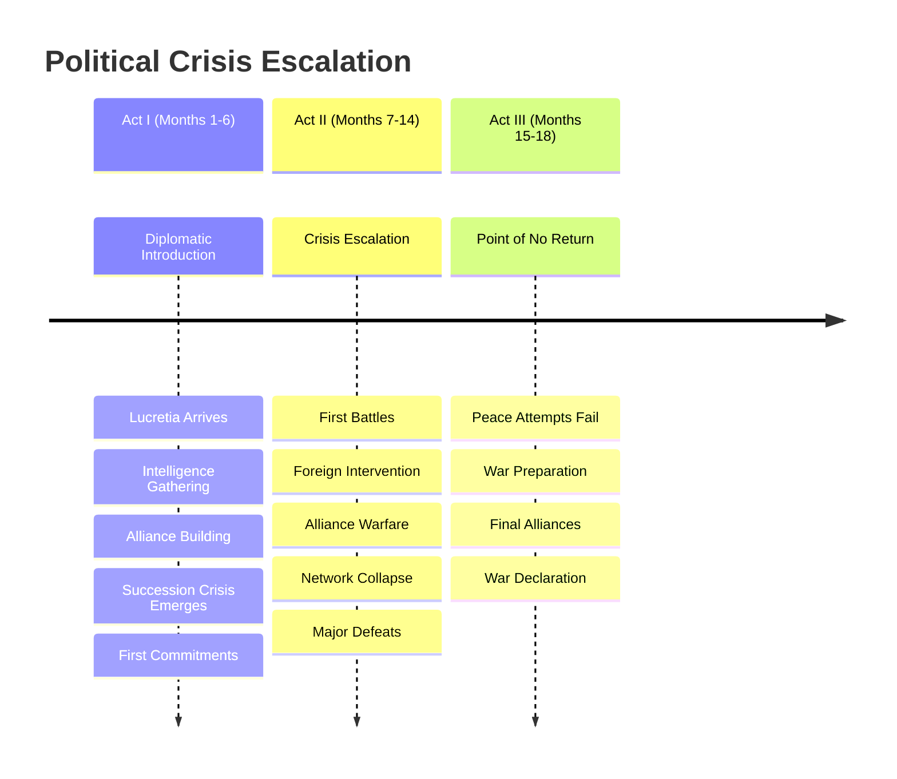

# Political Intrigue Story - Detailed Timeline
*Story Period: 957-958 AV | The 18 Months Before War*

## AI Friendly Summary
**File Purpose**: Provides month-by-month detailed timeline of all major events across the 18-month political intrigue storyline, showing progression from diplomatic tensions to full war.
**Content Overview**: Complete chronological mapping of political, military, diplomatic, and intelligence events with character involvement, story impact assessment, and act structure alignment.
**Dependencies**: Synchronizes with plot-thread-mapping.md for plot progression, character-arc-development.md for character milestones, and act-*-scene-breakdown.md files for scene timing.
**Usage Context**: Essential reference for maintaining chronological consistency during scene writing and ensuring proper pacing of events across the narrative structure.

## Timeline Overview

**Story Timespan**: 18 months (Early 957 AV - Late 958 AV)  
**Historical Context**: Late Medieval Political Crisis  
**Central Theme**: Diplomatic breakdown leading to inevitable war  
**Setting**: Regnum Aethermoor and surrounding kingdoms  
**Protagonist**: Lady Lucretia Aurelia Corvina

## Cross-References
- **Plot Integration**: See [Plot Thread Mapping](./plot-thread-mapping.md) for how timeline events drive major plot threads
- **Character Development**: See [Character Arc Development](./character-arc-development.md) for character growth milestones aligned with timeline events
- **Scene Planning**: See [Act I Scene Breakdown](./act-1-scene-breakdown.md), [Act II Scene Breakdown](./act-2-scene-breakdown.md), [Act III Scene Breakdown](./act-3-scene-breakdown.md) for scene placement within timeline
- **Historical Context**: See [Historical Context Integration](./historical-context-integration.md) for broader historical framework

## Timeline Visualization

## Crisis Escalation Metrics

| Phase | Diplomatic Status | Military Activity | Intelligence Operations | Character Stakes |
|-------|------------------|-------------------|------------------------|------------------|
| **Months 1-3** | Active Negotiations | Defensive Positioning | Network Building | Professional |
| **Months 4-6** | Growing Tensions | Border Incidents | Active Intelligence | Personal Investment |
| **Months 7-9** | Diplomatic Breakdown | Small Conflicts | Information Warfare | Survival Stakes |
| **Months 10-12** | International Crisis | Major Battles | Network Collapse | Life or Death |
| **Months 13-15** | Coalition Warfare | Siege Operations | Exposure/Betrayal | Complete Commitment |
| **Months 16-18** | War Declaration | Full Mobilization | Final Operations | No Return Point |

## Character Involvement Timeline

| Month | Lucretia | Gareth | Cassius | Court Officials | Foreign Powers |
|-------|----------|--------|---------|----------------|----------------|
| **1-3** | Diplomatic Leader | Military Advisor | Intelligence Officer | Faction Choosing | Watching |
| **4-6** | Alliance Builder | Strategic Planner | Network Controller | Side Choosing | Positioning |
| **7-9** | Political Player | Military Commander | Information Broker | War Preparation | Active Involvement |
| **10-12** | Survival Fighter | Battle Leader | Network Defender | Resource Management | Coalition Building |
| **13-15** | War Strategist | Campaign Commander | Exposed Operative | Conflict Leadership | Alliance Warfare |
| **16-18** | Political Operator | Master Strategist | Survival Expert | War Directors | Enemy States |

---

## Detailed Monthly Timeline

| Date | Event | Type | Description | Characters Involved | Story Impact | Act |
|------|-------|------|-------------|-------------------|--------------|-----|
| **957 AV - EARLY SPRING** | | | **ACT I: DIPLOMATIC INTRODUCTION** | | | |
| 957 AV, Month 1 | Lady Lucretia arrives at court | Diplomatic | Lucretia begins diplomatic assignment in Aethermoor | Lucretia, Court Officials | Character introduction, world establishment | I |
| 957 AV, Month 1 | First royal audience | Political | Formal presentation to aging monarch | Lucretia, King, Advisors | Succession concerns first revealed | I |
| 957 AV, Month 1 | Initial intelligence gathering | Intelligence | Lucretia assesses court factions and loyalties | Lucretia, Court contacts | Political landscape established | I |
| 957 AV, Month 2 | Trade dispute escalation | Economic | Border trade conflicts become diplomatic crisis | Lucretia, Foreign ambassadors | Tension building between kingdoms | I |
| 957 AV, Month 2 | Secret meetings begin | Intelligence | Private discussions with key political figures | Lucretia, Gareth Ironhold, Cassius | Alliance building and conspiracy hints | I |
| 957 AV, Month 2 | First diplomatic setback | Diplomatic | Major negotiation fails due to hidden agendas | Lucretia, Multiple kingdoms | Lucretia's limitations revealed | I |
| 957 AV, Month 3 | Succession rumors intensify | Political | King's health becomes public concern | Royal family, Court factions | Central crisis becomes apparent | I |
| 957 AV, Month 3 | Intelligence network activation | Intelligence | Cassius reveals spy operations to Lucretia | Lucretia, Cassius, Agents | Moral complexity introduced | I |
| 957 AV, Month 3 | Foreign kingdom positioning | Military | Other realms begin strategic preparations | Gareth, Military advisors | War preparations begin subtly | I |
| **957 AV - LATE SPRING** | | | | | | |
| 957 AV, Month 4 | Assassination attempt | Violence | Failed attempt on key political figure | Multiple characters | Stakes dramatically raised | I |
| 957 AV, Month 4 | Alliance negotiations | Diplomatic | Secret talks between potential allies | Lucretia, Foreign representatives | Personal involvement deepens | I |
| 957 AV, Month 4 | Military buildup begins | Military | Gareth starts positioning forces defensively | Gareth, Military commanders | War preparation becomes visible | I |
| 957 AV, Month 5 | Succession crisis public | Political | King's incapacity becomes undeniable | Royal family, All major characters | Central conflict fully revealed | I |
| 957 AV, Month 5 | Diplomatic breakdown | Political | Major treaty negotiations collapse completely | Lucretia, International delegates | First major diplomatic failure | I |
| 957 AV, Month 5 | Intelligence war escalates | Intelligence | Spy networks clash, casualties result | Cassius, Enemy agents | Personal cost of politics revealed | I |
| 957 AV, Month 6 | Lucretia chooses sides | Character | Protagonist commits to specific faction | Lucretia, Chosen allies | Character transformation begins | I |
| 957 AV, Month 6 | Border incidents increase | Military | "Accidental" clashes become frequent | Border commanders, Civilians | War becomes increasingly inevitable | I |
| **957 AV - EARLY SUMMER** | | | **ACT II: ESCALATING CRISIS** | | | |
| 957 AV, Month 7 | First battle | Military | Small-scale conflict erupts between kingdoms | Gareth, Military forces | Transition from politics to warfare | II |
| 957 AV, Month 7 | Diplomatic immunity violated | Political | Ambassadors attacked, treaties broken | Lucretia, Foreign diplomats | International law collapses | II |
| 957 AV, Month 7 | Intelligence coup | Intelligence | Major intelligence victory reveals enemy plans | Cassius, Lucretia | Strategic advantage gained | II |
| 957 AV, Month 8 | Succession war begins | Political | Multiple claimants declare themselves rulers | Royal claimants, Court factions | Internal civil conflict starts | II |
| 957 AV, Month 8 | Foreign intervention | International | Other kingdoms choose sides in succession | International players | Conflict becomes multi-national | II |
| 957 AV, Month 8 | Mass mobilization ordered | Military | All kingdoms begin full military preparation | Gareth, All military leaders | Point of no return reached | II |
| 957 AV, Month 9 | Diplomatic corps evacuated | Diplomatic | International diplomatic relations severed | Lucretia, Diplomatic community | Peaceful resolution abandoned | II |
| 957 AV, Month 9 | Alliance warfare begins | Military | Coalition warfare replaces bilateral conflicts | All major characters | Complex multi-front war starts | II |
| 957 AV, Month 9 | Personal betrayals | Character | Close allies reveal conflicting loyalties | Lucretia, Personal contacts | Character relationships tested | II |
| **957 AV - LATE SUMMER** | | | | | | |
| 957 AV, Month 10 | Major siege begins | Military | First major city comes under siege | Gareth, Siege participants | Large-scale warfare escalates | II |
| 957 AV, Month 10 | Intelligence network collapse | Intelligence | Spy operations compromised, agents killed | Cassius, Intelligence operatives | Information warfare intensifies | II |
| 957 AV, Month 10 | Civilian displacement | Humanitarian | Refugee crisis as populations flee conflict | Civilian populations | Human cost becomes apparent | II |
| 957 AV, Month 11 | Diplomatic immunity ends | Political | Last diplomatic protections formally removed | Lucretia, Remaining diplomats | Final breakdown of international law | II |
| 957 AV, Month 11 | Economic warfare | Economic | Trade embargo and economic sanctions imposed | Merchant classes, Civilian populations | War expands beyond military sphere | II |
| 957 AV, Month 11 | Religious involvement | Religious | Churches choose sides, religious war declared | Religious authorities | Ideological dimension added | II |
| 957 AV, Month 12 | Winter preparations | Military | All sides prepare for extended winter campaign | All military leaders | Long-term war commitment clear | II |
| 957 AV, Month 12 | Lucretia's final choice | Character | Protagonist abandons neutrality completely | Lucretia, All major relationships | Character arc completion | II |
| **958 AV - EARLY WINTER** | | | | | | |
| 958 AV, Month 1 | Winter offensive | Military | Surprise winter attacks break siege lines | Gareth, Military commanders | Strategic situation shifts | II |
| 958 AV, Month 1 | Counter-intelligence victory | Intelligence | Enemy spy network finally infiltrated | Cassius, Enemy agents | Information war advantage gained | II |
| 958 AV, Month 1 | International complications | International | Distant kingdoms begin involvement | New international players | Conflict scope expands globally | II |
| 958 AV, Month 2 | Major battle | Military | Decisive engagement determines strategic balance | All military characters | War's direction potentially decided | II |
| 958 AV, Month 2 | Alliance breakdown | Political | Key alliance fractures under pressure | Former allies, Lucretia | Political complexity increases | II |
| 958 AV, Month 2 | Personal losses | Character | Major character deaths affect protagonist | Lucretia, Close associates | Personal stakes maximized | II |
| **958 AV - LATE WINTER** | | | **ACT III: POINT OF NO RETURN** | | | |
| 958 AV, Month 3 | Peace negotiations fail | Diplomatic | Last attempt at diplomatic solution collapses | Lucretia, Peace negotiators | Final diplomatic failure | III |
| 958 AV, Month 3 | Total war declared | Military | All restraints removed, unlimited warfare begins | All leaders, Military commanders | Civilized warfare ends | III |
| 958 AV, Month 3 | Magic weapons deployed | Military | Ancient magical artifacts used in warfare | All sides, Magical specialists | Escalation beyond conventional war | III |
| 958 AV, Month 4 | Civilian targets | Military | Non-combatants become legitimate military targets | Civilian populations | War crimes begin | III |
| 958 AV, Month 4 | Scorched earth tactics | Military | Systematic destruction of infrastructure begins | Military forces, Civilian areas | Environmental destruction starts | III |
| 958 AV, Month 4 | Lucretia's final mission | Intelligence | Protagonist undertakes most dangerous assignment | Lucretia, All associates | Character climax approached | III |
| 958 AV, Month 5 | Ancient powers stir | Supernatural | Magical/supernatural forces begin involvement | Ancient entities, All characters | Supernatural escalation begins | III |
| 958 AV, Month 5 | Last strongholds fall | Military | Final defensive positions overcome | Gareth, Remaining defenders | Military situation becomes desperate | III |
| 958 AV, Month 5 | Intelligence breakthrough | Intelligence | Final crucial intelligence gathered | Cassius, Lucretia | Information crucial to war obtained | III |
| 958 AV, Month 6 | Character resolution | Character | Lucretia completes her transformation | Lucretia, All relationships | Character arc concluded | III |
| 958 AV, Month 6 | War preparation complete | Military | All sides ready for the final phase | All military leaders | Setup for main war complete | III |
| **958 AV - LATE SPRING** | | | **STORY CONCLUSION - WAR INEVITABLE** | | | |
| 958 AV, Late Spring | The Great War begins | Military | War of the Crimson Veil officially commences | All characters | Story conclusion, war setup | III |

---

## Character Development Timeline

### Lady Lucretia Aurelia Corvina
- **Months 1-6**: Transformation from neutral diplomat to involved political player
- **Months 7-12**: Growing compromise of diplomatic ideals for political necessity  
- **Months 13-18**: Complete abandonment of neutrality, full political commitment

### Gareth Ironhold  
- **Months 1-6**: Military advisor observing political developments
- **Months 7-12**: Active military preparation and strategic positioning
- **Months 13-18**: Full military commander preparing for total war

### Cassius (Intelligence Operations)
- **Months 1-6**: Intelligence gathering and network establishment
- **Months 7-12**: Active intelligence warfare and operations
- **Months 13-18**: Master spymaster coordinating information warfare

---

## Political Crisis Escalation Points

1. **Month 1**: Initial diplomatic tensions
2. **Month 5**: Succession crisis becomes public
3. **Month 7**: First military action taken
4. **Month 9**: Diplomatic immunity ends
5. **Month 12**: Winter war commitment
6. **Month 14**: Alliance system collapse
7. **Month 17**: Ancient powers involvement
8. **Month 18**: War inevitability accepted

---

## Story Arc Progression

### Act I (Months 1-6): Political Introduction
- Diplomatic arrival and initial assessments
- Growing awareness of deeper political currents
- First major compromises and alliance choices

### Act II (Months 7-12): Escalating Crisis  
- Transition from politics to warfare
- Personal relationships tested by political necessity
- Major diplomatic and military failures

### Act III (Months 13-18): Point of No Return
- Complete breakdown of peaceful resolution
- Character transformation completion
- Setup for the great war that follows

---

## Integration Notes

**Universe Timeline Alignment**: Events lead directly into "War of the Crimson Veil" (958-960 AV)  
**Character Consistency**: All actions align with established character profiles  
**Historical Context**: Events reflect late medieval political crisis patterns  
**Story Pacing**: 18-month timeframe allows proper character development  
**Thematic Consistency**: Political intrigue escalates logically to inevitable war
