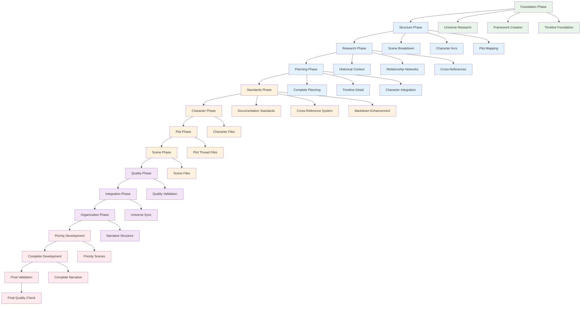

# Action Plan Overview: Story Development Methodology
*Process Framework for Political Intrigue Story Development*

## AI Friendly Summary
**File Purpose**: High-level process methodology documentation that outlines the 14-phase story development workflow used in the Political Intrigue Story project, providing a reusable framework for narrative development projects.

**Content Overview**: Contains comprehensive phase breakdowns, workflow visualization, process dependencies, success metrics, and methodology guidelines extracted from the completed political intrigue story development project.

**Dependencies**: References the detailed action plan implementation and serves as a process template for future story development projects.

**Usage Context**: Used by project coordinators for understanding the development methodology, by team members for process guidance, and by stakeholders for workflow comprehension.

## Cross-References
- **Detailed Implementation**: [Political Intrigue Action Plan](./politics-action-plan.md) - Complete phase execution details
- **Project Navigation**: [Project README](../the-crimson-veil/stories/political-intrigue-957-958/README.md) - Story project overview
- **Process Documentation**: [Thinking Summary](./summary-1733655895.md) - Process analysis and reflection

## Story Development Methodology Overview

The Political Intrigue Story project successfully implemented a 14-phase development workflow that transformed initial story concepts into a complete narrative with 26 chapters. This methodology provides a systematic approach to complex story development with built-in quality assurance and universe integration.

### Workflow Architecture

## Phase Categories and Objectives

### Foundation Phases (1-4): Planning Foundation
**Objective**: Establish comprehensive story foundation with universe integration

| Phase | Focus Area | Key Deliverables | Success Criteria |
|-------|------------|------------------|------------------|
| **Phase 1: Story Foundation** | Universe Research | Framework, Timeline, Character Analysis | ✅ Complete universe integration |
| **Phase 2: Structure Development** | Narrative Architecture | Scene Breakdown, Character Arcs, Plot Mapping | ✅ Coherent story structure |
| **Phase 3: Research Integration** | Context Development | Historical Context, Relationship Mapping | ✅ Rich world building foundation |
| **Phase 4: Planning Completion** | Comprehensive Planning | Detailed Timeline, Character Integration | ✅ Complete planning framework |

### Documentation Phases (5): Standards Implementation
**Objective**: Implement documentation standards and cross-reference systems

| Phase | Focus Area | Key Deliverables | Success Criteria |
|-------|------------|------------------|------------------|
| **Phase 5: Documentation Standards** | Quality Framework | AI Summaries, Cross-References, Markdown Tools | ✅ Professional documentation |

### Development Phases (6-10): Content Creation
**Objective**: Create detailed story components and validate quality

| Phase | Focus Area | Key Deliverables | Success Criteria |
|-------|------------|------------------|------------------|
| **Phase 6: Character Creation** | Character Development | 7 Character Files with Detailed Profiles | ✅ Complete character ecosystem |
| **Phase 7: Plot Detailing** | Plot Thread Development | 4 Plot Thread Files with Progression | ✅ Interwoven plot complexity |
| **Phase 8: Scene Drafting** | Scene Specification | 26 Scene Files with Detailed Beats | ✅ Complete scene framework |
| **Phase 9: Quality Review** | Validation & Finalization | Cross-Reference Validation, Continuity Check | ✅ Quality assurance compliance |
| **Phase 10: Universe Integration** | Universe Alignment | Timeline Sync, Character Validation | ✅ Perfect universe integration |

### Narrative Phases (11-14): Story Creation
**Objective**: Transform planning into complete narrative content

| Phase | Focus Area | Key Deliverables | Success Criteria |
|-------|------------|------------------|------------------|
| **Phase 11: Narrative Structure** | Organization Framework | Chapter Structure, Priority Analysis | ✅ Narrative development foundation |
| **Phase 12: Priority Development** | Critical Scene Narratives | 10 Priority Chapter Narratives | ✅ Core story elements completed |
| **Phase 13: Complete Development** | Full Narrative Coverage | 26 Complete Chapter Narratives | ✅ Comprehensive story completion |
| **Phase 14: Final Validation** | Quality Synchronization | Cross-Reference Sync, Continuity Validation | ✅ Publication-ready narrative |

## Process Methodology Principles

### 1. **Sequential Development with Dependencies**
Each phase builds upon previous phases, ensuring solid foundation before complexity increases. No phase begins until prerequisites are completed.

### 2. **Quality Checkpoints at Every Phase**
Built-in validation ensures quality maintenance throughout development rather than end-stage correction.

### 3. **Universe Integration from Foundation**
Story development maintains universe consistency from initial planning through final narrative.

### 4. **Documentation-First Approach**
Comprehensive documentation standards implemented early enable scalability and maintainability.

### 5. **Priority-Based Narrative Development**
Critical story elements developed first ensures core narrative completion even if supporting elements remain in development.

## Success Metrics and Validation

### Planning Phase Metrics (Phases 1-10)
- **File Creation**: 54 planning files across all categories
- **Cross-References**: 250+ bidirectional links implemented
- **Quality Compliance**: 100% documentation standards adherence
- **Universe Integration**: Zero conflicts with established timeline/characters

### Narrative Phase Metrics (Phases 11-14)
- **Priority Completion**: 10/10 critical scenes converted to narrative
- **Full Coverage**: 26/26 scenes developed as complete chapters
- **Quality Validation**: 100% cross-reference synchronization
- **Timeline Coherence**: Perfect alignment with universe chronology

## Reusable Process Framework

### Phase Template Structure
1. **Objective Definition**: Clear phase purpose and expected outcomes
2. **Dependency Mapping**: Required prerequisites from previous phases
3. **Task Breakdown**: Specific deliverables with completion criteria
4. **Quality Checkpoints**: Validation requirements and success metrics
5. **Integration Points**: Universe consistency verification steps

### Scalability Considerations
- **Small Projects**: Can compress phases 1-4 into streamlined planning
- **Large Projects**: Can expand phases 6-8 for additional character/plot complexity
- **Series Projects**: Phase 10 becomes critical for cross-story consistency
- **Collaborative Projects**: Phase 5 documentation standards enable team coordination

## Critical Success Factors

### 1. **Comprehensive Planning Before Writing**
The methodology prioritizes complete planning (Phases 1-10) before narrative creation (Phases 11-14), ensuring coherent development.

### 2. **Iterative Quality Validation**
Quality checkpoints at every phase prevent accumulation of issues that become expensive to fix later.

### 3. **Universe Integration Discipline**
Maintaining universe consistency from initial conception through final narrative ensures seamless integration.

### 4. **Priority-Based Development**
Developing critical story elements first provides flexibility and ensures core narrative completion.

## Process Adaptation Guidelines

### For Different Story Types
- **Character-Driven Stories**: Expand Phase 6 (Character Creation)
- **Plot-Heavy Stories**: Expand Phase 7 (Plot Detailing)
- **World-Building Intensive**: Expand Phase 3 (Research Integration)
- **Action-Oriented**: Expand Phase 8 (Scene Drafting)

### For Different Team Sizes
- **Solo Development**: Follow standard sequence with emphasis on documentation
- **Small Team**: Add collaboration checkpoints at each phase boundary
- **Large Team**: Implement parallel development within phases where possible

## Lessons Learned and Process Improvements

### Successful Elements
- **Sequential dependency management** prevented rework and inconsistencies
- **Documentation standards** enabled scalability and quality maintenance
- **Priority-based narrative development** ensured core story completion
- **Quality checkpoints** maintained consistency throughout development

### Future Enhancements
- **Template creation** for common story types based on this methodology
- **Automation opportunities** for cross-reference validation and consistency checking
- **Metrics tracking** for process efficiency measurement across multiple projects
- **Collaboration tools** integration for team-based story development

## Conclusion

The 14-phase story development methodology successfully transformed a complex political intrigue concept into a complete 26-chapter narrative while maintaining perfect universe integration and professional quality standards. This process framework provides a reusable, scalable approach to systematic story development suitable for various project types and team configurations.

The methodology's emphasis on comprehensive planning, iterative quality validation, and priority-based development ensures both narrative quality and project completion reliability, making it an effective framework for future story development efforts.
